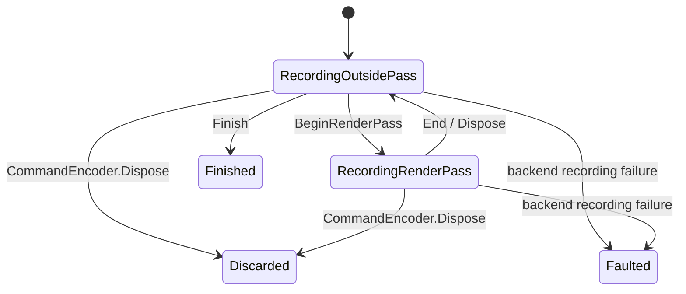

# ADR-0006: RenderEncoder による描画パスの記録

- 状態: 提案
- 日付: 2026-10-07

## 背景

[ADR-0004](0004-graphics-library.md) の RenderEncoder を独立した契約として具体化する。DirectX、Vulkan、WebGPU で描画パスとコマンド記録の境界が異なるため、公開 API の状態遷移、動的状態、描画引数、寿命を共通化する必要がある。

シェーダーと GPU データ参照は [ADR-0005](0005-shader-compilation-and-data-interop.md)、生成条件を表す Desc 型のフィールドと検証条件は [ADR-0007](0007-graphics-descriptors.md) を正本とする。本 ADR は描画方式を決める Renderer ではなく、GPU Core のコマンド記録 API を扱う。

## 決定

### 責務と対象範囲

RenderEncoder は一つの描画パスに属し、attachment、graphics pipeline、viewport、scissor、blend constant、stencil reference、index buffer と描画コマンドを記録する。シーン、Mesh、Material、シェーダーのコンパイル、リソースの生成・Upload、画面表示は担当しない。

最初の共通契約は頂点シェーダーによる vertex pulling、通常描画、インデックス描画、複数 color attachment、depth／stencil、MSAA と color resolve を対象とする。Mesh Shader、間接描画、render bundle、subpass、occlusion query、複数 viewport は後続の拡張で扱う。

パイプラインが固定状態を持ち、RenderEncoder は動的状態だけを持つ。頂点の入力レイアウトや GPU アドレスを利用者へ公開しない。draw ごとの単一 ShaderArguments の解決は ADR-0005 に従う。

### 公開 API 一覧

すべて `Lumyte.Graphics` 名前空間の C# シグネチャ案であり未実装である。RenderEncoder は利用者が直接生成できない sealed class とし、親 CommandEncoder の BeginRenderPass だけが生成する。コピー可能な struct によるパス終了状態の分裂を避ける。

| 公開 API | 役割 | 契約 |
| --- | --- | --- |
| `RenderEncoder CommandEncoder.BeginRenderPass(RenderPassDesc desc)` | パスを開始 | 親が RecordingOutsidePass。Desc を検証・コピーしてから開始。全 attachment が同じデバイス |
| `void RenderEncoder.SetPipeline(GraphicsPipeline pipeline)` | graphics pipeline を選択 | パスの color format 順序、depth／stencil format、sample count と完全一致。readonly aspect への書き込みは不可 |
| `void RenderEncoder.SetViewport(Viewport viewport)` | 一つの viewport を設定 | 座標・深度範囲の規約と検証は下記。pipeline の切り替えで失効しない |
| `void RenderEncoder.SetScissor(Scissor scissor)` | 描画領域を制限 | パスの領域内。pipeline の切り替えで失効しない |
| `void RenderEncoder.SetBlendConstant(Color4 value)` | constant blend factor の値 | 有限の float4。パス全体の動的状態で、既定値は全成分 0 |
| `void RenderEncoder.SetStencilReference(uint value)` | front／back 共通の stencil reference | 初期の共通契約は 8-bit stencil、値は 0〜255。既定値 0 |
| `void RenderEncoder.SetIndexBuffer(BufferSlice indices, IndexFormat format)` | index の読み取り範囲を設定 | Index 用途、Uint16／Uint32、offset と length が要素サイズの倍数。元 Buffer の寿命は利用側が保持 |
| `void RenderEncoder.Draw(ShaderArguments arguments, uint vertexCount, uint instanceCount = 1)` | 通常描画の簡易呼び出し | firstVertex／firstInstance は 0。下記 DrawDesc 版と同じ検証 |
| `void RenderEncoder.Draw(ShaderArguments arguments, DrawDesc desc)` | 開始位置を指定した通常描画 | pipeline と引数 ABI が一致。範囲・整数演算を検証。頂点データは引数の GPU データ参照から読む |
| `void RenderEncoder.DrawIndexed(ShaderArguments arguments, IndexedDrawDesc desc)` | インデックス描画 | pipeline と index buffer が設定済み。index 範囲と strip format が一致 |
| `void RenderEncoder.End()` | パスを終了 | Active → Ended を一度だけ行う。parent を RecordingOutsidePass に戻す |
| `void RenderEncoder.Dispose()` | using によるパス終了 | Active なら End、Ended なら何もしない。GPU 完了待機や attachment 解放は行わない |

`Viewport(float X, float Y, float Width, float Height, float MinDepth = 0, float MaxDepth = 1)` は top-left 原点のピクセル座標を使用する。全値が有限、Width／Height > 0、領域内、0 ≤ MinDepth ≤ MaxDepth ≤ 1 を要求する。負の viewport height は公開しない。NDC の Z は 0〜1 とし、画面座標や winding を合わせる変換はバックエンドと対応 Slang モジュールが担当する。

`Scissor(uint X, uint Y, uint Width, uint Height)` は半開区間の整数ピクセル領域で、attachment の共通サイズに収まることを要求する。加算は overflow を検証する。Width／Height が 0 なら描画は pixel を更新しない。

パス開始時の viewport と scissor は attachment の全領域、pipeline と index buffer は未設定にする。blend constant は (0,0,0,0)、stencil reference は 0。パスをまたぐ状態の継承は行わず、状態は呼び出し以降の描画に作用する。

### 状態遷移と親 Encoder の制約

親 CommandEncoder は同時に一つのパスだけを持つ。パス中に BeginRenderPass、Copy、Dispatch、Barrier、Finish を呼ぶと InvalidOperationException とする。Draw、SetPipeline、動的状態の操作は Active の RenderEncoder だけで呼べる。

明示的な End の二重呼び出しや終了後の操作は InvalidOperationException とする。Dispose は idempotent とする。親の Dispose は記録済みコマンドを破棄し、開いた RenderEncoder も無効にする。無効化後の RenderEncoder.Dispose は解放済みの Native handle を触らず、通常の操作は失敗させる。Finish で得た CommandBuffer は親 Encoder の Dispose で破棄しない。

CPU 側の入力検証は Native コマンドを追加する前に行い、検証失敗時は直前の状態を維持する。Native の記録失敗は親を Faulted にし、Finish／Submit を許可しない。WebGPU の後から判明する validation error は関連する CommandBuffer／Submission に記録し、成功として隠さない。

### 描画状態と引数の契約

GraphicsPipeline は topology、rasterizer、depth／stencil test、blend、出力形式、sample count を固定状態として保持する。viewport、scissor、blend constant、stencil reference、index buffer は RenderEncoder の状態とする。共通契約は動的な depth test 切り替えを要求しない。

SetPipeline は物理 BindingPlan も選ぶ。ShaderArguments は同じデバイスで構築され、schema、library ABI、layout／BindingPlan の互換性が pipeline と一致する必要がある。論理 schema が同じでも物理 layout が異なる引数をそのまま流用しない。End は引数や参照先の GPU 使用を終了させず、Submission の完了まで保持する。

draw の count が 0 の場合は GPU の描画コマンドを省略してよいが、状態・引数・参照の検証は行う。first と count の加算は広い整数で検証する。DrawIndexed の firstIndex は設定済み index 範囲からの要素単位の offset とし、CPU が GPU index 内容を走査して頂点範囲を保証することは要求しない。参照が範囲内であることは利用者のシェーダー契約とする。

通常描画の論理 vertex index は firstVertex を含み、インデックス描画では index 値 + baseVertex とする。論理 instance index は firstInstance を含む。Slang のターゲット間で system-value の意味が異なる部分は、ライブラリの vertex／instance index helper と内部 draw metadata で正規化する。生の system-value を使うコードはこの正規化の保証対象にしない。

index buffer は GPU データ参照とは別のネイティブ index input であり、BufferSlice で範囲を指定する。TriangleStrip／LineStrip は GraphicsPipelineDesc の StripIndexFormat と同じ format が必要で、最大 index 値を restart として扱う。それ以外の topology では strip format を設定しない。

### Attachment と同期

初期の描画パスは mip 一つ・array layer 一つの 2D view を attachment に使う。選択 mip のサイズと source attachment の sample count はすべて一致させる。color は順序を保持する密な配列とし、depth／stencil のみのパスも許可する。attachment が一つもないパスは拒否する。

Clear は描画がなくても実行する。Load は以前の内容を読むことを宣言し、Store はパス後に内容を保持する。Discard は後続の内容を未定義とし、0 で初期化される保証を与えない。未初期化／Discard 後の内容を Load しない責任は利用者にある。

MSAA color resolve は End 時点に source を同形式・同サイズの single-sample target へ解決する。source の Store が Discard でも resolve を行う。resolve の target に独立した load／store は設定せず、内容を保存する。integer color format と depth／stencil resolve は初期の共通契約に含めない。

同じパスの attachment と ShaderArguments が重複 subresource を参照する組み合わせは、readonly depth／stencil も含めて初期契約では拒否する。attachment 同士と resolve target の重複も拒否する。異なる subresource の利用は backend が許可する範囲で検証する。

パス開始は attachment 使用を宣言するが、以前の GPU 書き込みとの依存関係を省略する根拠にはしない。パス外の Barrier と ResourceDependency で前後の読み書きを表現する。Backend は必要なリソース状態・layout と WebGPU の使用 scope を構築する。パス中の任意 barrier は提供せず、依存を分ける場合は End 後に barrier を挟んで次のパスを開始する。

### 所有権、スレッド、Native 境界

RenderEncoder は親が所有する記録 scope であり、attachment、pipeline、ShaderArguments、index buffer を所有しない。これらの Native リソースは記録開始から GPU 完了まで有効であることを要求する。Desc の配列と値は呼び出し時にコピーするが、参照先のリソースを複製しない。

親と RenderEncoder は同じ記録スレッドから操作し、並列利用しない。Dispose／End は送信も完了待機も行わない。ShaderArguments 内の実 GPU アドレスやディスクリプタの pack は各 Native 実装と Slang の対応モジュールに閉じ込める。

Native C ABI は parent／pass の opaque handle と値型 POD、attachment の配列、引数 handle を渡す。backend 固有の pipeline、command list、render pass handle を公開 API に出さない。WebGPU は同じ契約を Browser の実装に対応させる。

## 検討した代替案

### CommandEncoder に全描画操作を置く

公開型は減るが、パス外の draw とパス中の Copy／Dispatch を区別しにくい。描画操作を RenderEncoder へ限定し、親との状態遷移も検証する。

### 任意の depth／blend／rasterizer 状態をすべて動的にする

柔軟だが、WebGPU などで pipeline 再生成が必要になる。共通契約は固定状態を GraphicsPipelineDesc に置き、一般的な動的状態だけを RenderEncoder に置く。

### End がすべての GPU 使用と解放を完了させる

利用者の寿命管理は単純になるが、毎パスで CPU を待機させる。End は記録 scope の終了だけにし、GPU 完了は Submission で扱う。

## 結果と影響

- 描画パスの状態を公開型と検証で表現でき、バックエンド固有の記録方法を内部へ閉じ込められる。
- 固定状態と動的状態、index input と shader data の責務が明確になる。
- pipeline の互換性、引数 ABI、resource scope、GPU 完了までの寿命の検証が必要になる。
- 初期の共通契約では一部の高度な描画機能と attachment の同時参照を制限する。必要になった場合は機能拡張として設計する。
- 本 ADR は未実装の提案であり、GPU 上の結果・Native の状態遷移・性能は未検証である。

## 検証方針

実装時は状態遷移、パスの二重開始・終了、親の破棄、Dispose の再実行、Finish の条件を確認する。validation failure の後で CPU 側の記録状態が変わらないことも確認する。

各 backend で通常／index 描画、firstVertex／baseVertex／firstInstance、pipeline 切り替え、viewport／scissor、blend constant、stencil reference、depth-only、MSAA resolve と Clear／Load／Discard を Readback で確認する。ABI・format・sample count の不一致、attachment の重複、GPU 完了前の解放を拒否できることを確認する。

今回の PR では文書の規約、公開 API と Desc の対応、ADR-0004／0005／0007 との相互参照を確認し、実装のビルド・GPU テストは行わない。

## 別途決定する事項

- Mesh Shader、間接描画、query、render bundle、複数 viewport、並列記録。
- 同一 subresource を attachment と shader resource に同時使用する拡張。
- Native C ABI の全宣言と、ターゲット別の vertex／instance index helper の実装。

## 参考資料

- [グラフィックス共通契約](0004-graphics-library.md)
- [Slang コンパイルと GPU データ受け渡し](0005-shader-compilation-and-data-interop.md)
- [Graphics の Desc 型](0007-graphics-descriptors.md)
- [WebGPU render pass](https://www.w3.org/TR/webgpu/#render-passes)
- [NoGraphicsAPI 公開 API](https://github.com/sebbbi/NoGraphicsAPI/blob/04004140f5b3b8ec7c566fd43bfed77d586155f8/include/NoGraphicsAPI/NoGraphicsAPI.hpp)
