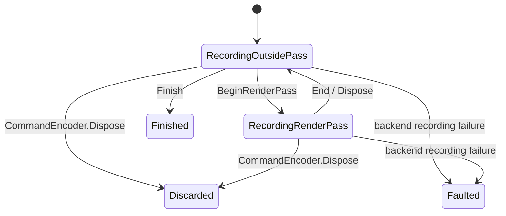

# ADR-0009: コマンドバッファと RenderEncoder による記録・送信

- 状態: 提案
- 日付: 2026-10-07

## 背景

[ADR-0004](0004-graphics-device.md) のコマンド記録・送信を具体化する。DirectX、Vulkan、WebGPU で描画パスとコマンド記録の境界が異なるため、公開 API の状態遷移、動的状態、描画引数、寿命を共通化する必要がある。

シェーダーと GPU データ参照は [ADR-0010](0010-shader-compilation-and-data-interop.md)、DeviceDesc と共通の Desc 規約は [ADR-0004](0004-graphics-device.md)、描画パス・pipeline・Draw の Desc は本 ADR を正本とする。本 ADR は描画方式を決める Renderer ではなく、GPU Core のコマンド記録 API を扱う。

## 決定

本 ADR は CommandEncoder によるコピー・バリア・dispatch の記録、CommandBuffer の確定と送信、Submission の完了、および RenderEncoder の描画パスを一つのコマンドライフサイクルとして扱う。コマンドの記録はリソースの CPU コピーと分離し、利用者が Finish／Submit と完了待機を明示する。

### コマンドと完了の公開 API

API 差分の比較元は origin/main（Graphics API は未導入）。

```diff
+namespace Lumyte.Graphics
+{
+    public sealed class CommandEncoder : IDisposable
+    {
+        // データの転送
+        // コピー用途、サイズ、アラインメントが有効であること
+        public void RecordCopyBuffer<TSource, TDestination>(BufferSlice<TSource> source, BufferSlice<TDestination> destination) where TSource : unmanaged where TDestination : unmanaged;
+
+        // テクスチャ Readback 用コピー
+        // 範囲・pitch・用途の正本は ADR-0006
+        public void RecordCopyTextureToBuffer(IGraphicsTexture source, BufferSlice<byte> destination, TextureCopyDesc desc);
+
+        // テクスチャ Upload
+        // 行ピッチとコピー範囲を検証
+        public void RecordCopyBufferToTexture(BufferSlice<byte> source, IGraphicsTexture destination, TextureCopyDesc desc);
+
+        // 描画パスの開始
+        // attachment と load／store を指定
+        // 終了まで別パスを開始しない
+        public RenderEncoder BeginRenderPass(RenderPassDesc desc);
+
+        // Compute 実行
+        // 描画パスの外
+        // グループ数と引数レイアウトを検証
+        public void Dispatch(ComputePipeline pipeline, ShaderArguments arguments, uint x, uint y, uint z);
+
+        // リソースの依存関係を宣言
+        // 前後のアクセス、BufferSlice／TextureView を指定
+        // パス外で呼ぶ
+        public void Barrier(ReadOnlySpan<ResourceDependency> dependencies);
+
+        // 記録の確定
+        // 一度だけ呼べる
+        // 以後 Encoder への記録は禁止
+        public CommandBuffer Finish();
+    }
+
+    public sealed class Submission
+    {
+        // GPU 完了確認
+        // 待機のキャンセルは送信済み処理を取り消さない
+        public bool IsCompleted { get; }
+
+        // GPU 完了確認
+        // 待機のキャンセルは送信済み処理を取り消さない
+        public ValueTask WaitAsync(CancellationToken cancellationToken);
+    }
+}
```

```diff
+namespace Lumyte.Graphics
+{
+    // Finish で生成する immutable な記録済み命令。直接 constructor は非公開。
+    public sealed class CommandBuffer : IDisposable
+    {
+        // 未送信の記録を破棄して lease を解放する。送信後の使用は GPU 完了まで保持する。
+        // 二重解放は無操作。二重送信は拒否する。
+        public void Dispose();
+    }
+}
```

### 記録・送信と完了の契約

CommandEncoder は Recording、描画パス中、Finished、Faulted、Disposed を区別する。Finish はパス外の Recording で一度だけ成功し、その後は記録を拒否する。Finish は GPU 処理を送信しない。GraphicsDevice.Submit は同じ Device の未送信 CommandBuffer を単一汎用キューへ一度だけ送信し、Submission を返す。送信順は保持し、キャンセルは送信済み処理を取り消さない。Device Lost は未完了の待機をエラーで終了する。

記録したリソースと引数は記録・送信中に変更・破棄・再利用できない。未送信のコマンド破棄で記録 lease を解放し、送信時には完了までの lease へ引き継ぐ。GPU 完了を観測してから Readback の CopyTo と再利用を許可する。Upload staging の確保と CopyFrom、GPU コピーの記録、送信、完了待機はすべて利用者が明示する。

Barrier は利用者が指定した範囲と producer／consumer のアクセスを native 遷移または resource scope へ変換する。buffer 自体はバリアを決定しない。WebGPU で合法な使用範囲を満たさない組合せは拒否し、依存宣言だけで不正な同時使用を許可しない。

### コマンドのバックエンド境界

以下は非公開の概念的なコマンド契約の抜粋。Token は内部 handle、結果／診断型と ABI layout は別途具体化する。Buffer の契約とは別に実装する。

```diff
+namespace Lumyte.Graphics.Implementation
+{
+    internal interface ICommandBufferBackendContract
+    {
+        // GPU コピーをコマンドへ記録する。検証後に参照を保持し、送信と実行は行わない。
+        void RecordCopyBuffer(EncoderToken encoder, BufferRange source, BufferRange destination);
+
+        // 利用者が指定した依存を native barrier／resource scope へ変換する。
+        // Buffer が依存を決定しない。利用者の明示的な Barrier のみを扱う。
+        void Barrier(EncoderToken encoder, ReadOnlySpan<ResourceDependency> dependencies);
+    }
+}
```

### RenderEncoder の責務と対象範囲

RenderEncoder は一つの描画パスに属し、attachment、graphics pipeline、viewport、scissor、blend constant、stencil reference、index buffer と描画コマンドを記録する。シーン、Mesh、Material、シェーダーのコンパイル、リソースの生成・Upload、画面表示は担当しない。

最初の共通契約は頂点シェーダーによる vertex pulling、通常描画、インデックス描画、複数 color attachment、depth／stencil、MSAA と color resolve を対象とする。Mesh Shader、間接描画、render bundle、subpass、occlusion query、複数 viewport は後続の拡張で扱う。

パイプラインが固定状態を持ち、RenderEncoder は動的状態だけを持つ。頂点の入力レイアウトや GPU アドレスを利用者へ公開しない。draw ごとの単一 ShaderArguments の解決は ADR-0010 に従う。

### RenderEncoder の公開 API 一覧

すべて `Lumyte.Graphics` 名前空間の C# シグネチャ案であり未実装である。RenderEncoder は利用者が直接生成できない sealed class とし、親 CommandEncoder の BeginRenderPass だけが生成する。コピー可能な struct によるパス終了状態の分裂を避ける。

API 差分の比較元は origin/main（Graphics API は未導入）。

```diff
+namespace Lumyte.Graphics
+{
+    public sealed class CommandEncoder : IDisposable
+    {
+        // パスを開始
+        // 親が RecordingOutsidePass
+        // Desc を検証・コピーしてから開始
+        // 全 attachment が同じデバイス
+        public RenderEncoder BeginRenderPass(RenderPassDesc desc);
+    }
+
+    public sealed class RenderEncoder : IDisposable
+    {
+        // graphics pipeline を選択
+        // パスの color format 順序、depth／stencil format、sample count と完全一致
+        // readonly aspect への書き込みは不可
+        public void SetPipeline(GraphicsPipeline pipeline);
+
+        // 一つの viewport を設定
+        // 座標・深度範囲の規約と検証は下記
+        // pipeline の切り替えで失効しない
+        public void SetViewport(Viewport viewport);
+
+        // 描画領域を制限
+        // パスの領域内
+        // pipeline の切り替えで失効しない
+        public void SetScissor(Scissor scissor);
+
+        // constant blend factor の値
+        // 有限の float4
+        // パス全体の動的状態で、既定値は全成分 0
+        public void SetBlendConstant(Color4 value);
+
+        // front／back 共通の stencil reference
+        // 初期の共通契約は 8-bit stencil、値は 0〜255
+        // 既定値 0
+        public void SetStencilReference(uint value);
+
+        // index の読み取り範囲を設定
+        // Index 用途、Uint16／Uint32、offset と length が要素サイズの倍数
+        // 元 Buffer の寿命は利用側が保持
+        public void SetIndexBuffer<T>(BufferSlice<T> indices, IndexFormat format) where T : unmanaged;
+
+        // 通常描画の簡易呼び出し
+        // firstVertex／firstInstance は 0
+        // 下記 DrawDesc 版と同じ検証
+        public void Draw(ShaderArguments arguments, uint vertexCount, uint instanceCount = 1);
+
+        // 開始位置を指定した通常描画
+        // pipeline と引数 ABI が一致
+        // 範囲・整数演算を検証
+        // 頂点データは引数の GPU データ参照から読む
+        public void Draw(ShaderArguments arguments, DrawDesc desc);
+
+        // インデックス描画
+        // pipeline と index buffer が設定済み
+        // index 範囲と strip format が一致
+        public void DrawIndexed(ShaderArguments arguments, IndexedDrawDesc desc);
+
+        // パスを終了
+        // Active → Ended を一度だけ行う
+        // parent を RecordingOutsidePass に戻す
+        public void End();
+
+        // using によるパス終了
+        // Active なら End、Ended なら何もしない
+        // GPU 完了待機や attachment 解放は行わない
+        public void Dispose();
+    }
+}
```

`Viewport(float X, float Y, float Width, float Height, float MinDepth = 0, float MaxDepth = 1)` は top-left 原点のピクセル座標を使用する。全値が有限、Width／Height > 0、領域内、0 ≤ MinDepth ≤ MaxDepth ≤ 1 を要求する。負の viewport height は公開しない。NDC の Z は 0〜1 とし、画面座標や winding を合わせる変換はバックエンドと対応 Slang モジュールが担当する。

`Scissor(uint X, uint Y, uint Width, uint Height)` は半開区間の整数ピクセル領域で、attachment の共通サイズに収まることを要求する。加算は overflow を検証する。Width／Height が 0 なら描画は pixel を更新しない。

パス開始時の viewport と scissor は attachment の全領域、pipeline と index buffer は未設定にする。blend constant は (0,0,0,0)、stencil reference は 0。パスをまたぐ状態の継承は行わず、状態は呼び出し以降の描画に作用する。

### 状態遷移と親 Encoder の制約



親 CommandEncoder は同時に一つのパスだけを持つ。パス中に BeginRenderPass、Copy、Dispatch、Barrier、Finish を呼ぶと InvalidOperationException とする。Draw、SetPipeline、動的状態の操作は Active の RenderEncoder だけで呼べる。

明示的な End の二重呼び出しや終了後の操作は InvalidOperationException とする。Dispose は idempotent とする。親の Dispose は記録済みコマンドを破棄し、開いた RenderEncoder も無効にする。無効化後の RenderEncoder.Dispose は解放済みの Native handle を触らず、通常の操作は失敗させる。Finish で得た CommandBuffer は親 Encoder の Dispose で破棄しない。

CPU 側の入力検証は Native コマンドを追加する前に行い、検証失敗時は直前の状態を維持する。Native の記録失敗は親を Faulted にし、Finish／Submit を許可しない。WebGPU の後から判明する validation error は関連する CommandBuffer／Submission に記録し、成功として隠さない。

### 描画状態と引数の契約

GraphicsPipeline は topology、rasterizer、depth／stencil test、blend、出力形式、sample count を固定状態として保持する。viewport、scissor、blend constant、stencil reference、index buffer は RenderEncoder の状態とする。共通契約は動的な depth test 切り替えを要求しない。

SetPipeline は物理 BindingPlan も選ぶ。ShaderArguments は同じデバイスで構築され、schema、library ABI、layout／BindingPlan の互換性が pipeline と一致する必要がある。論理 schema が同じでも物理 layout が異なる引数をそのまま流用しない。End は引数や参照先の GPU 使用を終了させず、Submission の完了まで保持する。

draw の count が 0 の場合は GPU の描画コマンドを省略してよいが、状態・引数・参照の検証は行う。first と count の加算は広い整数で検証する。DrawIndexed の firstIndex は設定済み index 範囲からの要素単位の offset とし、CPU が GPU index 内容を走査して頂点範囲を保証することは要求しない。参照が範囲内であることは利用者のシェーダー契約とする。

通常描画の論理 vertex index は firstVertex を含み、インデックス描画では index 値 + baseVertex とする。論理 instance index は firstInstance を含む。Slang のターゲット間で system-value の意味が異なる部分は、ライブラリの vertex／instance index helper と内部 draw metadata で正規化する。生の system-value を使うコードはこの正規化の保証対象にしない。

index buffer は GPU データ参照とは別のネイティブ index input であり、`BufferSlice<T>` の要素範囲で指定し、T は Uint16 で ushort、Uint32 で uint を要求する。TriangleStrip／LineStrip は GraphicsPipelineDesc の StripIndexFormat と同じ format が必要で、最大 index 値を restart として扱う。それ以外の topology では strip format を設定しない。

### Attachment と同期

初期の描画パスは mip 一つ・array layer 一つの 2D view を attachment に使う。選択 mip のサイズと source attachment の sample count はすべて一致させる。color は順序を保持する密な配列とし、depth／stencil のみのパスも許可する。attachment が一つもないパスは拒否する。

Clear は描画がなくても実行する。Load は以前の内容を読むことを宣言し、Store はパス後に内容を保持する。Discard は後続の内容を未定義とし、0 で初期化される保証を与えない。未初期化／Discard 後の内容を Load しない責任は利用者にある。

MSAA color resolve は End 時点に source を同形式・同サイズの single-sample target へ解決する。source の Store が Discard でも resolve を行う。resolve の target に独立した load／store は設定せず、内容を保存する。integer color format と depth／stencil resolve は初期の共通契約に含めない。

同じパスの attachment と ShaderArguments が重複 subresource を参照する組み合わせは、readonly depth／stencil も含めて初期契約では拒否する。attachment 同士と resolve target の重複も拒否する。異なる subresource の利用は backend が許可する範囲で検証する。

パス開始は attachment 使用を宣言するが、以前の GPU 書き込みとの依存関係を省略する根拠にはしない。パス外の Barrier と ResourceDependency で前後の読み書きを表現する。Backend は必要なリソース状態・layout と WebGPU の使用 scope を構築する。パス中の任意 barrier は提供せず、依存を分ける場合は End 後に barrier を挟んで次のパスを開始する。

### 所有権、スレッド、Native 境界

RenderEncoder は親が所有する記録 scope であり、attachment、pipeline、ShaderArguments、index buffer を所有しない。これらの Native リソースは記録開始から GPU 完了まで有効であることを要求する。Desc の配列と値は呼び出し時にコピーするが、参照先のリソースを複製しない。

親と RenderEncoder は同じ記録スレッドから操作し、並列利用しない。Dispose／End は送信も完了待機も行わない。ShaderArguments 内の実 GPU アドレスやディスクリプタの pack は各 Native 実装と Slang の対応モジュールに閉じ込める。

Native C ABI は parent／pass の opaque handle と値型 POD、attachment の配列、引数 handle を渡す。backend 固有の pipeline、command list、render pass handle を公開 API に出さない。WebGPU は同じ契約を Browser の実装に対応させる。

### RenderPassDesc と attachment

```diff
+namespace Lumyte.Graphics
+{
+    public sealed record RenderPassDesc
+    {
+        // Desc の構築では GPU 操作を行わない
+        // 生成・記録 API が検証する
+        public RenderPassDesc();
+
+        // 診断用ラベル
+        // 動作と互換性を変えない
+        public string? Label { get; init; } = null;
+
+        // 順序が出力 location に対応
+        // null の穴は許可しない
+        public IReadOnlyList<ColorAttachmentDesc> Colors { get; init; } = Array.Empty<ColorAttachmentDesc>();
+
+        // color が空の場合は必須
+        // attachment が一つ以上必要
+        public DepthStencilAttachmentDesc? DepthStencil { get; init; } = null;
+    }
+}
```

```diff
+namespace Lumyte.Graphics
+{
+    public sealed record ColorAttachmentDesc
+    {
+        // Desc の構築では GPU 操作を行わない
+        // 生成・記録 API が検証する
+        public ColorAttachmentDesc();
+
+        // 診断用ラベル
+        // 動作と互換性を変えない
+        public string? Label { get; init; } = null;
+
+        // color の D2 単一 mip／layer、RenderAttachment 用途
+        public required IGraphicsTextureView View { get; init; }
+
+        // Clear／Load
+        public LoadOp Load { get; init; } = LoadOp.Clear;
+
+        // Store／Discard
+        public StoreOp Store { get; init; } = StoreOp.Store;
+
+        // Load = Clear 時に使用
+        // format の numeric category と一致すること
+        public ClearColor ClearValue { get; init; } = ClearColor.Float(0,0,0,0);
+
+        // source が 4 samples、target が 1 sample、同 format・同サイズ
+        // integer format は不可
+        public IGraphicsTextureView? ResolveTarget { get; init; } = null;
+    }
+}
```

```diff
+namespace Lumyte.Graphics
+{
+    // ClearColor は Float(float r, float g, float b, float a)、Int(int r, int g, int b, int a)、UInt(uint r, uint g, uint b, uint a) の factory で作る tagged value とする
+    // Unorm／Srgb／Float format は Float、Sint は Int、Uint は UInt を要求する
+    // float 成分は有限値とする
+    // Srgb の clear 値は線形値として渡し、backend の render-target 書き込み規約に従って格納する
+    public readonly struct ClearColor
+    {
+        // format の numeric category に適合する値を作る。
+        public static ClearColor Float(float r, float g, float b, float a);
+        public static ClearColor Int(int r, int g, int b, int a);
+        public static ClearColor UInt(uint r, uint g, uint b, uint a);
+    }
+}
```

```diff
+namespace Lumyte.Graphics
+{
+    public sealed record DepthStencilAttachmentDesc
+    {
+        // Desc の構築では GPU 操作を行わない
+        // 生成・記録 API が検証する
+        public DepthStencilAttachmentDesc();
+
+        // 診断用ラベル
+        // 動作と互換性を変えない
+        public string? Label { get; init; } = null;
+
+        // depth／stencil の D2 単一 mip／layer、RenderAttachment 用途
+        public required IGraphicsTextureView View { get; init; }
+
+        // 使用する depth aspect の操作
+        // null はその aspect を使用しない
+        public DepthAttachmentOps? Depth { get; init; } = null;
+
+        // 使用する stencil aspect の操作
+        // null はその aspect を使用しない
+        public StencilAttachmentOps? Stencil { get; init; } = null;
+    }
+}
```

```diff
+namespace Lumyte.Graphics
+{
+    // Depth／Stencil の少なくとも一方が必要で、View が含む aspect に限る
+    // DepthAttachmentOps は bool ReadOnly = false、LoadOp Load = Clear、StoreOp Store = Store、float ClearValue = 1 を持つ
+    // depth clear は有限の 0〜1
+    // StencilAttachmentOps は同じ ReadOnly／Load／Store と uint ClearValue = 0 を持ち、値は 0〜255
+    public sealed record DepthAttachmentOps
+    {
+        public bool ReadOnly { get; init; } = false;
+        public LoadOp Load { get; init; } = LoadOp.Clear;
+        public StoreOp Store { get; init; } = StoreOp.Store;
+        public float ClearValue { get; init; } = 1;
+    }
+
+    public sealed record StencilAttachmentOps
+    {
+        public bool ReadOnly { get; init; } = false;
+        public LoadOp Load { get; init; } = LoadOp.Clear;
+        public StoreOp Store { get; init; } = StoreOp.Store;
+        public uint ClearValue { get; init; } = 0;
+    }
+}
```

使用しない aspect は backend 内部で readonly として扱い、clear／discard／書き込みを行わない。ReadOnly = true の aspect は Load = Load、Store = Store を要求し、clear／discard と pipeline の書き込みを拒否する。WebGPU では readonly aspect の native load／store フィールドを設定せず、この契約を表現する。使用しない aspect の test／write も pipeline で無効であることを要求する。

すべての attachment の source サイズ・sample count は一致し、Color 数は DeviceCaps.MaxColorAttachments 以下とする。alias、load／store、resolve の意味と寿命は ADR-0009 に従う。render area は共通サイズの全域とし、部分描画は viewport／scissor で指定する。

### GraphicsPipelineDesc

```diff
+namespace Lumyte.Graphics
+{
+    public sealed record GraphicsPipelineDesc
+    {
+        // Desc の構築では GPU 操作を行わない
+        // 生成・記録 API が検証する
+        public GraphicsPipelineDesc();
+
+        // 診断用ラベル
+        // 動作と互換性を変えない
+        public string? Label { get; init; } = null;
+
+        // vertex stage の compiled entry point
+        public required ShaderEntry Vertex { get; init; }
+
+        // color 出力がある場合は必須
+        // depth-only では省略可能
+        public ShaderEntry? Fragment { get; init; } = null;
+
+        // 各 stage と同じ linked program／schema／BindingPlan の layout
+        public required ShaderArgumentsLayout ArgumentsLayout { get; init; }
+
+        // PointList／LineList／LineStrip／TriangleList／TriangleStrip
+        public PrimitiveTopology Topology { get; init; } = PrimitiveTopology.TriangleList;
+
+        // strip の index 描画では Uint16／Uint32 が必要
+        // その他は null
+        public IndexFormat? StripIndexFormat { get; init; } = null;
+
+        // RenderPass の color 順序・format と一致
+        public IReadOnlyList<ColorTargetDesc> ColorTargets { get; init; } = Array.Empty<ColorTargetDesc>();
+
+        // null は depth／stencil attachment のない pipeline
+        public DepthStencilDesc? DepthStencil { get; init; } = null;
+
+        // 下記
+        public RasterizerDesc Rasterizer { get; init; } = new();
+
+        // 下記
+        public MultisampleDesc Multisample { get; init; } = new();
+    }
+}
```

ColorTargets が空の場合は DepthStencil が必要で、出力先のない pipeline は初期契約では拒否する。

```diff
+namespace Lumyte.Graphics
+{
+    // ShaderEntry(ShaderModule Module, string EntryPoint) は immutable な stage 参照で、entry の存在・stage・device を検証する
+    // stage 間の組み合わせは同じ composition ID と互換 layout を要求する
+    // ShaderArgumentsLayout は ADR-0010 の非 generic な共通基底契約とし、ShaderArgumentsLayout<T> が型付き契約を加える
+    // GPU アドレスや binding の数値は保持しても利用者に公開しない
+    public readonly record struct ShaderEntry
+    {
+        public ShaderEntry(ShaderModule module, string entryPoint);
+        public ShaderModule Module { get; }
+        public string EntryPoint { get; }
+    }
+}
```

```diff
+namespace Lumyte.Graphics
+{
+    // ColorTargetDesc は TextureFormat Format 必須、ColorWriteMask WriteMask = All、BlendDesc? Blend = null を持つ
+    // WriteMask は Red／Green／Blue／Alpha の flags（None も可）
+    // Blend = null は blending 無効
+    // fragment の出力 location、numeric type と format が一致し、blend は format capability に従う
+    public sealed record ColorTargetDesc
+    {
+        public ColorTargetDesc();
+        // 診断専用。動作と互換性を変えない。
+        public string? Label { get; init; } = null;
+        public required TextureFormat Format { get; init; }
+        public ColorWriteMask WriteMask { get; init; } = ColorWriteMask.All;
+        public BlendDesc? Blend { get; init; } = null;
+    }
+}
```

```diff
+namespace Lumyte.Graphics
+{
+    // BlendDesc は BlendComponentDesc Color = new() と BlendComponentDesc Alpha = new() を持つ
+    // BlendComponentDesc は BlendOperation Operation = Add、BlendFactor Source = One、BlendFactor Destination = Zero
+    // Operation は Add／Subtract／ReverseSubtract／Min／Max、Min／Max は factor が One／One の場合だけ受け付ける
+    // Factor は Zero／One／SourceColor／OneMinusSourceColor／SourceAlpha／OneMinusSourceAlpha／DestinationColor／OneMinusDestinationColor／DestinationAlpha／OneMinusDestinationAlpha／SourceAlphaSaturate／Constant／OneMinusConstant
+    // Alpha では color factor と SourceAlphaSaturate を拒否する
+    // dual-source blend は含めない
+    public sealed record BlendDesc
+    {
+        public BlendDesc();
+        // 診断専用。動作と互換性を変えない。
+        public string? Label { get; init; } = null;
+        public BlendComponentDesc Color { get; init; } = new();
+        public BlendComponentDesc Alpha { get; init; } = new();
+    }
+
+    public sealed record BlendComponentDesc
+    {
+        public BlendComponentDesc();
+        // 診断専用。動作と互換性を変えない。
+        public string? Label { get; init; } = null;
+        public BlendOperation Operation { get; init; } = BlendOperation.Add;
+        public BlendFactor Source { get; init; } = BlendFactor.One;
+        public BlendFactor Destination { get; init; } = BlendFactor.Zero;
+    }
+}
```

```diff
+namespace Lumyte.Graphics
+{
+    // RasterizerDesc は CullMode Cull = None、FrontFace FrontFace = CounterClockwise、int DepthBias = 0、float SlopeScaledDepthBias = 0、float DepthBiasClamp = 0 を持つ
+    // Cull は None／Front／Back
+    // bias の float は有限、Clamp != 0 は対応 feature が必要
+    // fill は Solid、depth clip は有効を共通契約とし、wireframe／depth clamp は今回含めない
+    // FrontFace はライブラリの座標規約で判断し、backend の viewport 変換で反転する場合は内部で補正する
+    public sealed record RasterizerDesc
+    {
+        public RasterizerDesc();
+        // 診断専用。動作と互換性を変えない。
+        public string? Label { get; init; } = null;
+        public CullMode Cull { get; init; } = CullMode.None;
+        public FrontFace FrontFace { get; init; } = FrontFace.CounterClockwise;
+        public int DepthBias { get; init; } = 0;
+        public float SlopeScaledDepthBias { get; init; } = 0;
+        public float DepthBiasClamp { get; init; } = 0;
+    }
+}
```

```diff
+namespace Lumyte.Graphics
+{
+    // MultisampleDesc は uint Count = 1、uint Mask = uint.MaxValue、bool AlphaToCoverage = false を持つ
+    // Count は 1 または 4、下位 Count bit だけを有効にする
+    // AlphaToCoverage は Count = 4、fragment が alpha を出力する location 0 の color target が必要
+    // Count とすべての attachment の source sample count が一致する
+    public sealed record MultisampleDesc
+    {
+        public MultisampleDesc();
+        // 診断専用。動作と互換性を変えない。
+        public string? Label { get; init; } = null;
+        public uint Count { get; init; } = 1;
+        public uint Mask { get; init; } = uint.MaxValue;
+        public bool AlphaToCoverage { get; init; } = false;
+    }
+}
```

### DepthStencilDesc

```diff
+namespace Lumyte.Graphics
+{
+    public sealed record DepthStencilDesc
+    {
+        // Desc の構築では GPU 操作を行わない
+        // 生成・記録 API が検証する
+        public DepthStencilDesc();
+
+        // 診断用ラベル
+        // 動作と互換性を変えない
+        public string? Label { get; init; } = null;
+
+        // RenderPass の view format と一致
+        public required TextureFormat Format { get; init; }
+
+        // depth aspect がない場合は Always
+        public CompareOp DepthCompare { get; init; } = CompareOp.Always;
+
+        // depth aspect が必要
+        // readonly attachment では true を拒否
+        public bool DepthWrite { get; init; } = false;
+
+        // true は stencil aspect が必要
+        public bool StencilEnabled { get; init; } = false;
+
+        // front／back の compare と操作
+        public StencilFaceDesc Front { get; init; } = new();
+
+        // front／back の compare と操作
+        public StencilFaceDesc Back { get; init; } = new();
+
+        // 0〜255
+        public uint StencilReadMask { get; init; } = 255;
+
+        // 0〜255
+        // readonly stencil では 0 または全操作 Keep が必要
+        public uint StencilWriteMask { get; init; } = 255;
+    }
+}
```

```diff
+namespace Lumyte.Graphics
+{
+    // StencilFaceDesc は CompareOp Compare = Always、StencilOp Fail = Keep、StencilOp DepthFail = Keep、StencilOp Pass = Keep を持つ
+    // StencilOp は Keep／Zero／Replace／IncrementClamp／DecrementClamp／Invert／IncrementWrap／DecrementWrap
+    // stencil reference の数値は Desc へ含めず RenderEncoder.SetStencilReference で指定する
+    public sealed record StencilFaceDesc
+    {
+        public StencilFaceDesc();
+        // 診断専用。動作と互換性を変えない。
+        public string? Label { get; init; } = null;
+        public CompareOp Compare { get; init; } = CompareOp.Always;
+        public StencilOp Fail { get; init; } = StencilOp.Keep;
+        public StencilOp DepthFail { get; init; } = StencilOp.Keep;
+        public StencilOp Pass { get; init; } = StencilOp.Keep;
+    }
+}
```

### ComputePipelineDesc

```diff
+namespace Lumyte.Graphics
+{
+    public sealed record ComputePipelineDesc
+    {
+        // Desc の構築では GPU 操作を行わない
+        // 生成・記録 API が検証する
+        public ComputePipelineDesc();
+
+        // 診断用ラベル
+        // 動作と互換性を変えない
+        public string? Label { get; init; } = null;
+
+        // compute stage の entry point、同じ Device
+        public required ShaderEntry Compute { get; init; }
+
+        // compiled program の schema／BindingPlan と一致
+        public required ShaderArgumentsLayout ArgumentsLayout { get; init; }
+    }
+}
```

threadgroup size は compiled artifact の numthreads／特殊化結果から取得する。Desc で別の値を重複指定せず、各次元と積を device limits に照合する。dispatch の group count は CommandEncoder.Dispatch の引数で指定する。実行時に numthreads を変更するには別の compiled artifact を生成する。

### DrawDesc／IndexedDrawDesc

```diff
+namespace Lumyte.Graphics
+{
+    public sealed record DrawDesc
+    {
+        // count = 0 は有効
+        // first と count の和は index の表現範囲内
+        public DrawDesc();
+        public string? Label { get; init; } = null;
+        public required uint VertexCount { get; init; }
+        public uint InstanceCount { get; init; } = 1;
+        public uint FirstVertex { get; init; } = 0;
+        public uint FirstInstance { get; init; } = 0;
+    }
+
+    public sealed record IndexedDrawDesc
+    {
+        // index 範囲が SetIndexBuffer した BufferSlice に収まること
+        // BaseVertex は符号付き
+        public IndexedDrawDesc();
+        public string? Label { get; init; } = null;
+        public required uint IndexCount { get; init; }
+        public uint InstanceCount { get; init; } = 1;
+        public uint FirstIndex { get; init; } = 0;
+        public int BaseVertex { get; init; } = 0;
+        public uint FirstInstance { get; init; } = 0;
+    }
+}
```

IndexFormat は Uint16／Uint32。primitive の不足する末尾は Native API の規約に従って描画されず、count を topology の単位へ丸めない。開始 index と instance の正規化、count = 0 の検証、index の内容による頂点アクセスは ADR-0009 に従う。

### 利用例

```csharp
var textureDesc = new TextureDesc {
    Size = new Extent3D(1280, 720, 1),
    Format = TextureFormat.Rgba8Unorm,
    Usage = TextureUsage.RenderAttachment | TextureUsage.Sampled,
};

// view は MipLevelCount = 1、ArrayLayerCount = 1 で作成済みとする。
using var render = commands.BeginRenderPass(new RenderPassDesc {
    Colors = new[] { new ColorAttachmentDesc {
        View = view,
        ClearValue = ClearColor.Float(0, 0, 0, 1),
    } },
});
render.SetPipeline(pipeline); // color format と sample count が一致するもの
render.Draw(arguments, new DrawDesc { VertexCount = 3 });
```

## 検討した代替案

### CommandEncoder に全描画操作を置く

公開型は減るが、パス外の draw とパス中の Copy／Dispatch を区別しにくい。描画操作を RenderEncoder へ限定し、親との状態遷移も検証する。

### 任意の depth／blend／rasterizer 状態をすべて動的にする

柔軟だが、WebGPU などで pipeline 再生成が必要になる。共通契約は固定状態を GraphicsPipelineDesc に置き、一般的な動的状態だけを RenderEncoder に置く。

### End がすべての GPU 使用と解放を完了させる

利用者の寿命管理は単純になるが、毎パスで CPU を待機させる。End は記録 scope の終了だけにし、GPU 完了は Submission で扱う。

## 結果と影響

- 描画パスの状態を公開型と検証で表現でき、バックエンド固有の記録方法を内部へ閉じ込められる。
- 固定状態と動的状態、index input と shader data の責務が明確になる。
- pipeline の互換性、引数 ABI、resource scope、GPU 完了までの寿命の検証が必要になる。
- 初期の共通契約では一部の高度な描画機能と attachment の同時参照を制限する。必要になった場合は機能拡張として設計する。
- 本 ADR は未実装の提案であり、GPU 上の結果・Native の状態遷移・性能は未検証である。

## 検証方針

Desc の必須項目、既定値、enum の不明値、null、数値境界・overflow、配列 snapshot、device 不一致、shader stage と layout 不一致を確認する。各 backend で format・sample count・readonly aspect、integer clear／blend、resolve、strip index format を検証する。

実装時は状態遷移、パスの二重開始・終了、親の破棄、Dispose の再実行、Finish の条件を確認する。validation failure の後で CPU 側の記録状態が変わらないことも確認する。

各 backend で通常／index 描画、firstVertex／baseVertex／firstInstance、pipeline 切り替え、viewport／scissor、blend constant、stencil reference、depth-only、MSAA resolve と Clear／Load／Discard を Readback で確認する。ABI・format・sample count の不一致、attachment の重複、GPU 完了前の解放を拒否できることを確認する。

今回の PR では文書の規約、公開 API と Desc の対応、ADR-0004〜0011 との相互参照を確認し、実装のビルド・GPU テストは行わない。

## 別途決定する事項

- Mesh Shader、間接描画、query、render bundle、複数 viewport、並列記録。
- 同一 subresource を attachment と shader resource に同時使用する拡張。
- depth／stencil コピー・resolve、sample count 拡張、wireframe／depth clamp、dual-source blend。
- Native C ABI の全宣言と、ターゲット別の vertex／instance index helper の実装。

## 参考資料

- [グラフィックス共通契約](0004-graphics-device.md)
- [Slang コンパイルと GPU データ受け渡し](0010-shader-compilation-and-data-interop.md)
- [バインディング](0008-resource-bindings.md)
- [WebGPU render pass](https://www.w3.org/TR/webgpu/#render-passes)
- [NoGraphicsAPI 公開 API](https://github.com/sebbbi/NoGraphicsAPI/blob/04004140f5b3b8ec7c566fd43bfed77d586155f8/include/NoGraphicsAPI/NoGraphicsAPI.hpp)
