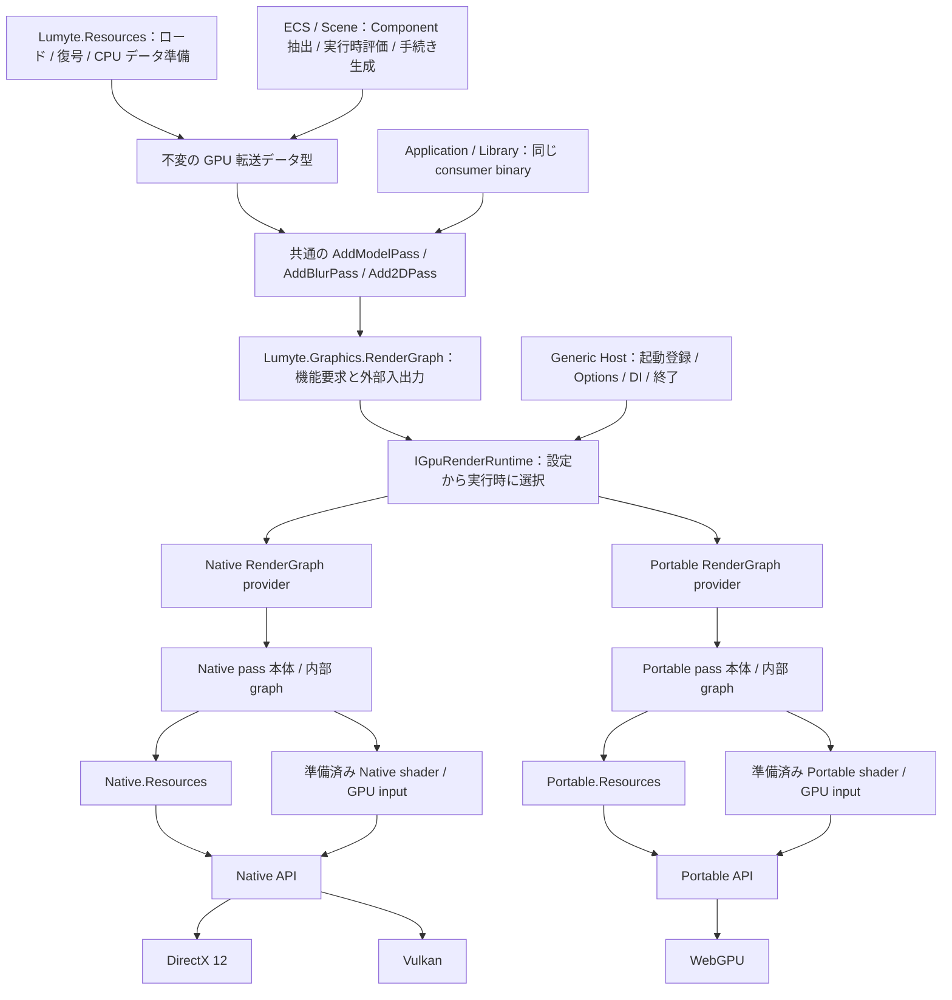

# Graphics ADR

Lumyte Graphics の目標設計を定義する。採用は実装完了を意味しない。旧 API／shader ABI との互換層は設けない。

Native メモリ基盤から実装を開始している。現在の実装済み API、実機で確認した範囲と残作業は [実装進捗](../designs/graphics-implementation-progress.md) を参照する。

## 共通化する境界

**Model 描画・ブラー・2D 描画など、機能 pass を追加する API を共通化する。利用 library／application は再コンパイルせず同じ binary で Native／Portable を選択できる。** pass の実装本体と shader は二系統で用意し、各 API に合わせて独立して最適化する。

library は機能の追加 API に、Model、camera、画像、半径、2D scene などを渡す。共通 `AddPass(name, contract, request)` は不変 CPU request と外部 Read／Write を登録し、GPU 記録 callback は受け取らない。Compile は機能の依存を整理し、SubmitAsync が選択系統の pass 本体を呼び出して準備・記録・提出する。

共通 graph の import/export と `IGpuGraphResources` の scope／pin／準備済み package の GPU 転送には共通の opaque resource ref を使う。通常の機能用 GPU data、view、descriptor／binding、転送は各 pass 実装が Native Resources／Portable Resources で準備する。下位の型を利用側へ渡さない。低レベル API と各 Resources は直接利用もできるが、その専用経路は共通 RenderGraph の binary 保証と区別する。

選択する provider、両系統の pass 実装とその shader artifact は配布・登録しておく。共通 contract version と CPU 実行環境の互換性を前提とし、異なる OS／CPU 向け executable の変換や、実行中の GPU 資源の移送は保証しない。AOT でも事前登録した実装を選べる。

準備済みのデータを渡す境界を採用する。Graphics はファイルや asset ID を受け取ってロードせず、画素、geometry、material、評価済み変形、glyph 輪郭と配置などが揃った不変データを受け取る。静的資産は Lumyte.Resources、実行時の動的データは ECS／scene 等の上位から同じ型で供給できる。共通の内容 key は cache の世代管理に使い、I/O の解決先にはしない。

## 起動時の登録と DI

provider、機能 pass、shader 準備と presentation の登録は Generic Host の composition root に集める。`services.AddLumyteGraphics()` と各機能の extension で定義を登録し、Options で実行先を設定する。登録中や DI の同期 factory では GPU 生成・I/O を行わず、非同期起動で登録と設定を確定して選択 runtime を準備する。

利用側は DI された `IGpuGraphicsSessionAccessor` から初期化時に一度 session を取得し、借用した runtime／render context を使う。毎 frame の登録や DI 解決は行わない。`GpuRenderProviderRegistry` 等は Hosting integration と手動 composition が使う下位 API とする。低レベル API と共通 RenderGraph は Microsoft.Extensions に依存させない。

Host が一つの所有者として起動失敗の回収と終了を担当し、GPU 利用が終わるまで runtime と CPU 依存を保持する。詳細、登録 API と利用例は [Generic Host と DI](0037-graphics-hosting-and-di.md) に定める。

## 連続描画で再利用するもの

共通 RenderGraph の構造は一度 Compile し、以後は `GpuGraphInput<T>` に対応する不変 bindings を更新して同じ plan を提出する。半径・色・camera・draw の値だけでは Compile し直さない。表示 target も固定の logical texture input へ今回取得した参照を設定する。pass、外部依存、出力形状が変わる場合に構造を作り直す。

Model は `ModelDrawList` の安定した handle へ Set／Remove を送り、2D は保持 scene の変更 node を編集する。snapshot と CPU データの所有情報は未変更部分を共有し、各本体は部品の差分転送と描画記述の再利用を行う。ECS やファイル形式の管理は上位に保つ。

Unity／Unreal／Three.js の一次資料との比較、処理段階ごとの性能評価と未実測の範囲は [描画の再利用と部分更新](../designs/rendering-reuse-and-updates.md) にまとめる。60 FPS は実機・描画量に応じて測定し、再利用方式を採用しただけで達成済みとはしない。

snapshot・使用保持・GPU 内容世代と提出結果の共通規範は [ADR 0030](0030-render-graph-api.md#所有同期失敗) に集める。各 provider は内容世代の登録・取得 SPI と低層 completion への接続、Model／2D は部品や atlas 固有の依存を定める。ADR 0030 の使用例は初回の target description 取得と resize による plan 再構築まで扱う。

最初の統合は [ADR 0034 の段階 0](0034-render-pass-categories.md#実装順と完了条件) に従い、起動から Clear／Copy／Output、提出結果、回収、終了までを同じ consumer binary で通す。[全体レビューと対応状況](../designs/graphics-architecture-review.md) には設計修正と未実装を分けて記録する。

## Native と Portable の責務

| 項目 | Native | Portable |
| --- | --- | --- |
| 基盤 | DirectX 12／Vulkan、NoGraphicsAPI を基礎とする | WebGPU を最初の実装先とする独立 API |
| 資源参照 | Bindless、descriptor index、対応 target の shader pointer | 明示的な binding layout と binding set |
| 線形 data | 統一 heap 上の linear region／range | Buffer object と range |
| メモリ取得 | Buffer 相当の線形 data と Texture の共通 allocation、明示配置 | Buffer／Texture を必要メモリ込みで直接生成。事前の heap 作成と明示配置は不要 |
| シェーダー | Native entry と共有計算 Slang → DXIL／SPIR-V | Portable entry と共有計算 Slang → WGSL、または明示した直接 WGSL |
| mesh 描画 | Mesh と任意の Amplification を追加機能として提供。Model 本体が従来経路と選択 | vertex／indexed draw と compute で同じ機能を実装。mesh command のエミュレーションは行わない |
| GPU 初期化用 package／構造体 | Native 専用。I/O は Lumyte.Resources | Portable 専用。I/O は Lumyte.Resources |
| PSO | NoGraphicsAPI の分解を取り入れ、target 差を明示 | binding layout と固定 state を持つ WebGPU 向けの論理 pipeline |
| 同期 | global dependency と必要な明示 transition | command／pass の順序と WebGPU が管理する状態遷移 |
| 管理ライブラリ | heap／region／texture pool、descriptor slot、自動退役 | resource／view／binding cache、object pool、自動退役 |
| 機能 pass 本体 | Native の command と shader で内部 graph を組み立てる | Portable の command と shader で別の内部 graph を組み立てる |
| RenderGraph provider | Native の内部使用に合わせた barrier、配置、command 記録 | Portable の内部使用に合わせた resource 生成、binding、pass 記録 |

Portable に Bindless を要求せず、エミュレーションも行わない。global descriptor profile、共通 index 空間、型領域の全 slot 初期化・延命は不要になる。Native の descriptor heap と slot ownership は維持し、その自動割当を選んだ場合だけ Native Resources が担当する。

共通の機能 contract が入力・出力と外部から見える振舞いを定める。利用側は shader を管理しない。新しい pass の作者は共通 contract と Native／Portable の二つの本体を提供し、それぞれの shader source と GPU 構造体、pipeline、内部資源を管理する。artifact の I/O と展開は Lumyte.Resources が済ませ、host が準備済み package を本体に渡す。

shader の計算は Slang module として部分共有する。BRDF、色変換、filter、幾何・coverage 等の関数を共通化し、entry point、resource、root、mesh payload と GPU 入力 ABI は二系統で定義する。Native の完成 artifact を WGSL へ変換したり、同じ GPU 構造体で両系統を動かしたりする方式ではない。具体的な共有範囲と例は [ADR 0033](0033-feature-render-passes.md#slang-source-の部分共有)、Portable の build と直接 root の条件は [ADR 0023](0023-shader-design-and-api.md) に定める。

Slang の通常の push constant 宣言は直接 root に変換されないため、Portable 専用 accessor と WGSL 相互運用機能を使う。Slang 2026.17 の生成物を変更せず実 GPU で動かす最小実験は成功した。[実験結果](../designs/slang-wgsl-root-investigation.md) に版・配置・再現手順を残し、toolchain を固定して採用する。未対応の shader 機能では作者が直接 WGSL authoring を明示して用意する。root の buffer 化やコンパイル失敗時の暗黙切替えは行わず、全 pass への移植完了とは扱わない。

機能の内部 pass 数、compute／raster の選択、batching、workgroup、material や構造体配列の byte layout は各実装が決める。共通の Draw／Dispatch IR や shader 入力 adapter を共通化の中心に置かない。各 pass が準備済み入力から自分の GPU data を構成して明示 upload し、shader library から上位 Graph 型へ依存させない。

root data は各系統の直接入力機能を使い、buffer fallback を行わない。共通の固定 byte 数は設けない。command は Parameter Data を生成・upload・所有しない。Portable の uniform／storage data も明示的な resource と転送で用意する。

## 文書構成と依存順

各 ADR は小さい番号の ADR にだけ依存する。0001 が境界、0002〜0015 が Native、0016〜0027 が Portable、0028〜0029 が独立した管理機構、0030 が共通 RenderGraph、0031〜0032 が各 provider の実装、0033 が共通実装規約、0034 が機能カテゴリと標準画像処理、0035 が汎用モデル描画、0036 が 2D と文字描画、0037 がこれらを構成する Generic Host と DI を定める。低レベル backend と Graph provider の実装詳細はそれぞれ別文書に置く。

| ADR | 担当 |
| --- | --- |
| [0001 Graphics](0001-graphics-api.md) | 二系統の構成、package、機能 pass の共通境界、検証と所有 |
| [0002 Native Graphics](0002-native-graphics-api.md) | device、capability、limit |
| [0003 Native Memory Allocation](0003-native-memory-allocation-api.md) | 純粋な共通 heap と opaque requirement |
| [0004 Native Linear Data](0004-native-linear-data-api.md) | region の配置、range、CPU／GPU address |
| [0005 Native Texture](0005-native-texture-api.md) | description、requirement、明示配置 |
| [0006 Native View](0006-native-view-api.md) | 非所有 view と render view |
| [0007 Native Bindless](0007-native-bindless-api.md) | resource／sampler index と shader 参照 |
| [0008 Native Descriptor](0008-native-descriptor-api.md) | caller-owned storage と slot 書込み |
| [0009 Native Shader](0009-native-shader-api.md) | raw target code、entry point と直接 root ABI |
| [0010 Native PSO](0010-native-pipeline-state-api.md) | pipeline／state の分解、提出時の PSO 解決 |
| [0011 Native Command Recording](0011-native-command-recording-api.md) | rendering、work、copy、明示 barrier |
| [0012 Native 提出と同期](0012-native-command-submission-and-synchronization.md) | 受理、queue、completion と CPU 待機 |
| [0013 DirectX 12](0013-directx12-backend-implementation.md) | Native API の DX12 実装と採用差分 |
| [0014 Vulkan](0014-vulkan-backend-implementation.md) | Native API の Vulkan 実装と採用差分 |
| [0015 Native Shader Package](0015-native-shader-package-api.md) | Slang compiler、準備済み Native artifact、生成構造体と program 初期化 |
| [0016 Portable Graphics](0016-portable-api.md) | 独立した device と機能境界 |
| [0017 Portable Resource のメモリ所有](0017-resource-memory-model.md) | 生成時のメモリ確保と resource 単位の所有・解放 |
| [0018 Portable Buffer](0018-buffer-api.md) | Buffer object の直接生成、mapping と明示転送 |
| [0019 Portable Texture](0019-texture-api.md) | Texture object、生成と copy |
| [0020 Portable View](0020-view-api.md) | view、range、sampler と attachment |
| [0021 Portable Binding Layout](0021-binding-layout-api.md) | 明示的な group／binding と入力 layout |
| [0022 Portable Binding](0022-binding-api.md) | immutable binding set の生成と使用 |
| [0023 Portable Shader](0023-shader-design-and-api.md) | Slang／WGSL authoring、WGSL artifact、準備済み Portable package、生成構造体と GPU 初期化 |
| [0024 Portable PSO](0024-pipeline-state-api.md) | WebGPU に適した pipeline と提出時の生成 |
| [0025 Portable Command Recording](0025-command-recording-api.md) | pass、binding、直接入力、work と copy |
| [0026 Portable 提出と同期](0026-command-submission-and-synchronization.md) | queue 受理と completion |
| [0027 WebGPU](0027-webgpu-backend-implementation.md) | Portable API の WebGPU 実装 |
| [0028 Resource Utilities](0028-resource-utilities.md) | 系統別 arena／pool の明示的な貸出・返却 |
| [0029 Resource Management](0029-resource-management-api.md) | 独立した二管理 API、依存と寿命、提出 token、転送、自動 descriptor／binding と遅延回収 |
| [0030 共通 RenderGraph](0030-render-graph-api.md) | 固定の機能構成と依存、型付き入力と bindings、plan 再利用、GPU 転送型、提出と presentation |
| [0031 Native RenderGraph 実装](0031-native-render-graph-implementation.md) | Native provider、専用 pass 本体の SPI、内部 graph と heap／descriptor／command |
| [0032 Portable RenderGraph 実装](0032-portable-render-graph-implementation.md) | Portable provider、専用 pass 本体の SPI、内部 graph と resource／binding／pass |
| [0033 機能 RenderPass](0033-feature-render-passes.md) | 共通 contract、作者による二系統の本体と shader 所有 |
| [0034 レンダーパスのカテゴリ](0034-render-pass-categories.md) | 初期化・転送、画像処理、合成・表示、モデル、2D の分類と実装順 |
| [0035 モデル描画](0035-model-render-passes.md) | 汎用の保持描画集合、部品と範囲の更新、ECS と動的入力、glTF の必要描画能力 |
| [0036 2D・文字描画](0036-2d-render-passes.md) | 準備済み画像・glyph・配置データ、path／layer と既存描画能力 |
| [0037 Generic Host と DI](0037-graphics-hosting-and-di.md) | 起動時の登録と設定、非同期初期化、DI からの借用、GPU と CPU 依存の終了 |

各 ADR に担当 API の説明、コード配置、使用例、未実装範囲を置く。例は目標設計を示し、現行コードでのコンパイル・動作は保証しない。

## コード配置の共通規約

各 ADR の「コード配置」は repository root 相対の目標パスであり、コードと project が既に存在することを示さない。既存 project は責務を改編し、「新設予定」は実装時に追加する。同じ project を複数 ADR が担当してよく、ADR ごとに assembly を作らない。project 内のサブディレクトリは責務の整理であり、新しい公開 namespace や API を自動的に追加するものではない。

Graphics の production project は `src/graphics/<Project>/<Project>.csproj` に置く。現在の solution の source 配置に従い、repository 直下の過去の build 出力ディレクトリには実装を追加しない。以下の表は project の対応表であり、担当する型・実装のサブディレクトリは各 ADR が定める。

| 配置先 | 目標の責務／現状 |
| --- | --- |
| `src/graphics/Lumyte.Graphics/` | 基礎値。既存 project を改編 |
| `src/graphics/Lumyte.Graphics.Native/`、`src/graphics/Lumyte.Graphics.Portable/` | 二系統の低レベル API。作成済み |
| `src/graphics/Lumyte.Graphics.DirectX12/`、`src/graphics/Lumyte.Graphics.Vulkan/`、`src/graphics/Lumyte.Graphics.WebGPU/` | 対応 backend。既存 project を改編 |
| `src/graphics/Lumyte.Graphics.WebGPU.Browser/` | WebGPU の browser 接続。既存 project を改編 |
| `src/graphics/Lumyte.Graphics.Native.Shaders/`、`src/graphics/Lumyte.Graphics.Portable.Shaders/` | 準備済み shader package と GPU 初期化。runtime は実装済み |
| `tools/Lumyte.Graphics.Native.Shaders.Offline/`、`tools/Lumyte.Graphics.Portable.Shaders.Offline/` | 系統別の offline compiler、package 生成と下位 GPU 入力生成。新設予定 |
| `src/graphics/Lumyte.Graphics.Native.Resources/`、`src/graphics/Lumyte.Graphics.Portable.Resources/` | utility と管理層を実装済み。scope／batch、完了と回収、descriptor／binding、package 転送 |
| `src/graphics/Lumyte.Graphics.Native.Resources.Generators/`、`src/graphics/Lumyte.Graphics.Portable.Resources.Generators/` | 準備済み schema から managed resource 入力を作る build 用生成器。実装済み |
| `src/graphics/Lumyte.Graphics.RenderGraph/` | 共通 graph／入力／runtime 契約。既存 project を改編 |
| `src/graphics/Lumyte.Graphics.Native.RenderGraph/`、`src/graphics/Lumyte.Graphics.Portable.RenderGraph/` | provider、専用 SPI と内部 graph。新設予定 |
| `src/graphics/Lumyte.Graphics.Portable.RenderGraph.Generators/` | Portable の内部 logical binding 入力を作る build 用生成器。新設予定 |
| `src/graphics/Lumyte.Graphics.Passes/` | 共通機能契約、Model の CPU データ、AddPass extension。新設予定 |
| `src/graphics/Lumyte.Graphics.TwoD.Primitives/` | scene と glyph が共有する path／paint 等の CPU 値。新設予定。namespace は Lumyte.Graphics.TwoD を使う |
| `src/graphics/Lumyte.Graphics.TwoD/`、`src/graphics/Lumyte.Graphics.Text/` | scene と準備済み文字データ。既存 project を改編。TwoD → Text → TwoD.Primitives の依存とし、Text から scene へ参照しない |
| `src/graphics/Lumyte.Graphics.Native.Passes/`、`src/graphics/Lumyte.Graphics.Portable.Passes/` | 機能本体、専用 GPU データ、shader source と cache。新設予定 |
| `src/graphics/Shaders/Shared/` | build 用の共有 Slang module。Math／Color／ImageProcessing／Models／TwoD に計算処理を置く。独立した runtime project や共通 GPU ABI は作らない |
| `src/graphics/Lumyte.Graphics.Hosting/`、`src/graphics/Lumyte.Graphics.Native.Hosting/`、`src/graphics/Lumyte.Graphics.Portable.Hosting/`、`src/graphics/Lumyte.Graphics.Passes.Hosting/` | Host と DI、系統別／機能別の登録。新設予定 |
| `src/devtools/Lumyte.DevTools.Host/Graphics/` | 既存 Host 内に新設予定。platform／Resources と Graphics の composition |
| `samples/graphics/Lumyte.Graphics.Hosting.Sample/` | 新設予定。起動設定と同一描画 API の利用を示す application |
| `benchmarks/Lumyte.Benchmarks/Graphics/` | 既存 benchmark project 内に追加する CPU／GPU の計測 |

テストは xUnit とし、production の隣に同名の `Lumyte.<Area>.Tests` project を置く。offline tool のテストも `tools/` 内で隣接させる。実 GPU、browser、外部 compiler process を使う試験は `Integration/` または `Conformance/` に配置し、category 等で高速な CPU 試験とは実行を区分する。生成器は生成した API を compile・実行する consumer 試験で確認する。新しい project は実装時に `Lumyte.slnx` へ追加する。

系統別 entry と resource／root 宣言は各 pass の `<Feature>/Shaders/` に置き、Native は Slang、Portable は Slang または直接 WGSL とする。共有する計算だけを `src/graphics/Shaders/Shared/` の Slang module に置く。生成 C# と artifact は利用 project の `obj/<Configuration>/<TargetFramework>/Shaders/<Family>/`、内部 graph 入力はその `Graph/` に置く。管理入力生成器のディスク出力は `obj/<Configuration>/<TargetFramework>/Shaders/Resources/<analyzer名>/` を既定とし、両系統の analyzer と利用側の出力設定を共存させる。Slang が生成した WGSL も build の出力先へ置き、手書き WGSL と区別する。配布 package は build の成果物から application の資産へ取り込み、生成物を手書き source の正として管理しない。offline compiler と各生成器は build 用であり、runtime project から tool の assembly を参照しない。

既存の `Lumyte.Graphics.Library`、`Lumyte.Graphics.Shader`、`Lumyte.Graphics.Shader.Browser` と `tools/Lumyte.Graphics.Shader.Offline` は必要な実装の移植元とし、互換用の新規実装を追加する配置先にはしない。ファイル取得・decode は `src/resources/`、window／event loop は `src/platform/`、ECS と application 固有の抽出・評価は利用側に置く。この文書更新では project の作成や source の移動は行わない。

## 実装するレンダーパス

| カテゴリ | 機能 | 設計 |
| --- | --- | --- |
| 初期化・転送 | Clear、Texture Copy | [標準機能](0034-render-pass-categories.md) |
| 画像処理 | Blit、Blur | [標準機能](0034-render-pass-categories.md) |
| 合成・表示 | Composite、ToneMap、Output | [標準機能](0034-render-pass-categories.md) |
| モデル描画 | 汎用モデル、ECS からの描画データ、動的 geometry／material／変形、glTF 2.0 core と採用拡張、PBR | [モデル描画 ADR](0035-model-render-passes.md) |
| 2D 描画 | 図形、path、画像、文字、clip、layer と合成 | [2D 描画 ADR](0036-2d-render-passes.md) |

Model の内部の透明描画や変形、2D の atlas／mask／layer blur は、それぞれの本体が組み立てる。共通の AddDraw／AddCompute に shader を渡して利用者が組み直す方式にはしない。

モデル描画の入口は `ModelRenderSnapshot(Camera, Draws, Lighting)` とし、`Draws` は geometry、material、LocalToWorld、任意の変形と描画範囲を組み合わせた `ModelDrawItem` の不変列とする。Draws は `ModelDrawList.Snapshot()` が返す共有状態であり、変更 item だけ更新しても未変更の全列を作り直さない。geometry、頂点属性、index、material、skin palette、morph weights は独立した内容世代を持ち、Component ごとの共有や変更に合わせて更新できる。ノード階層や Entity／Component の格納は上位 ECS／scene に任せ、平坦な描画項目を抽出して渡す。

glTF 2.0 core と採用する五拡張を描画できる能力を必須とし、ファイル形式の解釈と required extension の判定は Lumyte.Resources が扱う。他形式や手続き生成にも同じ入力を使い、animation／物理の評価済み変形や動的な頂点・材質を Resources へ迂回させず供給できる。

2D は repository の `Lumyte.Graphics.TwoD`／`Text` と同等の能力を基準にする。stroke の詳細設定、全描画要素での拡張 gradient／path clip など、現行の部分実装は新しい契約で完成させる。段落 layout、font fallback、SVG 変換は Lumyte.Resources の分野とし、Graphics は結果の転送／描画データを受け取る。image brush、nine-slice は描画機能の追加提案として分ける。既存型の GPU 管理を含む API との互換性は残さない。

表示の典型的な順序は Model → ToneMap → 2D／Composite → Output とする。Output は画素の符号化であり、実際の提出と Present は共通 frame が行う。追加の後処理、時間履歴、解析・debug はカテゴリ表の必須機能とは別に検討する。

## メモリと管理

Native は一種類の `NativeGpuHeap` でメモリを取得し、その上に線形 region と texture を配置する。用途別 pool は管理方針であり、低レベルの heap 型を再び分けるものではない。共通の native allocation が成立しない要件は生成時に失敗し、低レベル API が自動分割しない。

Resources の package は resource、view、shader 用参照、upload と寿命をまとめる。低レベルの Native Resources には `SingleAllocation` を残し、Portable Resources は Buffer／Texture を直接生成する。共通 facade は共通 export を持つ準備済みの GpuPackageUploadData を受け取る。通常の Model 等も request に転送データを含め、各 pass 実装が GPU 資源を構成する。配置方針と系統別 payload は実装の内側で選ぶ。package の一括所有を物理 allocation の統合と同一視しない。

`Lumyte.Resources` はロード、復号、CPU データ準備と asset／世代／依存を扱う。ECS／scene 等は実行時の状態を評価し、同じ不変転送データを直接供給できる。Graphics は GPU への転送データ型を定義し、配置・転送の実装を二系統に分ける。glTF decoder、font loader、URI resolver や ECS の管理 API を Graphics に定義しない。GC の詳細、予算に基づく未使用資産の eviction と CLR GC 連動は [GPU リソース管理の設計案](../designs/gpu-resource-management.md) に分け、確定した scope／pin／batch と GPU completion による回収契約と区別する。

## 検証と実装方針

native API と WebGPU runtime が検証できる usage、format、shader、pipeline／binding、GPU 同期を独自 validator で複製しない。Lumyte は自分の CPU memory、package／入力 ABI、所有世代、allocation／回収、graph の依存計画を扱う。

許可 ViewFormats の列挙、command の Abort／内部状態公開、raster PSO の事前準備 API は設けない。必要な raster PSO は提出された batch の使用組合せから解決する。GPU completion 前の resource／descriptor／binding 再利用は行わない。

実装は Native 基盤と DX12／Vulkan の適合確認を先に進める。Portable と WebGPU は独立した経路として実装し、それぞれの shader toolchain と Resources で機能 pass を実装し、専用 RenderGraph provider へ登録する。

適合試験は、一度だけビルドした同じ consumer assembly を両 provider で実行する。公開 signature に下位型が漏れていないこと、同じ機能 pass の出力、所有と失敗の振舞いを確認する。provider ごとに consumer をビルドし直したり、shader bytes や native command 列の一致だけを調べたりして要件達成としない。

## 参考資料と採用範囲

Native の参考は [NoGraphicsAPI](https://github.com/sebbbi/NoGraphicsAPI)、[公開 header](https://github.com/sebbbi/NoGraphicsAPI/blob/main/include/NoGraphicsAPI/NoGraphicsAPI.hpp)、[原案との比較](https://github.com/sebbbi/NoGraphicsAPI/blob/main/docs/no-graphics-api-comparison.md)、[Vulkan 対応](https://github.com/sebbbi/NoGraphicsAPI/blob/main/docs/vulkan-support.md)、[Slang 契約](https://github.com/sebbbi/NoGraphicsAPI/blob/main/docs/slang.md) とする。Portable は [WebGPU 仕様](https://www.w3.org/TR/webgpu/) と [WGSL 仕様](https://www.w3.org/TR/WGSL/) に従う。

NoGraphicsAPI の原案、参照実装、Lumyte の採用範囲を区別する。統一 allocation、線形 region の identity、DX12 の表現差、Resources と RenderGraph は Lumyte の設計である。Native で原案どおり提供できない部分は部分採用とし、各 ADR の末尾に示す。Portable に Native の設計思想をそのまま再現させることは目的にしない。
