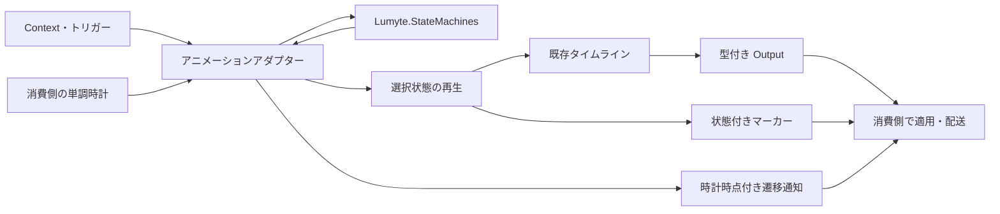

# ADR-ANIMATION-0002: 状態機械によるアニメーションの選択と遷移

- 状態: 提案
- 日付: 2026-10-09

## 背景

[ADR-ANIMATION-0001](ANIMATION-0001-animation-system.md) は、単調時計による再生と汎用値の計算を定めた。状態機械は独立した PR の対象として残している。UI の通常・押下・無効状態や、キャラクターの待機・移動・一度だけのアクションでは、入力条件や再生完了に応じて次のタイムラインを選ぶ必要がある。

消費側が遷移判定を個別に実装すると、競合する条件の優先順位、入力の消費、再入場時の再生位置、更新間隔が長い場合の扱いが分散する。これらの汎用部分は独立した状態機械の契約とし、Animation には再生との接続を定める。ボーンのデータ構造、対象への値適用、イベント配送は引き続き消費側が担当する。

本 ADR は設計提案であり、この PR では実装を追加しない。前 ADR のタイムライン・再生契約を置換せず、その上に状態選択の層を追加する。

## 決定

### 責務と範囲

`Lumyte.Animation` に、[汎用状態機械](../core/CORE-0001-state-machine.md)を所有するアニメーション用アダプターを追加する。汎用機械は `Lumyte.StateMachines` に配置し、Animation や時計には依存しない。アダプターは不変の状態とタイムラインの対応、および時計を持つ可変の実行者を提供する。一つの実行者は一つの状態だけを選択し、各状態は既存の `AnimationTimeline` と `AnimationWrapMode` を持つ。状態識別子を `TState`、外部入力を `TContext` とし、文字列のパラメーター辞書やボーン固有の状態を要求しない。

遷移条件は `TContext` と現在状態の再生情報から値を返す純粋な判定とする。トリガーは汎用側の `StateMachineTrigger` をそのまま使い、発火済みかどうかは内部の汎用実行者が保持する。Animation 独自のトリガー型は設けない。条件の中から値を適用したり、状態機械を操作したりしない。

今回は平坦な状態、条件遷移、トリガー遷移、Once の完了遷移、優先順位、明示した自己遷移を扱う。切替は即時とする。階層状態、複数の同時状態、クロスフェード、ブレンドツリー、状態履歴、シリアライズは今回追加しない。



`Lumyte.Animation → Lumyte.StateMachines` を追加し、既存の `Lumyte.Animation → Lumyte.Core.Time／Lumyte.Composition` の依存方向を維持する。逆方向の依存は作らない。別の Composition 連携プロジェクトや独自 Generator は追加しない。値ソース、Repeat／Reverse、チャネル、補間を状態機械側で再実装しない。

### 汎用機械との接続

継承用の基底クラスではなく、通常 API の合成でベースとして利用する。Animation の実行者は `StateMachine<TState, AnimationStateContext<TContext>>` と各状態の再生資源を所有する。状態一覧・初期状態・候補の選択・優先順位・トリガー保留・自己遷移の検証は汎用側を唯一の実装とし、Animation 側で同じ判定器を作らない。

`AnimationStateContext<TContext>` は消費側の Input と評価済みの Playback 情報を持つ。汎用側はこの型を参照せず、任意の TContext の一つとして扱う。Animation の Builder は `OnCompleted` を `context.Playback.IsCompleted` の条件に変換し、指定した Condition と AND にして汎用 Builder に登録する。一般用途には OnCompleted という API を追加しない。

アニメーション定義は汎用の Control 定義と、状態 ID から Timeline／Wrap への対応を持つ。専用 Builder／Composition は両者を一緒に構築する簡便 API とし、既に構築した汎用 Control と再生対応を直接渡す経路も用意する。従ってアニメーション専用の構築 API を使わなくても、このアダプターを利用できる。

専用 Builder は Loop 状態の OnCompleted を拒否できる。一方、直接渡された汎用条件の内容は解析しない。Loop の IsCompleted は常に false なので、完了を調べる汎用条件は成立しない。この二つの検証範囲を区別する。

### 更新と遷移の順序

`Update(context, output, events, transitions)` 一回の順序を次で固定する。

1. 引数を検証し、注入された時計の `Now` を一度だけ取得する。内部の再生者にはこの取得済み時点を返す時計を渡す。
2. 現在状態をその時点まで評価する。値は内部の再利用可能な出力へ計算し、通過したマーカーを保持する。
3. その評価後の位置・完了情報と今回の Context を AnimationStateContext に包み、内部の汎用機械の TryStep を一度呼ぶ。候補の優先順位と短絡評価は汎用側の契約を使う。
4. 遷移がなければ現在状態の値を外部 Output に書き込む。遷移があれば旧状態の値の寄与を破棄し、新状態を取得済み時点から位置 0 で開始して値を評価する。旧状態の途中位置や超過時間は引き継がない。
5. 通過マーカーと、成立した一件の遷移通知を追記する。保留トリガーは手順 3 の汎用 TryStep の正常終了時に既に消費されている。

一回の Update で最大一遷移とし、新状態からの連鎖遷移を同じ呼び出しでは調べない。同じ時計時点の再呼び出しでも条件判定は行うため、呼び出し回数は消費側が制御する。時計が進まなければ、既存再生契約どおり通過マーカーを重複出力しない。

長い更新間隔で Once が終了した場合も、旧状態のマーカーをその終端まで収集してから、今回の観測時点で新状態を開始する。遷移条件は過去の Context を復元できないため、完了した過去時点まで遡って適用しない。このため、マーカー列の比較には既存タイムラインの規則を使えるが、状態遷移の時刻と値は更新の刻みに依存する。

### 条件とトリガー

遷移の成立条件は、指定された条件すべての AND とする。

- `Trigger` が指定されていれば、その実行者に保留されていること。
- `OnCompleted` が true なら、現在状態が Once の終端に達していること。
- `Condition` が指定されていれば、今回の Context と評価済み再生情報について true を返すこと。

何も指定しない遷移は無条件となる。優先順位は大きい数値を優先する。同順位は安定した登録順とし、数値の差で重み付けや時間制御は行わない。Loop は完了しないため、Loop 状態を出発点に `OnCompleted` を指定した定義は Build で拒否する。

`SetTrigger` は同じキーの複数回の入力を一件にまとめる。候補の不成立や優先順位負けも含め、内部 TryStep が通常終了した際に保留トリガー全体を破棄し、次状態へ持ち越さない。その後の出力追記が失敗しても入力の消費は巻き戻さない。条件入力を持続させる場合は Context に状態を保持する。イベントが発生するたびにキューとして処理したい場合は消費側が入力キューを管理する。

停止中の `SetTrigger` は InvalidOperationException。一時停止中は保留できるが、Update は条件を調べずトリガーも消費しない。`ClearTriggers` と Stop は保留を破棄する。条件とマーカーの名前を暗黙に結び付けない。今回のマーカーを消費側が `SetTrigger` に変換した場合、そのトリガーは次の Update から有効になる。

### 状態の再生とライフサイクル

Start は停止中にだけ呼べる。初期状態を位置 0 で開始し、保留入力と前回更新の基準を初期化する。初期状態の選択自体は遷移通知に含めない。実行中の Start は InvalidOperationException とし、最初からやり直す場合は Stop → Start を使う。

状態へ入場するたびに新しい再生区間を開始する。自己遷移も再生位置を 0 に戻す。誤った常時再起動を防ぐため、自己遷移は `Reenter = true` が必要であり、それ以外は Build で拒否する。

Start／Stop は汎用機械と再生資源を一緒に開始・停止する。Pause は Animation のみの状態とし、内部の汎用機械は Running のまま TryStep を呼ばない。Pause は現在位置を固定する。Resume は同じ位置から新しい時計基準で続ける。Pause 中の Update は停止位置の値だけを出し、遷移と未配送マーカーの収集は Resume 後へ残す。Speed は既存再生と同じ非負の有限値であり、状態の切替先にも引き継ぐ。Speed が 0 でも、実行中なら Context・トリガーによる遷移は判定する。

Once の完了後も機械は Running のまま終端を保持し、後続 Update で条件遷移できる。`OnCompleted` は一度限りの通知ではなく、完了済みという条件である。Stop は現在状態と保留を破棄し、値の復元や最後の値の書き込みをしない。停止中の Update は出力を変更せず false を返す。

機械は Seek を公開せず、内部再生者も消費側へ渡さない。状態選択と再生位置を別々に操作できる API は後続の用途に応じて決める。

### 出力と通知

外部 Output とイベント・遷移コレクションは消費側が所有し、Update は Clear せず追記する。同じ Output に他の再生者と収集する場合も、後の評価を優先する既存契約を維持する。内部出力の転送は型付きスロットを用いる内部操作として実装し、消費側向けの汎用 setter や対象参照を追加しない。

切替した更新では旧状態の Hold／Release の値を外部へ転送しない。新状態に寄与がないチャネルは Output に出ないので、前の値を保つか復元するかは消費側が決める。切替時の連続性は保証せず、クロスフェードや現在値からの補間を暗黙に行わない。

旧状態が切替までに通過したマーカーは失わず、旧状態の識別子付きで配送する。`AnimationStateEvent<TState>` の `Occurrence.Time` と `LoopIndex` はその状態のタイムライン内の値、`UpdateOffset` は状態機械の前回評価基準からの時計上の時間幅とする。内部再生者の基準が異なる場合は機械が差を補正する。Start 後の最初の基準は Start の時計時点とする。

0 のマーカーを開始操作で追加配送しない。既存 `AnimationPlayback` と同様に、最初に時間が前進した Update で収集する。新状態の 0 のマーカーも次の前進更新で収集する。遷移通知にはソース、ターゲット、切替を観測した `TimePoint` を記録する。異なる時計の TimePoint 同士は比較しない。コレクション間の配送は消費側が行い、必要ならマーカーの基準時点＋UpdateOffset と遷移の ObservedAt から並べる。

## 公開 API の追加差分

比較元は main の `3e31e7d5fae9a8d4d00ce30136bd951f0949ea72`。以下は追加提案であり未実装。既存の `AnimationPlayback`、`AnimationOutput`、タイムラインの公開シグネチャは変更しない。

```diff
+using System;
+using System.Collections.Generic;
+using Lumyte.Core.Time;
+using Lumyte.StateMachines;
+
+namespace Lumyte.Animation;
+
+public enum AnimationStateMachineStatus { Stopped, Running, Paused }
+// 条件評価時点の不変情報。Loop の IsCompleted は常に false。
+public readonly record struct AnimationStateInfo(
+    Duration Position, Duration Duration, bool IsCompleted);
+// 消費側の入力と今回評価した再生情報。汎用機械には一つの Context として渡す。
+public readonly record struct AnimationStateContext<TContext>(TContext Input, AnimationStateInfo Playback);
+// 状態と既存タイムラインの対応。データ構造・対象参照は含めない。
+public readonly record struct AnimationStateBinding<TState>(
+    TState State, AnimationTimeline Timeline, AnimationWrapMode Wrap = AnimationWrapMode.Once)
+    where TState : notnull;
+public readonly record struct AnimationStateEvent<TState>(
+    TState State, AnimationEventOccurrence Occurrence) where TState : notnull;
+public readonly record struct AnimationStateTransition<TState>(
+    TState From, TState To, TimePoint ObservedAt) where TState : notnull;
+
+// Build で構築する不変定義。実行者・対象・現在の Context は保持しない。
+public sealed class AnimationStateMachineDefinition<TState, TContext> where TState : notnull
+{
+    // 任意の汎用定義をベースにできる。全状態との一対一対応を検証しコピーする。
+    public AnimationStateMachineDefinition(
+        StateMachineDefinition<TState, AnimationStateContext<TContext>> control,
+        IReadOnlyList<AnimationStateBinding<TState>> states);
+    public StateMachineDefinition<TState, AnimationStateContext<TContext>> Control { get; }
+    public TState InitialState { get; }
+}
+public sealed class AnimationStateMachineBuilder<TState, TContext> where TState : notnull
+{
+    public AnimationStateMachineBuilder();
+    // 正の長さを持つ既存タイムラインを登録する。
+    public void AddState(TState id, AnimationTimeline timeline,
+        AnimationWrapMode wrap = AnimationWrapMode.Once);
+    // 全指定条件の AND。priority が大きい順、同順位は登録順。
+    public void AddTransition(TState from, TState to,
+        Func<TContext, AnimationStateInfo, bool>? condition = null,
+        StateMachineTrigger? trigger = null, bool onCompleted = false,
+        int priority = 0, bool reenter = false);
+    // 汎用 Builder で制御定義を構築し、再生対応を検証しコピーする。
+    public AnimationStateMachineDefinition<TState, TContext> Build(TState initialState);
+}
+public sealed class AnimationStateMachine<TState, TContext> where TState : notnull
+{
+    // clock／definition の null は ArgumentNullException。
+    public AnimationStateMachine(IMonotonicClock clock,
+        AnimationStateMachineDefinition<TState, TContext> definition);
+    public AnimationStateMachineStatus Status { get; }
+    // 停止中の状態・位置取得は InvalidOperationException。
+    public TState CurrentState { get; }
+    // 最後の更新または時計を取得する制御操作で捕捉した位置。読み出しで時計を進めない。
+    public Duration Position { get; }
+    // 既定 1。非有限・負数は ArgumentOutOfRangeException。0 は許可。
+    public double Speed { get; set; }
+    public void Start();
+    public void Pause();
+    public void Resume();
+    public void Stop();
+    // null は ArgumentNullException。定義で未使用のキーは ArgumentException。
+    public void SetTrigger(StateMachineTrigger trigger);
+    public void ClearTriggers();
+    // false は「今回遷移しなかった」。再生完了や値の有無を表さない。
+    public bool Update(TContext context, AnimationOutput output,
+        ICollection<AnimationStateEvent<TState>> events,
+        ICollection<AnimationStateTransition<TState>> transitions);
+}
```

### Lumyte.Composition の定義と生成入口

既存の `ComposeAnimation.Definitions` に StateMachine／State／Transition を追加し、同じ属性と Generator を使う。状態のタイムラインは既存 `Definitions.Timeline` をパラメーターとして受け取るため、Repeat／Reverse と深いネストも既存構築 API で表現できる。状態を指す遷移は参照 ID で保持し、Composition の子グラフ自体に循環を作らない。

```diff
+using System;
+using System.Collections.Generic;
+using Lumyte.Composition;
+using Lumyte.StateMachines;
+
+namespace Lumyte.Animation;
+
+public static partial class ComposeAnimation
+{
+    public static partial class Definitions
+    {
+        [Composable(Factory = "ComposeAnimation")]
+        public partial class StateMachine<TState, TContext> where TState : notnull
+        {
+            [ComposeParameter] public required TState InitialState { get; init; }
+            [ComposeContent] public IReadOnlyList<State<TState, TContext>> States { get; set; } = [];
+            // 各 Timeline を Build し、Builder と同じ検証で不変定義を返す。
+            public AnimationStateMachineDefinition<TState, TContext> Build();
+        }
+        [Composable(Factory = "ComposeAnimation")]
+        public partial class State<TState, TContext> where TState : notnull
+        {
+            [ComposeParameter] public required TState Id { get; init; }
+            [ComposeParameter] public required Timeline Timeline { get; init; }
+            [ComposeParameter] public AnimationWrapMode Wrap { get; init; } = AnimationWrapMode.Once;
+            [ComposeContent] public IReadOnlyList<Transition<TState, TContext>> Transitions { get; set; } = [];
+        }
+        [Composable(Factory = "ComposeAnimation")]
+        public partial class Transition<TState, TContext> where TState : notnull
+        {
+            [ComposeParameter] public required TState To { get; init; }
+            [ComposeParameter] public Func<TContext, AnimationStateInfo, bool>? Condition { get; init; }
+            [ComposeParameter] public StateMachineTrigger? Trigger { get; init; }
+            [ComposeParameter] public bool OnCompleted { get; init; }
+            [ComposeParameter] public int Priority { get; init; }
+            [ComposeParameter] public bool Reenter { get; init; }
+        }
+    }
+    // 以下の入口は既存 Generator が生成する。
+    public static Definitions.StateMachine<TState, TContext> StateMachine<TState, TContext>(
+        TState initialState, IReadOnlyList<Action<Definitions.StateMachine<TState, TContext>>>? with = null)
+        where TState : notnull;
+    public static Definitions.State<TState, TContext> State<TState, TContext>(
+        TState id, Definitions.Timeline timeline, Optional<AnimationWrapMode> wrap = default,
+        IReadOnlyList<Action<Definitions.State<TState, TContext>>>? with = null) where TState : notnull;
+    public static Definitions.Transition<TState, TContext> Transition<TState, TContext>(
+        TState to, Optional<Func<TContext, AnimationStateInfo, bool>?> condition = default,
+        Optional<StateMachineTrigger?> trigger = default, Optional<bool> onCompleted = default,
+        Optional<int> priority = default, Optional<bool> reenter = default,
+        IReadOnlyList<Action<Definitions.Transition<TState, TContext>>>? with = null) where TState : notnull;
+    public static Definitions.StateMachineFactory<TState, TContext> StateMachineFactory<TState, TContext>()
+        where TState : notnull;
+    public static Definitions.StateFactory<TState, TContext> StateFactory<TState, TContext>()
+        where TState : notnull;
+    public static Definitions.TransitionFactory<TState, TContext> TransitionFactory<TState, TContext>()
+        where TState : notnull;
+    public static partial class Definitions
+    {
+        public delegate StateMachine<TState, TContext> StateMachineFactory<TState, TContext>(
+            TState initialState, IReadOnlyList<Action<StateMachine<TState, TContext>>>? with = null)
+            where TState : notnull;
+        public delegate State<TState, TContext> StateFactory<TState, TContext>(
+            TState id, Timeline timeline, Optional<AnimationWrapMode> wrap = default,
+            IReadOnlyList<Action<State<TState, TContext>>>? with = null) where TState : notnull;
+        public delegate Transition<TState, TContext> TransitionFactory<TState, TContext>(
+            TState to, Optional<Func<TContext, AnimationStateInfo, bool>?> condition = default,
+            Optional<StateMachineTrigger?> trigger = default, Optional<bool> onCompleted = default,
+            Optional<int> priority = default, Optional<bool> reenter = default,
+            IReadOnlyList<Action<Transition<TState, TContext>>>? with = null) where TState : notnull;
+        public partial class StateMachine<TState, TContext> where TState : notnull
+        {
+            public StateMachine<TState, TContext> this[params State<TState, TContext>[] content] { get; }
+        }
+        public partial class State<TState, TContext> where TState : notnull
+        {
+            public State<TState, TContext> this[params Transition<TState, TContext>[] content] { get; }
+        }
+    }
+}
```

条件デリゲートは例のように型付きの変数で渡す。Optional に包むパラメーターへ匿名関数を直接渡す場合は、まず Func 型へ変換する。

生成される `StateMachineFactory<TState, TContext>()`、`StateFactory<TState, TContext>()`、`TransitionFactory<TState, TContext>()` のデリゲート引数は、それぞれ上記入口と同じとする。Optional、with、インデクサーによる子の置換は既存 Composition 契約に従う。Build は入力コレクションと構築ノードを読み取ってコピーし、その後のノード変更を定義に反映しない。共有タイムライン定義は許可するが、その子の循環は既存 Timeline.Build と同じく拒否する。

## 利用例

以下は提案 API の使用例であり、現行版ではまだコンパイルできない。消費側のボーン構造・UI 型に依存せず、float のチャネルで待機・移動・一度だけのアクションを表す。

### Composition で状態とタイムラインを構築する

```csharp
using Lumyte.Animation;
using Lumyte.Core.Time;
using Lumyte.StateMachines;
using static Lumyte.Animation.ComposeAnimation;

var amount = AnimationChannel<float>.Create();
var action = StateMachineTrigger.Create();
Func<MotionInput, AnimationStateInfo, bool> isMoving = (input, _) => input.IsMoving;
Func<MotionInput, AnimationStateInfo, bool> isIdle = (input, _) => !input.IsMoving;
var idle = new Tween<float>(0, 0, Duration.FromSeconds(1), AnimationInterpolators.Float, AnimationEasing.Linear);
var moving = new Tween<float>(0, 1, Duration.FromSeconds(1), AnimationInterpolators.Float, AnimationEasing.Linear);
var pulse = new Tween<float>(0, 1, Duration.FromSeconds(0.2), AnimationInterpolators.Float, AnimationEasing.Linear);

AnimationStateMachineDefinition<Motion, MotionInput> definition =
    StateMachine<Motion, MotionInput>(Motion.Idle)[
        State<Motion, MotionInput>(Motion.Idle,
            Timeline()[Track<float>(amount, idle)], wrap: AnimationWrapMode.Loop)[
            Transition<Motion, MotionInput>(Motion.Action, trigger: action, priority: 100),
            Transition<Motion, MotionInput>(Motion.Moving, condition: isMoving)
        ],
        State<Motion, MotionInput>(Motion.Moving,
            Timeline()[Track<float>(amount, moving)], wrap: AnimationWrapMode.Loop)[
            Transition<Motion, MotionInput>(Motion.Action, trigger: action, priority: 100),
            Transition<Motion, MotionInput>(Motion.Idle, condition: isIdle)
        ],
        State<Motion, MotionInput>(Motion.Action,
            Timeline()[Sequence()[Repeat(2)[Sequence()[
                Track<float>(amount, pulse), Reverse()[Track<float>(amount, pulse)]
            ]], Marker("ActionFinished")]])[
            Transition<Motion, MotionInput>(Motion.Moving,
                condition: isMoving, onCompleted: true, priority: 10),
            Transition<Motion, MotionInput>(Motion.Idle, onCompleted: true)
        ]
    ].Build();

enum Motion { Idle, Moving, Action }
readonly record struct MotionInput(bool IsMoving);
```

Action への切替は入力条件より優先する。Action は Repeat と Reverse を含む有限 0.8 秒の状態であり、完了時点の Context によって移動か待機へ戻る。ループ状態には完了遷移を置かない。

### 時計を進め、結果を消費側で取得する

次のコードは上記の型宣言より前へ置く。表示やボーンへの適用は TryGet 後に消費側で行う。

```csharp
var clock = new ManualClock();
var machine = new AnimationStateMachine<Motion, MotionInput>(clock, definition);
var output = new AnimationOutput();
var events = new List<AnimationStateEvent<Motion>>();
var transitions = new List<AnimationStateTransition<Motion>>();
machine.Start();
machine.SetTrigger(action);

output.Clear();
events.Clear();
transitions.Clear();
machine.Update(new MotionInput(IsMoving: true), output, events, transitions);
// Idle → Action。時計時点 0 で Action を開始し、位置 0 の値を返す。

clock.Advance(Duration.FromSeconds(1));
output.Clear();
events.Clear();
transitions.Clear();
bool changed = machine.Update(new MotionInput(IsMoving: true), output, events, transitions);
// ActionFinished を Action のイベントとして収集し、Action → Moving。
// 超過 0.2 秒は引き継がず、Moving の位置 0 の値を返す。
if (output.TryGet(amount, out float value))
{
    // 消費側が UI やボーンへ value を適用する。
}
```

### Builder でも同じ定義を作る

```csharp
var builder = new AnimationStateMachineBuilder<Motion, MotionInput>();
builder.AddState(Motion.Idle, Timeline()[Track<float>(amount, idle)].Build(), AnimationWrapMode.Loop);
builder.AddState(Motion.Action,
    Timeline()[Sequence()[Repeat(2)[Sequence()[
        Track<float>(amount, pulse), Reverse()[Track<float>(amount, pulse)]
    ]], Marker("ActionFinished")]].Build());
builder.AddTransition(Motion.Idle, Motion.Action, trigger: action, priority: 100);
builder.AddTransition(Motion.Action, Motion.Idle, onCompleted: true);
AnimationStateMachineDefinition<Motion, MotionInput> simple = builder.Build(Motion.Idle);
```

### 汎用状態機械を直接ベースとして使う

専用 Builder を使わず、汎用側の API で条件を作る例。idle と pulse は上の例と同じ値ソースを使う。

```csharp
var control = new StateMachineBuilder<Motion, AnimationStateContext<MotionInput>>();
control.AddState(Motion.Idle);
control.AddState(Motion.Action);
control.AddTransition(Motion.Idle, Motion.Action, trigger: action);
control.AddTransition(Motion.Action, Motion.Idle,
    condition: context => context.Playback.IsCompleted);
var baseDefinition = control.Build(Motion.Idle);
var adapted = new AnimationStateMachineDefinition<Motion, MotionInput>(baseDefinition,
    new AnimationStateBinding<Motion>[]
    {
        new(Motion.Idle, Timeline()[Track<float>(amount, idle)].Build(), AnimationWrapMode.Loop),
        new(Motion.Action, Timeline()[Track<float>(amount, pulse)].Build())
    });
var animation = new AnimationStateMachine<Motion, MotionInput>(clock, adapted);
```

汎用の StateMachine を別に公開・操作するのではなく、アニメーション実行者がその可変インスタンスを内部所有する。Control 定義は外部で作成・共有できるが、現在状態だけを外から変更して再生との対応を壊すことはできない。

## 検証・所有権・失敗時の契約

状態の一意性・初期状態・遷移先・自己遷移は汎用 Build が検証する。アニメーション定義は Control の全状態と再生対応の一対一の一致、null、Wrap の有効値と正のタイムライン長を検証する。専用 Builder はさらに Loop 状態の OnCompleted を検証する。`TState` の等価比較には `EqualityComparer<TState>.Default` を使用する。ID の等価性とハッシュ値は定義の寿命中に変えてはならない。到達不能な状態と複数の同一条件は許可するが、曖昧な条件に優先順位を付ける責任は定義作成者にある。

null の必須引数は ArgumentNullException、不整合な定義と未使用トリガーは ArgumentException、無効な数値・列挙値は ArgumentOutOfRangeException、時計逆行は InvalidOperationException、時間演算のオーバーフローは OverflowException とする。Pause／Resume は対象状態以外では何もしない。Stop は繰り返しても安全。参照型 Context の null は Update の変更前に拒否する。

定義は共有できるが、実行者と出力は一スレッドだけが操作する。条件が捕捉する可変オブジェクトと参照型 Context は消費側が管理する。機械は Context を更新後に保持しない。条件は Update 中の固定入力として扱い、外部の時計や可変状態の読み直しを避ける。Update 中の再入呼び出し・操作は InvalidOperationException とする。

汎用 TryStep の条件例外時は汎用側の状態・保留を維持する。ただしアニメーション側は既に再生を評価しており、独自条件・値ソース・追記先コレクションが例外を投げた場合、更新全体の完全なロールバックは保証しない。消費側はその更新結果を適用せず、Stop → Start または実行者の作り直しで復旧する。引数の事前検証に失敗した場合は状態と出力を変更しない。

内部の値・イベント格納とトリガー集合は再利用する。定常更新の標準数値型について割り当てゼロを目標とし、状態の切替も有限状態ごとの再生資源を再利用する。独自条件・ソースの割り当てや任意のイベント出力量は保証しない。Native ハンドル・Dispose・実行時リフレクション・動的コード生成は要求しない。

## 検討した代替案

### 消費側で状態選択をすべて実装する

小さい用途は実現しやすいが、入力消費と遷移優先順位の規則が用途ごとに異なる。タイムラインを使い続ける単独再生は維持しつつ、共通の選択制御を追加する。

### Animation に状態選択を閉じ込める

一般用途でも時計や再生型への参照が必要になる。条件・優先順位・トリガーを汎用基盤へ分離し、完了情報はアダプターが Context に変換する。

### 自動連鎖と超過時間の引継ぎを提供する

大きな時間差で完了状態を連続して進められる一方、入力がいつ変化したか不明なまま過去の条件を判定し、無条件・自己遷移の循環対策も必要になる。観測時点で一遷移とする。

### 最初からクロスフェードを導入する

ボーン、UI、離散値で合成やチャネル欠落の意味が異なる。既存の後勝ち Output に暗黙の補間を追加せず、即時切替を先に定める。クロスフェードは明示した合成契約を伴う別の判断にする。

## 結果と影響

- Context、トリガー、完了条件の評価と優先順位を共通化できる。
- 既存の時計・タイムライン・Repeat／Reverse と Composition の構築方法を再利用できる。
- 更新単位の切替により履歴入力を要求せず、無限の自動遷移を避けられるが、遷移結果は更新の刻みに依存する。
- 切替時の値の連続性と、前状態だけが持つチャネルの復元は消費側の責務となる。
- マーカーと遷移通知はデータとして外へ出すため、UI／ボーン固有のスレッド・配送規則を持ち込まない。
- 汎用状態機械を UI・ゲーム進行などから独立利用でき、Animation はそのアダプターになる。
- 既存公開 API の破壊的変更は不要。実装には型付き出力の内部転送と取得済み時計時点の共有が必要になる。

## 検証方針

本 PR は文書のみを追加する。以下は採用後の実装の受け入れ条件であり、実装・測定済みの結果ではない。

- ManualClock で初期状態、条件・トリガー・完了遷移、自己遷移、最大一遷移、同時刻の再評価を確認する。
- 優先順位と同順位の登録順、短絡評価、条件の AND、未使用トリガー、保留の消費、Pause 中の保留を確認する。
- Pause／Resume、Speed 0、速度変更と入場への継承、Once 終端保持、Loop に完了がないこと、停止・再開始を確認する。
- 一回の Update が時計を一回だけ読むこと、入場時点が同じであること、ゲームと UI の時計を独立して進められることを確認する。
- 長い更新間隔で旧マーカーを収集し、新状態を観測時点から開始すること、旧値を破棄しチャネルを復元しないことを確認する。
- 状態をまたぐ UpdateOffset と ObservedAt、Repeat／Reverse／Loop のマーカー、0 マーカーの配送と重複防止を確認する。
- 汎用 Control を直接渡す構築、専用 Builder／Composition との等価性、Build 後の変更分離、複数実行者の独立性、共有タイムラインと無効定義を確認する。
- 実際の Composition Generator と別アセンブリで、二つの型引数・notnull 制約・Optional の条件デリゲート・ネスト例をコンパイルする。
- 汎用候補選択を一更新で一度だけ呼ぶこと、独自条件例外からの再生側の復旧、入力と再生情報の合成を確認する。
- ウォームアップ後の定常更新・繰り返し遷移について標準数値型の割り当てを測定する。Windows／Linux／Browser で同じ入力の遷移順と値を比較する。

## 別途決定する事項

- クロスフェード、ブレンドツリー、チャネル欠落時の合成、離散値の切替時点。
- 階層・並列状態、状態履歴。汎用側の拡張と再生側の拡張は別々に判断する。
- 任意位置からの入場、状態と再生位置の保存・復元、編集・シリアライズ形式。
- ボーン姿勢の合成、ルートモーション、UI・シーンへの適用とイベント配送。

## 参考資料

- [ADR-CORE-0001: アニメーションに依存しない汎用状態機械](../core/CORE-0001-state-machine.md)
- [ADR-0001: ADR の書き方と運用](../0001-adr-writing-policy.md)
- [ADR-ANIMATION-0001: 単調時計とタイムラインによる汎用値の計算](ANIMATION-0001-animation-system.md)
- [ADR-COMPOSITION-0001: デリゲート型ファクトリとノード操作の生成](../composition/COMPOSITION-0001-declarative-composition.md)
- [既存の再生実装](../../../src/Animation/Lumyte.Animation/AnimationPlayback.cs)
- [既存の Composition 定義](../../../src/Animation/Lumyte.Animation/ComposeAnimation.cs)
