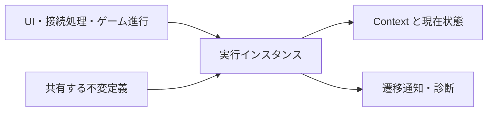

# ADR-CORE-0001: 汎用状態機械と型付きトリガーによる遷移

- 状態: 提案
- 日付: 2026-10-09

## 背景

UI の画面選択、接続処理、ゲーム進行では、状態、入力、遷移条件、入場・退出処理を共通の規則で管理する必要がある。

旧ライブラリの `Lumyte.StateMachine` は、型付き Context と Trigger、状態の入場・退出アクション、ガード、遷移エフェクト、優先順位、通知、診断を提供している。この機能一式を独立した基盤として引き継ぐ。本 ADR は設計提案であり、この PR では実装を追加しない。

## 決定

### 配置と責務

プロジェクト・NuGet・名前空間を `Lumyte.StateMachines`、配置を `src/Core/Lumyte.StateMachines/` とする。旧ライブラリの機能を引き継ぎ、公開 API は現在の構築・所有権の方針に合わせて設計する。型名・メソッド名・シグネチャ・構築構文・診断識別子について、旧 API のソース互換・バイナリ互換は要求しない。

一つの不変定義から、独立した Context と現在状態を持つ実行インスタンスを作る。状態の識別には `State<TContext>` の参照同一性を使い、Name は表示・診断用とする。同名の別インスタンスを別状態として扱う。TTrigger は enum、文字列、独自型を使え、`EqualityComparer<TTrigger>.Default` で比較する。不透明なキーだけに制限しない。

外部システムへの依存を持たず、時計・スケジューラーは所有しない。構築には既存 `Lumyte.Composition` とその Generator を使用し、通常のコンストラクター・Builder からも同じ定義を構築できる。独自 Generator は追加しない。診断は .NET 標準の System.Diagnostics による。



### 旧ライブラリから継承する機能

以下をすべて実装の受け入れ条件とする。旧実装の比較元は `462e5b3e1e65c37ab2d1df6ba9ddde9f287690ee` の `src/interaction/Lumyte.StateMachine/` と、そのテスト・ベンチマークである。

- 名前付き状態と、複数の入場・退出アクションの登録・順次実行。
- 型付き Context と enum・文字列・独自型の Trigger。
- 複数ガードの AND・候補内の短絡評価、複数の遷移エフェクト、優先順位と同順位の登録順。
- 初期状態と遷移一覧の参照、共有できる確定済み定義と独立した実行インスタンス。
- 保持 Context、現在状態、生成時の初期入場、同期の発火と遷移可能性の照会、遷移通知。
- 退出 → エフェクト → 状態変更 → 入場 → 通知の順序。
- 未知・不成立トリガーの false、自己遷移、外部で変更した参照型 Context の利用。
- 構築時の設定変更と、定義確定後の設定変更の禁止。
- 通常 API と Composition による構築。
- ActivitySource による状態・トリガー・遷移先・優先順位・成功と、例外の診断。

旧実装は階層状態、並列状態、履歴、非同期コールバック、自動遷移連鎖、保留トリガーキューを提供しない。これらを「旧機能」として追加することはしない。

### 定義と凍結

State と Transition は構築中だけ可変であり、定義に所属した時点で凍結する。Builder／Composition の Build で検証を終えてから、状態と遷移をまとめて凍結する。初期状態だけを設定途中で凍結する API は設けない。OnEnter／OnExit／When／Effect／WithPriority を凍結後に呼ぶと InvalidOperationException。

States は InitialState を先頭とし、遷移を登録順に走査して From／To を参照同一性で重複排除する。初期状態以外の明示登録を許す Builder の追加状態は、その後に登録順で含める。Transitions は登録順を保持する。外部から一覧を変更できない読み取り専用の格納とする。

定義の作成は Build に統一し、実行時の定義に再構成用インデクサーを持たせない。Builder と Composition ノードは編集できるが、Build は入力一覧をコピーし、構築済み定義に後から変更を反映しない。空の遷移一覧も有効な確定済み定義とする。状態名とトリガーの等価性・ハッシュ値は定義の寿命中に変更しない。

### インスタンスと評価規則

CreateInstance(context) は Context を保持し、CurrentState を InitialState に設定して OnEnter を登録順に実行する。複数インスタンスで定義を共有しても現在状態は独立する。Context の共有は消費側が明示的に選ぶ。

Fire(trigger) は同期処理で、保持した Context を使って次の順に実行する。

1. From が現在状態と同じ参照、Trigger が一致するものだけを候補とし、Priority の降順、同順位は登録順に調べる。
2. 各候補の When を登録順に評価する。一つでも false ならその候補を除外する。ガードがなければ成立する。
3. 最初に成立した候補を一つ選び、それ以後のガードは呼ばない。純粋なガードによる最大優先順位の選択結果を維持し、旧実装の候補走査順や呼び出し回数は互換対象にしない。
4. 候補がなければ false。あれば旧状態の OnExit → 選択遷移の Effect → CurrentState を To に変更 → 新状態の OnEnter → Transitioned の順に実行して true。

一回の Fire で最大一遷移。自己遷移に追加フラグを要求せず、通常どおり退出・Effect・再入場・通知を行う。未登録のトリガーと不成立トリガーは例外にせず false を返す。Fire は入力を即座に処理し、保留・集約・次回評価への持ち越しを行わない。

CanFire は同じ候補選択とガード評価を行うが、状態を変更せず、入場・退出・Effect・Transitioned を実行しない。ガードを実際に呼ぶため、ガードが外部状態を変更しないことは消費側の責任となる。CanFire の後に Fire するとガードを再評価し、その間に Context が変われば結果も変わり得る。

保持 Context のほか、今回だけの Context を渡す Fire／CanFire の追加オーバーロードを用意する。これらはインスタンスの Context プロパティを置換せず、当該呼び出しのガード・アクションだけに指定 Context を渡す。

複数の入力を一度に評価したい消費側のために FireAny／CanFireAny を追加する。指定したいずれかの Trigger に一致する候補から、一回のガード評価で最大 Priority の一遷移を選ぶ。同順位はトリガーの並びではなく遷移の登録順。重複トリガーでガードを複数回呼ばず、空の入力は false。コレクションのコピー・検証を副作用前に行う。Fire と同じコールバック順を使い、入力の保留や消費キューは持たない。

### 通知と診断

Transitioned は新状態の OnEnter が正常終了した後に、選択した Transition を渡して同期発火する。購読者は消費側が管理し、長寿命の定義が実行者を保持することはない。

ActivitySourceName は新パッケージと揃えて `Lumyte.StateMachines` とし、通常 Fire の操作名は `StateMachine.Fire` とする。タグは `state_machine.state`、`state_machine.trigger`、`state_machine.transitioned`、成立時の `state_machine.target` と `state_machine.priority` を使う。例外時は Error status と `error.type` を記録して再送出する。CanFire は診断 Activity を開始しない。FireAny は `StateMachine.FireAny` とし、単一トリガーの代わりに `state_machine.triggers` を記録する。

## 公開 API の追加差分

現在の main `3e31e7d5fae9a8d4d00ce30136bd951f0949ea72` に対する追加提案。実装本体を省いた宣言であり未実装。旧ライブラリとの差分は前節の機能対応と後述の契約で示す。

```diff
+using System;
+using System.Collections.Generic;
+using System.Diagnostics;
+
+namespace Lumyte.StateMachines;
+
+public sealed class State<TContext>
+{
+    // null・空白名は拒否。名前は状態同一性のキーではない。
+    public State(string name);
+    public string Name { get; }
+    // 複数登録可、登録順。凍結後は InvalidOperationException。
+    public State<TContext> OnEnter(Action<TContext> action);
+    public State<TContext> OnExit(Action<TContext> action);
+}
+public sealed class Transition<TContext, TTrigger>
+{
+    public Transition(State<TContext> from, State<TContext> to, TTrigger trigger);
+    public State<TContext> From { get; }
+    public State<TContext> To { get; }
+    public TTrigger Trigger { get; }
+    // 既定 0。大きい値を優先する。
+    public int Priority { get; }
+    // 複数ガードは AND。候補内では最初の false で短絡。
+    public Transition<TContext, TTrigger> When(Func<TContext, bool> guard);
+    public Transition<TContext, TTrigger> Effect(Action<TContext> effect);
+    public Transition<TContext, TTrigger> WithPriority(int priority);
+}
+public sealed class StateMachine<TContext, TTrigger>
+{
+    internal StateMachine();
+    public State<TContext> InitialState { get; }
+    public IReadOnlyList<State<TContext>> States { get; }
+    public IReadOnlyList<Transition<TContext, TTrigger>> Transitions { get; }
+    // 同期で初期状態の OnEnter を実行する。
+    public StateMachineInstance<TContext, TTrigger> CreateInstance(TContext context);
+}
+public sealed class StateMachineInstance<TContext, TTrigger>
+{
+    internal StateMachineInstance(StateMachine<TContext, TTrigger> definition, TContext context);
+    public TContext Context { get; }
+    public State<TContext> CurrentState { get; }
+    public event Action<Transition<TContext, TTrigger>>? Transitioned;
+    public bool Fire(TTrigger trigger);
+    public bool CanFire(TTrigger trigger);
+    // 追加：保持 Context を変更せず、一呼び出しの入力を指定する。
+    public bool Fire(TTrigger trigger, TContext context);
+    public bool CanFire(TTrigger trigger, TContext context);
+    // 追加：入力集合から最大一遷移。未知の入力や空入力は false。
+    public bool FireAny(IReadOnlyList<TTrigger> triggers, TContext context);
+    public bool CanFireAny(IReadOnlyList<TTrigger> triggers, TContext context);
+}
+public static class StateMachineDiagnostics
+{
+    public const string ActivitySourceName = "Lumyte.StateMachines";
+    public static ActivitySource Activities { get; }
+}
+// enum・文字列と並んで使用できる任意の参照同一性キー。
+public sealed class StateMachineTrigger
+{
+    private StateMachineTrigger();
+    public static StateMachineTrigger Create();
+}
+// 通常 API で定義を作る追加入口。Build は Composition と同じ凍結を行う。
+public sealed class StateMachineBuilder<TContext, TTrigger>
+{
+    public StateMachineBuilder(State<TContext> initialState);
+    public void AddState(State<TContext> state);
+    public void AddTransition(Transition<TContext, TTrigger> transition);
+    public StateMachine<TContext, TTrigger> Build();
+}
```

State と Transition は通常のコンストラクターで構築し、定義は Builder または Composition の Build で確定する。遷移ゼロの定義も同じ経路で構築できる。CreateInstance は確定済みの定義だけを受け取る。

### 構築入口と Composition

現在の Generator が要求する `ComposeStateMachines.Definitions` 内のノードを構築入口とし、通常 Builder と同じ検証・凍結処理へ接続する。旧 StateMachineKit と実行時定義の子登録インデクサーは設けない。

```diff
+using System;
+using System.Collections.Generic;
+using Lumyte.Composition;
+
+namespace Lumyte.StateMachines;
+
+public static partial class ComposeStateMachines
+{
+    public static partial class Definitions
+    {
+        [Composable(Factory = "ComposeStateMachines")]
+        public partial class Machine<TContext, TTrigger>
+        {
+            [ComposeParameter] public required State<TContext> InitialState { get; init; }
+            [ComposeContent] public IReadOnlyList<Transition<TContext, TTrigger>> Transitions { get; set; } = [];
+            // Builder と同じ検証と凍結を行う。実行者は作らない。
+            public StateMachine<TContext, TTrigger> Build();
+            public Machine<TContext, TTrigger> this[params Transition<TContext, TTrigger>[] content] { get; }
+        }
+        public delegate Machine<TContext, TTrigger> MachineFactory<TContext, TTrigger>(
+            State<TContext> initialState, IReadOnlyList<Action<Machine<TContext, TTrigger>>>? with = null);
+    }
+    public static Definitions.Machine<TContext, TTrigger> Machine<TContext, TTrigger>(
+        State<TContext> initialState, IReadOnlyList<Action<Definitions.Machine<TContext, TTrigger>>>? with = null);
+    public static Definitions.MachineFactory<TContext, TTrigger> MachineFactory<TContext, TTrigger>();
+}
```

Optional、with、生成インデクサーによる子の置換は既存 Composition の契約に従う。構築ノードの編集と、Build 後の State／Transition の凍結は区別する。Build 後にノードの一覧を変えても既存定義の一覧は変わらない。

## 利用例

以下は提案 API の例であり、現行版では未実装。

```csharp
using Lumyte.StateMachines;
using static Lumyte.StateMachines.ComposeStateMachines;

var context = new ConnectionContext();
State<ConnectionContext> disconnected = new State<ConnectionContext>("Disconnected")
    .OnExit(c => c.Log.Add("exit disconnected"));
State<ConnectionContext> connecting = new State<ConnectionContext>("Connecting")
    .OnEnter(c => c.Log.Add("enter connecting"));
State<ConnectionContext> connected = new State<ConnectionContext>("Connected");
StateMachine<ConnectionContext, ConnectionTrigger> definition =
    Machine<ConnectionContext, ConnectionTrigger>(disconnected)[
        new Transition<ConnectionContext, ConnectionTrigger>(disconnected, connecting, ConnectionTrigger.Connect)
            .When(c => c.HasConfiguration)
            .When(c => !c.IsConnecting)
            .Effect(c => c.IsConnecting = true)
            .WithPriority(10),
        new Transition<ConnectionContext, ConnectionTrigger>(connecting, connected, ConnectionTrigger.Ready)
            .When(c => c.IsReady)
    ].Build();
var machine = definition.CreateInstance(context);
machine.Transitioned += transition => context.Log.Add(transition.To.Name);
if (machine.CanFire(ConnectionTrigger.Connect))
{
    machine.Fire(ConnectionTrigger.Connect);
    // exit disconnected → Effect → enter connecting → Transitioned
}
context.IsReady = true;
machine.Fire(ConnectionTrigger.Ready);

sealed class ConnectionContext
{
    public bool HasConfiguration { get; set; } = true;
    public bool IsConnecting { get; set; }
    public bool IsReady { get; set; }
    public List<string> Log { get; } = [];
}
enum ConnectionTrigger { Connect, Ready }
```

通常 Builder での構築も同じ State と Transition を使う。構築済みの凍結オブジェクトを別定義でも共有できる。

```csharp
var builder = new StateMachineBuilder<ConnectionContext, ConnectionTrigger>(disconnected);
builder.AddTransition(new Transition<ConnectionContext, ConnectionTrigger>(
    disconnected, connecting, ConnectionTrigger.Connect).When(c => c.HasConfiguration));
StateMachine<ConnectionContext, ConnectionTrigger> another = builder.Build();
StateMachineInstance<ConnectionContext, ConnectionTrigger> second = another.CreateInstance(new ConnectionContext());
```

既存 Composition の生成入口からも、同じ遷移オブジェクトで定義を構築できる。

```csharp
StateMachine<ConnectionContext, ConnectionTrigger> composed =
    ComposeStateMachines.Machine<ConnectionContext, ConnectionTrigger>(disconnected)[
        new Transition<ConnectionContext, ConnectionTrigger>(
            disconnected, connecting, ConnectionTrigger.Connect).When(c => c.HasConfiguration)
    ].Build();
```

## 所有権と失敗時の契約

定義は Managed の共有オブジェクト。インスタンス、Context、アクション・条件が捕捉するオブジェクト、通知購読の寿命は消費側が管理する。インスタンスの Context は作成時から保持される。明示 Context のオーバーロードでは、指定 Context を呼び出し後に保持しない。Dispose や Native ハンドルは要求しない。単一インスタンスの操作は一スレッドに限定する。

必須の null は ArgumentNullException、空白の Name と null を含む定義は ArgumentException、凍結後の変更は InvalidOperationException。Fire の null トリガーは一致候補なしとして false を返す。明示 Context と入力一覧の null は副作用前に拒否する。無効な一覧を検証しただけで既存定義を部分更新しない。

条件・アクション・通知は同期処理であり、例外を呼び出し側へ返す。ガード例外時は状態未変更。退出・Effect の例外時は旧状態のまま、入場・Transitioned の例外時は新状態に変更済みとなる。完了したアクションと外部への副作用は巻き戻さない。CreateInstance の初期入場例外はインスタンス作成の失敗として返す。

旧実装で未定義だった Fire の再入操作は、現在状態の変更順序を壊すため InvalidOperationException で拒否する。通常の同期コールバックと通知は維持し、別の実行インスタンスの操作は許可する。ガードは副作用を持たないものとし、Context と呼び出し回数が同じなら同じ結果を返す。

旧実装の機能を省略せず、構築の確定、読み取り専用の一覧、再入評価、例外時の状態を明示する。利用コード・構築コード・診断リスナーの変更を許容し、旧 API を転送する互換層は提供しない。旧実装に存在しない Start／Stop／Pause や入力保留を基本 API に必須化しない。リセットは定義から新しいインスタンスを作り、初期入場を再実行する。

## 検討した代替案

### 入場・退出・Effect を外部処理だけにする

状態変更の結果だけを返す設計は簡素だが、旧ライブラリのコールバック連結と同期実行順を失う。登録できるアクションとイベントを継承し、副作用と例外の契約を記載する。

### トリガーを不透明なキーに限定する

参照同一性は便利だが、旧ライブラリで使える enum・文字列・独自型の入力を制限する。TTrigger を維持し、不透明なキーは任意の追加型とする。

### 旧 API と候補走査順を維持する

互換入口や全候補のガード評価は、必要な機能を増やさず構築経路と処理量を増やす。互換層を設けず、純粋なガードを優先順位順に短絡評価する。

## 結果と影響

- 旧ライブラリの状態機械機能を維持し、通常 API と Composition の両方から使える。
- 型付き入力、Context、複数ガードとアクション、通知・診断を独立した基盤として提供する。
- コールバックの副作用と例外時の部分完了を利用側が扱う必要がある。
- 状態同一性は参照であり、Name をキーとして保存・検索する場合は消費側で対応を管理する。
- ガードを優先順位順に短絡評価できる。最悪時の評価量は該当状態とトリガーの候補数に比例する。

## 検証方針

- 旧 StateMachineTests の全 8 ケースが検証する機能を新 API で確認する。旧テストコードの無変更移植は要求しない。型付きトリガー、ガード、優先順位、退出／Effect／入場、独立インスタンス、未知トリガー、凍結、診断タグを含む。
- 初期入場、複数アクションの登録順、複数ガードの AND／短絡、同順位、成立後のガード省略、自己遷移を確認する。
- enum・文字列・独自型の Trigger 等価性、同名別状態、CanFire が状態・Effect・通知を変更しないことを確認する。
- 空定義、Build 後のノード編集と既存定義の分離、入力一覧のコピー、読み取り専用の一覧、通常 Builder と Composition の等価性を確認する。
- 各コールバック・通知の例外時の状態と診断 Error、再入拒否、通知購読の寿命を確認する。
- 明示 Context の非保持と、FireAny の一回の候補評価・優先順位・入力重複・空入力・例外を確認する。
- 旧ベンチマークの候補数 1／8／32 の FireAndReset を再現し、診断リスナーの有無別に割り当てと実行時間を測定する。
- Windows／Linux／Browser と、別アセンブリの生成ファクトリ利用を確認する。

実装と測定は未実施。割り当てゼロは診断リスナーなし・標準的なトリガー・ウォームアップ後の目標とし、リスナー・独自条件・ToString・アクションが発生させる割り当てと区別する。

## 別途決定する事項

- 階層・並列状態、履歴、非同期処理、遷移の自動連鎖、入力キュー。
- 保存・復元、編集・シリアライズ、状態名と永続 ID の対応。

## 参考資料

- [ADR-0001: ADR の書き方と運用](../0001-adr-writing-policy.md)
- [ADR-0002: リポジトリのフォルダ構成](../0002-repository-layout.md)
- [ADR-COMPOSITION-0001: デリゲート型ファクトリとノード操作の生成](../composition/COMPOSITION-0001-declarative-composition.md)
- [旧状態機械の全ソース](https://github.com/ikihiki/Lumyte_old/tree/462e5b3e1e65c37ab2d1df6ba9ddde9f287690ee/src/interaction/Lumyte.StateMachine)
- [旧状態機械のテスト](https://github.com/ikihiki/Lumyte_old/blob/462e5b3e1e65c37ab2d1df6ba9ddde9f287690ee/src/interaction/Lumyte.StateMachine.Tests/StateMachineTests.cs)
- [旧ベンチマーク](https://github.com/ikihiki/Lumyte_old/blob/462e5b3e1e65c37ab2d1df6ba9ddde9f287690ee/benchmarks/Lumyte.Benchmarks/StateMachineBenchmarks.cs)
