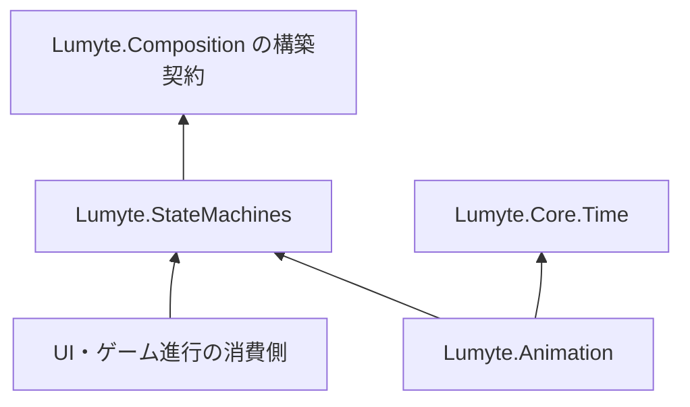

# ADR-CORE-0001: アニメーションに依存しない汎用状態機械

- 状態: 提案
- 日付: 2026-10-09

## 背景

アニメーション、UI の画面選択、ゲーム進行は、状態、入力条件、トリガー、競合する遷移の優先順位という共通の仕組みを必要とする。再生時間や出力に依存した状態機械では、アニメーションを使わない処理でも Animation の型と依存を要求してしまう。

汎用の状態選択を独立した基盤とし、[アニメーション用の状態機械](../animation/ANIMATION-0002-animation-state-machine.md)がその基盤を使用する。時計やアニメーションの完了は汎用状態機械の機能ではなく、消費側から渡す Context の情報とする。本 PR は設計提案のみであり、実装は追加しない。

## 決定

### 配置と責務

プロジェクト・NuGet・名前空間を `Lumyte.StateMachines`、配置を `src/Core/Lumyte.StateMachines/` とする。状態 ID、型付き Context、純粋な条件、不透明なトリガー、優先順位、不変定義と可変の実行者を提供する。実行者は常に一状態を選択し、一度の評価で最大一遷移を確定する。

Animation、Core.Time、UI、ECS、Graphics、OS、Native を参照せず、時計、Duration、タイムライン、値の出力、再生完了、ポーズ合成を公開 API に含めない。時間条件が必要な消費側は自分の Context に時間を入れる。状態の入場・退出に伴う副作用は返された遷移結果を受け取る消費側が行う。

構築には既存の `Lumyte.Composition` と、その Generator をビルド時 Analyzer として使用する。Composition の利用は任意であり、Builder と通常 API だけでも構築・評価できる。独自 Generator は設けない。



### 評価規則

Start は停止中にだけ呼び、定義の初期状態を選択して保留トリガーを消去する。実行中の Start は InvalidOperationException。停止中の CurrentState 取得も InvalidOperationException。Stop は状態と保留を破棄し、繰り返し可能とする。

`TryStep(context, out transition)` は次の順序で実行する。

1. Context を検証する。停止中なら false を返し、条件は呼ばない。
2. 現在状態の候補を、Priority の降順、同順位は登録順で調べる。
3. Trigger が指定された候補は、保留されている場合だけ Condition を評価する。Condition がない場合は true とみなす。指定した Trigger と Condition は AND。
4. 最初に成立した一候補だけを確定して CurrentState を変更し、From／To を返す。以後の条件と、新状態からの候補は評価しない。
5. 遷移の有無にかかわらず、正常終了した評価で保留トリガーをすべて消去する。

一回の入力は一回の評価だけ有効。同じキーの複数回の SetTrigger は一件にまとめる。条件の不成立・優先順位負けの入力を次状態へ持ち越さない。キューが必要なら消費側が管理する。定義に含まれないキーは ArgumentException、停止中の SetTrigger は InvalidOperationException。

外部時計を読まないため、同一時点という概念は持たない。同じ Context の再評価も一回の Step として扱う。無条件の循環も一呼び出し内では連鎖しないが、繰り返し Step すれば進む。自己遷移は `Reenter = true` の明示が必要。自己遷移の From と To が等しくても戻り値は true とし、消費側が再入場処理を行える。

Pause は汎用 API に含めない。消費側が TryStep を呼ばなければ状態と保留が維持される。時間停止や値の評価停止は各消費側が扱う。

## 公開 API の追加差分

比較元は main の `3e31e7d5fae9a8d4d00ce30136bd951f0949ea72`。以下は未実装の追加提案。

```diff
+using System;
+using System.Collections.Generic;
+
+namespace Lumyte.StateMachines;
+
+// 参照同一性のキー。保留状態を持たない。
+public sealed class StateMachineTrigger
+{
+    private StateMachineTrigger();
+    public static StateMachineTrigger Create();
+}
+public enum StateMachineStatus { Stopped, Running }
+// 時計時点、副作用、値の適用を含まない。
+public readonly record struct StateTransition<TState>(TState From, TState To) where TState : notnull;
+public sealed class StateMachineDefinition<TState, TContext> where TState : notnull
+{
+    internal StateMachineDefinition();
+    public TState InitialState { get; }
+    // 登録順の読み取り専用スナップショット。呼び出し側は変更できない。
+    public IReadOnlyList<TState> States { get; }
+}
+public sealed class StateMachineBuilder<TState, TContext> where TState : notnull
+{
+    public StateMachineBuilder();
+    public void AddState(TState id);
+    // 全指定条件の AND。無指定は無条件。自己遷移は reenter が必要。
+    public void AddTransition(TState from, TState to,
+        Func<TContext, bool>? condition = null, StateMachineTrigger? trigger = null,
+        int priority = 0, bool reenter = false);
+    // 未登録の初期状態・遷移先などは ArgumentException。
+    public StateMachineDefinition<TState, TContext> Build(TState initialState);
+}
+public sealed class StateMachine<TState, TContext> where TState : notnull
+{
+    public StateMachine(StateMachineDefinition<TState, TContext> definition);
+    public StateMachineStatus Status { get; }
+    public TState CurrentState { get; }
+    public void Start();
+    public void Stop();
+    public void SetTrigger(StateMachineTrigger trigger);
+    public void ClearTriggers();
+    // 一呼び出しで最大一遷移。false の out 値は default であり使用しない。
+    public bool TryStep(TContext context, out StateTransition<TState> transition);
+}
```

### Composition の定義と入口

状態と遷移を ID で結び、子構造に循環を作らない。以下は主要メンバーの追加差分。Build は Builder と同じ検証・スナップショットを行う。

```diff
+using System;
+using System.Collections.Generic;
+using Lumyte.Composition;
+
+namespace Lumyte.StateMachines;
+
+public static partial class ComposeStateMachines
+{
+    public static partial class Definitions
+    {
+        [Composable(Factory = "ComposeStateMachines")]
+        public partial class Machine<TState, TContext> where TState : notnull
+        {
+            [ComposeParameter] public required TState InitialState { get; init; }
+            [ComposeContent] public IReadOnlyList<State<TState, TContext>> States { get; set; } = [];
+            public StateMachineDefinition<TState, TContext> Build();
+        }
+        [Composable(Factory = "ComposeStateMachines")]
+        public partial class State<TState, TContext> where TState : notnull
+        {
+            [ComposeParameter] public required TState Id { get; init; }
+            [ComposeContent] public IReadOnlyList<Transition<TState, TContext>> Transitions { get; set; } = [];
+        }
+        [Composable(Factory = "ComposeStateMachines")]
+        public partial class Transition<TState, TContext> where TState : notnull
+        {
+            [ComposeParameter] public required TState To { get; init; }
+            [ComposeParameter] public Func<TContext, bool>? Condition { get; init; }
+            [ComposeParameter] public StateMachineTrigger? Trigger { get; init; }
+            [ComposeParameter] public int Priority { get; init; }
+            [ComposeParameter] public bool Reenter { get; init; }
+        }
+    }
+    // 既存 Generator が生成する型付き入口。
+    public static Definitions.Machine<TState, TContext> Machine<TState, TContext>(TState initialState,
+        IReadOnlyList<Action<Definitions.Machine<TState, TContext>>>? with = null) where TState : notnull;
+    public static Definitions.State<TState, TContext> State<TState, TContext>(TState id,
+        IReadOnlyList<Action<Definitions.State<TState, TContext>>>? with = null) where TState : notnull;
+    public static Definitions.Transition<TState, TContext> Transition<TState, TContext>(TState to,
+        Optional<Func<TContext, bool>?> condition = default, Optional<StateMachineTrigger?> trigger = default,
+        Optional<int> priority = default, Optional<bool> reenter = default,
+        IReadOnlyList<Action<Definitions.Transition<TState, TContext>>>? with = null) where TState : notnull;
+    public static Definitions.MachineFactory<TState, TContext> MachineFactory<TState, TContext>() where TState : notnull;
+    public static Definitions.StateFactory<TState, TContext> StateFactory<TState, TContext>() where TState : notnull;
+    public static Definitions.TransitionFactory<TState, TContext> TransitionFactory<TState, TContext>() where TState : notnull;
+    public static partial class Definitions
+    {
+        public delegate Machine<TState, TContext> MachineFactory<TState, TContext>(TState initialState,
+            IReadOnlyList<Action<Machine<TState, TContext>>>? with = null) where TState : notnull;
+        public delegate State<TState, TContext> StateFactory<TState, TContext>(TState id,
+            IReadOnlyList<Action<State<TState, TContext>>>? with = null) where TState : notnull;
+        public delegate Transition<TState, TContext> TransitionFactory<TState, TContext>(TState to,
+            Optional<Func<TContext, bool>?> condition = default, Optional<StateMachineTrigger?> trigger = default,
+            Optional<int> priority = default, Optional<bool> reenter = default,
+            IReadOnlyList<Action<Transition<TState, TContext>>>? with = null) where TState : notnull;
+        public partial class Machine<TState, TContext> where TState : notnull
+        {
+            public Machine<TState, TContext> this[params State<TState, TContext>[] content] { get; }
+        }
+        public partial class State<TState, TContext> where TState : notnull
+        {
+            public State<TState, TContext> this[params Transition<TState, TContext>[] content] { get; }
+        }
+    }
+}
```

### アニメーションを使わない例

以下は提案 API の例であり、現行版では未実装。時計や Animation を参照せず、接続処理の状態だけを選択する。

```csharp
using Lumyte.StateMachines;

var connect = StateMachineTrigger.Create();
var builder = new StateMachineBuilder<Connection, ConnectionInput>();
builder.AddState(Connection.Disconnected);
builder.AddState(Connection.Connecting);
builder.AddState(Connection.Connected);
builder.AddTransition(Connection.Disconnected, Connection.Connecting, trigger: connect);
builder.AddTransition(Connection.Connecting, Connection.Connected, condition: input => input.IsReady);
var machine = new StateMachine<Connection, ConnectionInput>(builder.Build(Connection.Disconnected));
machine.Start();
machine.SetTrigger(connect);
if (machine.TryStep(new ConnectionInput(false), out StateTransition<Connection> transition))
{
    // 消費側が Connecting への入場処理として接続を開始する。
}
machine.TryStep(new ConnectionInput(true), out _); // Connecting → Connected

enum Connection { Disconnected, Connecting, Connected }
readonly record struct ConnectionInput(bool IsReady);
```

同じ定義の Composition 例。Optional に渡す条件は型付きデリゲート変数を用いる。

```csharp
using static Lumyte.StateMachines.ComposeStateMachines;

Func<ConnectionInput, bool> ready = input => input.IsReady;
StateMachineDefinition<Connection, ConnectionInput> definition = Machine<Connection, ConnectionInput>(Connection.Disconnected)[
    State<Connection, ConnectionInput>(Connection.Disconnected)[
        Transition<Connection, ConnectionInput>(Connection.Connecting, trigger: connect)
    ],
    State<Connection, ConnectionInput>(Connection.Connecting)[
        Transition<Connection, ConnectionInput>(Connection.Connected, condition: ready)
    ],
    State<Connection, ConnectionInput>(Connection.Connected)
].Build();
```

## 所有権と失敗時の契約

Build は一状態以上、ID の一意性、初期状態・遷移元・遷移先の存在、自己遷移の明示を検証する。ID は `EqualityComparer<TState>.Default` で比較し、等価性とハッシュ値は定義の寿命中に変更しない。定義は入力コレクションをコピーする。到達不能な状態と同じ条件の候補は許可し、優先順位は作成者が定める。

null の必須引数と参照型 Context は ArgumentNullException、定義の不整合は ArgumentException。引数の検証失敗では状態・保留を変更しない。独自条件の例外時は状態と保留を維持し、呼び出し側へ例外を返す。条件自体の副作用の取り消しは保証しない。TryStep 中の再入評価と操作は InvalidOperationException。

定義を共有しても実行者の現在状態・保留は独立する。実行者は一スレッドだけが操作し、条件と Context の可変オブジェクトは消費側が管理する。Context は評価後に保持しない。Managed オブジェクトのみとし Dispose は不要。ウォームアップ後の標準的な Step と遷移は割り当てゼロを目標とするが、独自条件の割り当ては対象外とする。

## 検討した代替案

### Animation 内の実装だけを公開する

時間・出力を使わない用途も Animation に依存してしまう。選択制御を分離し、アニメーションはその消費側とする。

### 抽象基底クラスを継承して再生処理を埋め込む

遷移途中の virtual 呼び出し、例外時の状態、時計を読む位置が継承側に分散する。遷移結果を返す通常 API を持ち、アダプターが実行者を所有する合成で再利用する。

### 入場・退出コールバックを汎用機械内から実行する

副作用の完了順序と失敗時の回復を基盤が扱う必要がある。基盤は選択の確定までとし、返された結果に基づく副作用は消費側が行う。

## 結果と影響

- Animation を参照せず UI・ゲーム進行などで同じ遷移規則を使える。
- アニメーションの完了は Context から渡し、汎用 API に再生型や時計を持ち込まない。
- 継承ではなく合成によって、更新順と副作用の制御を各アダプターに残せる。
- 一つのパッケージとその構築 API が増える。汎用とアニメーションの検証を分ける必要がある。

## 検証方針

- Animation と Core.Time を参照しない別アセンブリから通常 API と Composition 例をコンパイルする。
- 条件・トリガー・優先順位・安定した登録順・短絡評価・一評価一遷移・自己遷移を確認する。
- 保留の集約と消去、停止・再開始、条件例外時の保持、再入操作の拒否を確認する。
- スナップショットの変更分離、複数実行者の独立性、無効な ID と定義を確認する。
- 型引数・notnull 制約・Optional 条件と定常評価の割り当て量を確認する。
- Windows／Linux／Browser で同じ Context と評価回数の遷移結果を比較する。

実装と測定は未実施。実装時にこの受け入れ条件を確認する。

## 別途決定する事項

- 階層・並列状態、履歴、遷移の自動連鎖、入力キュー。
- 保存・復元、編集・シリアライズ、非同期の入場・退出処理。

## 参考資料

- [ADR-0001: ADR の書き方と運用](../0001-adr-writing-policy.md)
- [ADR-0002: リポジトリのフォルダ構成](../0002-repository-layout.md)
- [ADR-ANIMATION-0002: 状態機械によるアニメーションの選択と遷移](../animation/ANIMATION-0002-animation-state-machine.md)
- [ADR-COMPOSITION-0001: デリゲート型ファクトリとノード操作の生成](../composition/COMPOSITION-0001-declarative-composition.md)
