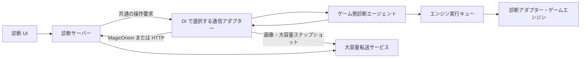

# ADR-DIAGNOSTICS-0001: DI で通信方式を選択するゲームエンジン診断システム

- 状態: 提案
- 日付: 2026-10-08

## 背景

Lumyte の実行状態を外部から観測し、必要に応じて変更できる診断機能を提供する。診断システムをサーバー、ゲームに組み込む診断エージェントをクライアントとして通信する。Desktop では MagicOnion、Browser では HTTP を DI で選択し、診断機能とサブシステムは通信方式に依存させない。

対象は Metrics / Trace / Log のテレメトリー、シーンやコンポーネントなどのオブジェクトグラフ、レンダリング結果、プロパティ編集、インプットのオーバーライドである。ゲーム側で待ち受けポートを開かずに、診断側から操作できる必要がある。

通信遅延、切断、対象オブジェクトの破棄、大容量転送があっても、ゲーム実行と診断操作の整合性を維持する。通信処理からエンジンへ直接アクセスすると、スレッド制約やフレーム更新を壊すため、実行境界も定める。

配置と記述は [ADR-0001](../0001-adr-writing-policy.md)、プロジェクト配置は [ADR-0002](../0002-repository-layout.md) に従う。本 ADR は診断通信と操作の共通契約を対象とし、各サブシステムの具体的な実装は扱わない。

## 決定

通信抽象を診断セッションに DI 注入し、MagicOnion と HTTP のアダプターを差し替える。診断サーバーからの要求は共通の非同期受信列として扱い、ゲーム側は安全な実行タイミングで処理して結果を報告する。

観測と変更操作を明示的なプロトコルにする。制御、テレメトリー、大容量データは論理的に分離し、画像や大きなスナップショットを制御メッセージに直接載せない。

### 責務と依存関係

| 構成要素 | 責務 | 依存の制約 |
| --- | --- | --- |
| 診断 UI | 対象選択、可視化、操作要求 | 診断サーバーを利用し、ゲームへ直接接続しない |
| 診断サーバー | 認証、セッション、購読、要求と結果の相関管理 | エンジン実装型を参照しない |
| ゲーム側診断エージェント | 接続、検証、要求キュー、観測データの送信 | 各サブシステムの診断アダプターを利用する |
| 診断アダプター | 安全な時点での読み取り・変更、診断モデルへの変換 | 通信接続や UI を管理しない |
| 共有通信契約 | 通信抽象、診断専用 DTO、スキーマ | エンジンオブジェクトや Native ハンドルを含めない |
| 通信アダプター | 共通メッセージと MagicOnion / HTTP の変換 | 診断エージェントとサーバーの共通処理を参照し、エンジンを参照しない |
| 大容量転送サービス | 分割データの受信、保存、期限付き参照 | 制御と独立したキュー・転送予算を持つ |

共有契約、エージェント、サーバーは実装時に `src/Diagnostics/` の別プロジェクトとして配置する。エンジンの通常実行は診断サーバーの存在に依存させず、診断アダプターを明示的に登録する。この ADR の追加ではプロジェクトを作成しない。



### 接続とセッション

ゲーム側が論理セッションを確立し、選択したアダプターが接続または HTTP ポーリングを維持する。接続時にプロトコルバージョン、エンジン・ビルド情報、実行インスタンス ID、対応機能、型スキーマのバージョンを交換する。サーバーはセッション ID とセッションに許可する機能を返す。

実行インスタンス ID はゲームプロセスの起動ごとに変える。セッション ID は接続ごとに変える。複数インスタンスを許容し、診断利用者は操作対象を明示する。

接続状態は未接続、接続中、機能交渉中、利用可能、切断として扱い、交渉完了前は操作を受け付けない。再接続には上限付きのバックオフを使用し、新しいセッションで購読とスナップショットを同期し直す。古いセッションの未完了操作は自動再実行しない。

### 通信方式に依存しない公開 API

共有契約の名前空間は `Lumyte.Diagnostics.Contracts`、通信抽象は `Lumyte.Diagnostics.Transport` とする。共通契約は BCL の型と診断専用 DTO だけを参照し、MagicOnion、gRPC、HttpClient、MessagePack の属性を要求しない。

```csharp
public interface IDiagnosticTransportFactory
{
    ValueTask<IDiagnosticConnection> OpenAsync(
        ClientHello hello, CancellationToken cancellationToken);
}

public interface IDiagnosticConnection : IAsyncDisposable
{
    SessionWelcome Welcome { get; }
    IAsyncEnumerable<DiagnosticCommand> ReadCommandsAsync(
        CancellationToken cancellationToken);
    ValueTask<PublishReceipt> PublishAsync(
        DiagnosticMessage message, CancellationToken cancellationToken);
    ValueTask<TransferDescriptor> UploadAsync(
        BlobDescriptor descriptor, Stream content,
        CancellationToken cancellationToken);
}

public sealed record DiagnosticMessage(
    Guid MessageId, Guid SessionId, DiagnosticMessagePayload Payload);
public sealed record PublishReceipt(
    Guid MessageId, PublishStatus Status, string? ErrorCode = null);
public enum PublishStatus { Accepted, Duplicate, Rejected }
```

`DiagnosticMessagePayload` は閉じた判別共用体として、Catalog、CommandResult、MetricsBatch、TraceBatch、LogBatch、GraphUpdate、TransferCompleted を表す。任意の `object` や任意 CLR 型を転送する契約にしない。`DiagnosticCommand` も型付きの閉じた要求集合とし、計測・Trace・Log の購読設定、グラフ取得、操作呼び出し、プロパティ編集、キャプチャー、入力リースを扱う。型識別子と値の意味を共通化し、DTO のフィールド番号や各形式へのマッピングは通信アダプターで具体化する。

| 公開 API | 役割 | 契約 |
| --- | --- | --- |
| `OpenAsync` | 認証、セッション確立、機能交渉 | 利用可能状態になってから Connection を返す。呼び出し中のキャンセルは接続を解放する |
| `Welcome` | セッション ID、許可機能、転送上限 | セッション期間中に不変。再確立では別 Connection を返す |
| `ReadCommandsAsync` | サーバー要求の受信 | 一接続に一 reader。通知方式はアダプターに隠す |
| `PublishAsync` | 結果・カタログ・計測の送信 | サーバーによる受理を返す。診断操作の実行完了や永続保存とは区別する |
| `UploadAsync` | 大容量データの転送 | 上限と整合性を検証し、完了した転送参照を返す。入力 Stream は呼び出し側所有 |
| `DisposeAsync` | セッション終了 | 冪等。受付と受信を停止し、可能ならサーバーへ終了を通知する |

サブシステムはこれらの通信 API も参照しない。Scoped の診断セッションが DI で Factory を受け取り、Connection を一つ所有する。セッションは要求検証、所有スレッドへの配送、重複排除、購読、収集と予算を担当する。アダプターは符号化、物理接続、HTTP 要求・Hub 通知の変換だけを担当し、エンジンに依存しない。

受信要求を拒否した場合は明示的な結果を返す。有界の受信キューが満杯になって通知を保持できない場合は接続失敗として扱い、要求を黙って捨てない。`ReadCommandsAsync` は次の要素の取得時に直前の配送を確認できるため、セッションはキュー投入または明示的な拒否を済ませてから次へ進む。途中切断では同じ要求が再配送され得るが、`RequestId` の重複排除で再実行を防ぐ。

`MessageId` はセッション内で一意とする。通信アダプターが応答不明の送信を再試行するときは同じ ID とペイロードを使い、サーバーは保持期間内で重複を受理済みとして返す。同じ ID の異なるペイロードは拒否する。保持期限を過ぎた結果不明は上位へ返し、永久の重複排除や exactly-once を保証しない。

制御メッセージは順序を保ち、計測種別ごとのシーケンスは各バッチが保持する。異なる種別間の全順序は要求しない。アダプター内にも有界送信予算を設け、大容量転送と計測で制御要求・結果を詰まらせない。`PublishReceipt.Accepted` はカタログの場合、後続の要求に利用できるところまでサーバーが処理したことを意味する。

共通の接続失敗を `DiagnosticTransportException` として公開し、`FailureKind`（Unavailable、Unauthorized、Incompatible、SessionExpired、ProtocolError）と `IsTransient` を持たせる。キャンセルは `OperationCanceledException` とする。生の gRPC ステータスや HTTP ステータスで診断側を分岐させない。個別の編集・実行エラーは CommandResult のままとする。

### DI による通信アダプターの選択

MagicOnion 実装は `Lumyte.Diagnostics.Transport.MagicOnion`、HTTP 実装は `Lumyte.Diagnostics.Transport.Http` に分ける。各モジュールの DI 拡張を Composition Root から呼び、同じ `IDiagnosticTransportFactory` を登録する。

```csharp
public sealed class MagicOnionDiagnosticTransportOptions
{
    public Uri Endpoint { get; set; } = null!;
}

public sealed class HttpDiagnosticTransportOptions
{
    public Uri BaseAddress { get; set; } = null!;
    public TimeSpan LongPollTimeout { get; set; } = TimeSpan.FromSeconds(20);
}

public static IServiceCollection AddMagicOnionDiagnosticTransport(
    this IServiceCollection services,
    Action<MagicOnionDiagnosticTransportOptions> configure);
public static IServiceCollection AddHttpDiagnosticTransport(
    this IServiceCollection services,
    Action<HttpDiagnosticTransportOptions> configure);
```

構成例は次のようになる。サブシステム登録・ILogger・ActivitySource・Meter のコードは共通で、接続先は各アダプターの設定へ移す。選択条件はアプリ起動側が決め、診断機能や各サブシステムへ `IsBrowser` の分岐を入れない。

```csharp
services.AddLumyteDiagnostics(options =>
{
    options.Enabled = true;
    options.AllowedMeterNames = new[] { "Lumyte.Physics" };
    options.AllowedActivitySourceNames = new[] { "Lumyte.Physics" };
    options.AllowedLogCategoryPrefixes = new[] { "Lumyte.Physics" };
});

// Desktop 向け Composition Root
services.AddMagicOnionDiagnosticTransport(options =>
    options.Endpoint = new Uri("https://diagnostics.example.com"));

// Browser 向け Composition Root では上の代わりにこちらを登録する。
// services.AddHttpDiagnosticTransport(options =>
//     options.BaseAddress = new Uri("https://diagnostics.example.com"));
```

Factory は Singleton とし、Scoped サブシステムを捕捉しない。Connection は DI サービスとして共有せず、ゲーム実行セッションが生成・非同期破棄する。診断有効時は Factory がちょうど一つ必要で、未登録や複数方式の同時登録は起動エラーとする。診断無効時は Factory の登録・接続を必須にしない。

初期設計では一ゲーム実行に一方式を固定する。通信失敗時に HTTP へ暗黙切り替えたり、同じデータを両方式へ送ったりしない。テストはインメモリーの Factory / Connection を DI で差し替える。

### MagicOnion アダプター

ゲーム側から StreamingHub に接続する。アダプター内部の Hub は登録、メッセージ送信、終了を提供し、receiver の操作通知を共通の受信キューへ変換する。receiver の戻り値を操作結果にせず、CommandResult メッセージで報告する。

共有 DTO とは別の通信 DTO に MessagePack の安定したキーを割り当てる。大容量転送は制御 Hub と独立したサービス・ストリームで行う。Hub のインターフェースと gRPC 型は共通公開 API に露出させない。

### Browser HTTP アダプター

Browser の `HttpClient` / Fetch で使える HTTPS の POST、GET、PUT、DELETE と長いポーリングを使用する。双方向 HTTP/2 ストリーム、gRPC-Web、WebSocket、SSE を前提にしない。長いポーリングがタイムアウトしてもセッションが有効なら同じセッションで次の要求を行い、TCP 接続の入れ替わりを診断セッションの再確立とみなさない。

| HTTP API | 対応する共通処理 |
| --- | --- |
| `POST /diagnostics/v1/sessions` | ClientHello を送り、SessionWelcome を取得する |
| `GET /diagnostics/v1/sessions/{id}/commands?after={cursor}` | 未配送の要求を待ち、有界件数と次カーソルを返す |
| `POST /diagnostics/v1/sessions/{id}/messages` | 診断メッセージを受理し、PublishReceipt を返す |
| `POST /diagnostics/v1/sessions/{id}/transfers` | 転送 ID、総サイズ、チャンク上限を確立する |
| `PUT /diagnostics/v1/sessions/{id}/transfers/{transferId}/chunks/{index}` | バイナリの有界チャンクを送信する |
| `POST /diagnostics/v1/sessions/{id}/transfers/{transferId}/complete` | サイズ・ハッシュを検証し、TransferDescriptor を返す |
| `DELETE /diagnostics/v1/sessions/{id}` | セッション終了を通知する |

制御と計測 DTO は型識別子付き JSON、チャンクはバイナリとする。64 bit 整数と decimal は桁を失わない文字列表現で符号化する。数値型・UTC 時刻・単調増加時刻・ID・タグの意味は両アダプターで同一に保つ。System.Text.Json の Source Generator を用い、Browser / AOT で動的な型探索に依存しない。

カーソルはアダプター内部の配送確認であり、ゲーム側の実行完了とは異なる。キュー投入・拒否まで済ませた範囲だけを次回要求の `after` へ反映する。サーバーは未確認要求を再配送でき、古いカーソルが保持範囲外になったらセッション再確立を要求する。ポーリングはセッションごとに一つだけ行い、キャプチャー転送と競合しないよう HTTP 同時数とサイズを制限する。

HTTP セッションには認証主体に紐付く有効期限を設け、有効なポーリングまたは送信で更新する。Browser のバックグラウンド化・ページ終了・ネットワーク断で更新できない場合は期限切れとし、復帰後に新しいセッションで再同期する。入力リースの期限はこれより短い独立したゲーム側期限で扱う。Browser 自体が停止中にコードを実行できるとは保証せず、復帰時に入力適用より先に期限切れを処理する。

同一 origin を基本とし、別 origin ならサーバーで明示的な CORS と preflight 対応を設定する。資格情報はアダプター側の HttpClient / ハンドラーで構成し、共通 DTO に埋め込まない。Cookie 認証なら CSRF 対策を適用する。ページ終了の DELETE 到達を保証せず、サーバー側の期限とゲーム側リースで解放する。

チャンクの同じ index への再送は同一内容の場合だけ受け付け、完了要求も転送 ID に対して冪等にする。未完了転送はセッション期限とは別の期限で解放する。

サーバーは HTTP と MagicOnion の入口を、同じセッション・認可・カタログ・要求管理のアプリケーションサービスへ配送する。診断 UI はゲームが選んだ通信方式に依存しない。両方式の同じ共通契約に対する適合性テストを行う。

### DI による構成と公開境界

DI をサブシステム統合の基準とする。診断アダプターはコンストラクターで対象サブシステムを受け取り、属性付きメソッドで操作を宣言する。Generator が `IDiagnosticContributor.Configure` を実装する。サブシステム自身はレジストリ、接続、ランタイムを取得しない。登録ハンドルと通信のライフサイクルは診断基盤が所有する。

DI 統合は `Microsoft.Extensions.DependencyInjection` の `IServiceCollection` を使う。診断操作の契約型は `Lumyte.Diagnostics`、DI 拡張は `Lumyte.Diagnostics.DependencyInjection` に分ける。MagicOnion / HttpClient への依存は各通信アダプターに限定する。以下は公開 API の設計であり、実装は未追加である。設定の `LogLevel` は `Microsoft.Extensions.Logging` を使用する。

```csharp
public interface IDiagnosticContributor
{
    void Configure(DiagnosticBuilder builder);
}

public interface IDiagnosticPump<TPoint> where TPoint : class
{
    void Activate();
    void Pump(DiagnosticFrame frame, DiagnosticBudget budget);
    void Deactivate();
}

public interface IDiagnosticSession
{
    Task StartAsync(CancellationToken cancellationToken);
    Task StopAsync(CancellationToken cancellationToken);
}

public sealed class DiagnosticOptions
{
    public bool Enabled { get; set; }
    public IReadOnlyList<string> AllowedMeterNames { get; set; } = Array.Empty<string>();
    public IReadOnlyList<string> AllowedActivitySourceNames { get; set; } = Array.Empty<string>();
    public double TraceSampleRatio { get; set; } = 0.1;
    public IReadOnlyList<string> AllowedLogCategoryPrefixes { get; set; } = Array.Empty<string>();
    public LogLevel MinimumLogLevel { get; set; } = LogLevel.Information;
}

// Lumyte.Diagnostics.DependencyInjection 内の拡張メソッド。
public static IServiceCollection AddLumyteDiagnostics(
    this IServiceCollection services, Action<DiagnosticOptions> configure);
public static IServiceCollection AddDiagnosticExecutionPoint<TPoint>(
    this IServiceCollection services, string id) where TPoint : class;
public static IServiceCollection AddDiagnosticSubsystem<TContributor, TPoint>(
    this IServiceCollection services, SubsystemDescriptor descriptor)
    where TContributor : class, IDiagnosticContributor
    where TPoint : class;
```

`AddLumyteDiagnostics` は設定を Singleton、セッション、レジストリ、購読状態、カタログ、実行キューを Scoped として登録する。一つのゲーム実行に一つの明示的な DI スコープを作る。別スコープは別の実行インスタンス ID と接続を持ち、オブジェクト、要求、購読を共有しない。Scoped をプロセス全体の Singleton として注入しない。

`TraceSampleRatio` は 0〜1 の有限値とし、各許可リストは既定で空とする。無効な設定は起動時に拒否する。`StartAsync` は Metrics / Trace Listener とログ送信先を有効化し、`StopAsync` はそれらを無効化・解放する。

`AddDiagnosticExecutionPoint<TPoint>` は型と安定したポイント ID を対応付け、`IDiagnosticPump<TPoint>` を Scoped として登録する。型は DI で使うマーカーであり、マーカーインスタンスを生成しない。型・ID の重複と未定義ポイントへの登録を起動時に拒否する。

`AddDiagnosticSubsystem<TContributor, TPoint>` は公開記述子を登録し、`TContributor` を Scoped として登録する。同じ型の既存の Scoped 登録があればそれを利用し、Singleton・Transient 登録なら起動時に拒否する。フレーム更新側への `TContributor` の注入と診断側の解決は、同じスコープ内の同一インスタンスになる。同じ型の複数サービス登録も拒否し、別の `IDiagnosticContributor` インスタンスを生成する登録は行わない。同じ型を複数サブシステムとして登録することは初期 API では拒否する。

スコープごとの調整サービスだけが登録済み型を DI から解決する。アダプターとサブシステムは `IServiceProvider` を受け取らず、依存をコンストラクターに明示する。未使用のアダプターが DI 登録だけで公開されるとは限らず、対応ポイントの `Activate` が必要である。

| サービス | 寿命 | 所有者・依存 |
| --- | --- | --- |
| 設定、通信ファクトリ、登録記述子 | Singleton | スコープ内のエンジンオブジェクトを保持しない |
| `IDiagnosticSession`、内部レジストリ | Scoped | ゲーム実行スコープ。アダプターの生成・破棄は DI に任せる |
| `IDiagnosticPump<TPoint>` | Scoped | 同じスコープのキューと調整サービスを参照する |
| 診断アダプター、診断対象、更新ループ | Scoped | 同じゲーム実行内のインスタンスを共有する |
| `IMeterFactory` / Meter | DI ルート | 標準 AddMetrics。スコープから共有 Meter を破棄しない |
| `IGameExecutionIdentity` / MeterListener / ActivityListener | Scoped | 実行 ID による計測分離と購読管理 |
| ActivitySource を持つ計測サービス | Scoped | 所有する Source をスコープ破棄時に解放する |
| ILoggerProvider / ログルーター | Singleton | Scoped を注入せず、稼働中の送信先だけへ配送する |
| 操作登録ハンドル | 登録期間 | DI サービスにせず、診断基盤が解除を管理する |

### DI と所有スレッドのライフサイクル

DI の解決と所有スレッドの確定は別の処理とする。コンストラクターでは外部公開・接続・エンジン操作を行わない。

1. Composition Root でサービスを登録し、ゲーム実行スコープを作る。
2. エンジンが各ポイントの所有スレッドで `Activate` を呼ぶ。初回呼び出しで所有スレッドを確定し、そのポイントのアダプターを同じスコープから解決して `Configure` を呼ぶ。
3. 診断基盤がスキーマを検証し、ポイント単位で全アダプターを一括公開する。失敗時はそのポイントの公開を取り消し、例外を起動側に返す。
4. `IDiagnosticSession.StartAsync` が通信を開始し、有効化されたカタログを送る。接続開始後の追加 `Activate` もカタログ更新として扱う。
5. 所有スレッドが安全な更新位置で `Pump` を呼び、アダプターが値を記録する。
6. 終了時は各所有スレッドで `Deactivate` を呼び、要求受付・登録・操作対象の購読を解除する。標準メトリクスはセッション停止まで独立して観測できる。その後 `StopAsync` で接続と送信処理を終了し、スコープを破棄する。

有効化済みポイントへの同じ所有スレッドからの `Activate` は冪等とする。`Deactivate` も冪等とし、再有効化時は新しい登録世代にする。異なるスレッドからの有効化・処理・解除、`Pump` 中の再入や解除を拒否する。予期しないスコープ破棄では基盤が登録を無効化し、通信を終了するが、サブシステムにアクセスする終了コールバックは呼ばない。セッション実装は `IAsyncDisposable` を実装し、スコープは `CreateAsyncScope` で生成して非同期破棄する。通常終了は上の順序を守る。

計測用サービスのコンストラクターで標準 Meter / Instrument を作成することは許容するが、計測値は発行せずエンジンへアクセスしない。型の解決時にスレッド制約のある対象を構築する場合は、その解決も所有スレッドで行う。DI 自体にスレッド親和性を期待しない。複数ポイントを同時に持つスコープでは、調整サービスが登録カタログの更新を同期する。

`Enabled = false` でも同じ DI 登録と注入を利用する。アダプターの構成は有効化時に行えるが、診断用 Listener は計測を有効化せず、キューは空、通信接続は作らない。標準 Metrics / Trace / Log の生成と他の Listener / Provider は継続できる。テストでは診断対象や Pump をテスト用サービスに差し替えられる。メトリクスのテストは標準 MeterListener で記録を受け取り、診断通信を必要としない。

### サブシステムが宣言する API

```csharp
namespace Lumyte.Diagnostics;

public sealed record SubsystemDescriptor(
    string Id, string DisplayName, int SchemaVersion);

public readonly record struct DiagnosticFrame(long Number, long TimestampTicks);
public sealed record DiagnosticBudget(TimeSpan MaxDuration, int MaxCommands);

public sealed class DiagnosticBuilder
{
    public void Operation(
        OperationDescriptor descriptor, DiagnosticOperationHandler handler);
}

public enum DiagnosticPermission { Observe, Edit, OverrideInput }
public enum DiagnosticValueKind { Boolean, Int64, Double, String }
public sealed record DiagnosticField(
    string Id, DiagnosticValueKind Kind,
    double? Minimum = null, double? Maximum = null,
    int? MaxLength = null);
public sealed record OperationDescriptor(
    string Id, string DisplayName, DiagnosticPermission RequiredPermission,
    DiagnosticField[] Arguments, DiagnosticField[] Results);

public delegate DiagnosticOperationResult DiagnosticOperationHandler(
    DiagnosticOperationContext context, DiagnosticArguments arguments);

public sealed record DiagnosticOperationContext(
    Guid RequestId, Guid SessionId, DiagnosticFrame Frame, string ActorId,
    long? ExpectedRevision, CancellationToken CancellationToken);

public sealed class DiagnosticArguments
{
    public bool GetBoolean(string id);
    public long GetInt64(string id);
    public double GetDouble(string id);
    public string GetString(string id);
}

public readonly struct DiagnosticValue
{
    public static DiagnosticValue From(bool value);
    public static DiagnosticValue From(long value);
    public static DiagnosticValue From(double value);
    public static DiagnosticValue From(string value);
}

public sealed class DiagnosticOperationResult
{
    public static DiagnosticOperationResult Success(
        IReadOnlyDictionary<string, DiagnosticValue> values,
        long? revision = null);
    public static DiagnosticOperationResult Reject(string code, string message);
    public static DiagnosticOperationResult Conflict(long currentRevision);
}
```

`DiagnosticBuilder` は `Configure` の呼び出し中だけ有効とし、内容をコピー・検証して一括登録する。登録失敗時は一部だけ公開しない。操作 ID の重複と無効な引数・結果スキーマを登録エラーとする。標準メトリクスはこの Builder に登録しない。

サブシステム ID は `physics` などの安定した名前、操作 ID は `set-time-scale` などとする。メトリクスは Meter と Instrument の名前で独立して識別する。表示名を識別子に使わない。同時に同じサブシステム ID を登録できない。再有効化すると世代を進め、旧世代の要求と購読を引き継がない。契約変更時は `SchemaVersion` を更新する。

基盤の内部登録が操作ハンドラーの生存期間を所有し、公開 API として登録ハンドルを DI 利用者に渡さない。解除後の未実行要求は対象消失になる。再有効化時には `Configure` を再実行する。基盤は解除後のハンドラー参照を解放するが、アダプター自体の破棄は DI スコープが担う。

### .NET 標準メトリクスの生成と転送

テレメトリーの生成には `System.Diagnostics.Metrics` を使用する。独自の `DiagnosticMetric<T>`、`Gauge` / `Counter` 登録、`TryRecord` は提供しない。サブシステムは DI で受け取る `IMeterFactory` から `Meter` を取得し、標準の Instrument に `Record` / `Add` する。診断操作の登録とは独立して計測でき、OpenTelemetry 等の別 Listener と併用できる。

`services.AddMetrics()` が標準の `IMeterFactory` を登録する。ファクトリは DI ルートで Meter を共有・所有するため、Scoped サブシステムが共有 Meter を Dispose しない。`AddLumyteDiagnostics` も `AddMetrics` を呼ぶが、計測のみ利用するアプリは診断接続を登録する必要がない。

同じ Meter を使う複数ゲームスコープを分離するため、Scoped の `IGameExecutionIdentity` を注入する。`Guid InstanceId { get; }` を持ち、セッションの実行インスタンス ID と一致する。全ゲーム計測に `lumyte.instance.id` タグを付ける。Listener はそのタグと Meter の所属ファクトリを検証し、自分の実行スコープの計測だけを受け付ける。タグを持たないプロセス共通メトリクスは初期設計ではゲームへ自動配信しない。

エージェントはスコープごとに `MeterListener` を所有する。Instrument の公開通知から名前、Meter 名・版、Instrument 種別、数値型、単位、説明を取得し、カタログへ登録する。購読がある Instrument にだけ `EnableMeasurementEvents` を適用し、`SetMeasurementEventCallback<T>` で標準計測を受け取る。解除・切断で不要な計測受信を無効化し、セッション終了で Listener を Dispose する。再接続時は Listener を再作成し、既存 Instrument も再発見する。

Listener のコールバックは `Record` / `Add` を呼ぶスレッドで同期実行される。コールバック内ではエンジンへアクセスせず、タグをコピーして有界バッファへ投入するか、短い集約処理だけを行う。シリアライズと通信送信は別処理に移す。バッファ超過と不正値の破棄を診断基盤が数え、計測コードへ例外を返さない。標準 `Record` / `Add` に配送成功の戻り値はなく、完全配送は保証しない。

| 標準 Instrument | 用途・入力 | 初期の送信集約 |
| --- | --- | --- |
| `Counter<T>` | 件数などの非負の増分を `Add` | 集約窓の Sum。累計値として解釈しない |
| `UpDownCounter<T>` | リソースの増減を `Add` | 符号付きの窓内 Sum。購読前の現在量は復元しない |
| `Gauge<T>` | 現在値を `Record` | Latest / Min / Max / Mean |
| `Histogram<T>` | 時間などの観測分布を `Record` | Count / Sum / Min / Max、明示境界のバケット |

対象は標準 API が許容する `byte`、`short`、`int`、`long`、`float`、`double`、`decimal` とする。転送で整数を無条件に double に変換せず、元の型をカタログで宣言する。集約のオーバーフローや精度の扱いは通信 DTO の具体化時に定める。Gauge は .NET 10 の標準 API を使う。

Histogram のバケット境界はエージェントの設定で固定し、カタログへ含める。異なる境界の購読要求は拒否する。標準計測は単なる観測値であり、Listener が分布を構成する。集約期間内に Counter の記録がない場合は、期間全体を継続観測できたときだけ増分ゼロとし、Gauge 等の未観測値は欠測とする。切断、バッファ欠落、購読開始時刻も送信する。

`ObservableGauge` / `ObservableCounter` / `ObservableUpDownCounter` は初期転送対象に含めない。`RecordObservableInstruments` は収集側スレッドでコールバックを呼び得るため、エンジン状態への直接アクセスや、共有 Meter から Scoped オブジェクトの捕捉を許可する設計にしない。後続設計ではスレッド安全なスナップショットとコールバックの寿命を定める。未対応 Instrument はカタログで非対応を示す。

Instrument の識別には Meter 名・版、Instrument 名・種別・数値型と、Listener が割り当てる Instrument ID を使う。同じ名前の別 Instrument を無条件に統合しない。Meter 名は `DiagnosticOptions.AllowedMeterNames` の完全一致で制限し、既定の空リストでは公開しない。タグ名・文字列長・系列数にも上限を設ける。`lumyte.instance.id` は経路識別用として集約系列の次元から除き、オブジェクト ID やフレーム番号を高カーディナリティタグにしない。

複数利用者の購読はエージェントが統合し、購読ごとに必要な窓で集約する。生成側の `Instrument.Enabled` はすべての Listener の状態を示すため、診断サーバーの購読有無とは解釈しない。高価な計測のガードには使えるが、診断無効時にも OpenTelemetry 等による計測を妨げない。

標準計測にはフレーム番号や生成時刻が含まれない。Listener は受信時の単調増加時刻を記録し、送信データに集約期間を付ける。フレーム相関がない計測にはフレーム番号を推測して付けない。正確なフレーム相関が必要なイベントはメトリクスとは別契約で設計する。Trace と Log は以下の標準 API と転送契約で扱う。

### .NET 標準 Trace の生成と転送

Trace は `System.Diagnostics.ActivitySource` と `Activity` で生成する。サブシステムは開始時に `StartActivity`、終了時に `Dispose` を使い、必要に応じてタグ、イベント、リンク、`SetStatus` を設定する。独自の Span 型や生成 API は設けない。Trace ID / Span ID / Parent Span ID は W3C 形式で保持する。

`ActivitySource` を所有する計測サービスを Scoped で DI 登録する。コンストラクターでは Source の生成だけを行い、そのサービスの `Dispose` で Source を破棄する。初期設計では Source を static にせず、スコープをまたぐサブシステム参照を捕捉しない。診断用 Listener の有無にかかわらず、他の OpenTelemetry Listener がこの Source を観測できる。

エージェントはセッションごとに `ActivityListener` を持つ。`ShouldListenTo` は `AllowedActivitySourceNames` の完全一致で Source を絞る。`Sample` と `SampleUsingParentId` の両方を実装し、Source、操作名、開始時タグの `lumyte.instance.id`、購読とサンプリング設定を判定する。ゲーム内のすべての Activity は開始時タグに実行 ID を付ける。開始後の `SetTag` だけではサンプリングと経路分離に使えない。

診断側は未購読・対象外なら `None`、収集対象なら `AllDataAndRecorded` を返す。これは他 Listener のサンプリング結果を上書きするものではなく、他 Listener が生成した Activity の開始・終了通知も来得るため、通知側でも実行 ID と診断側の収集判定を確認する。`Activity.IsAllDataRequested` は全 Listener の要求であり、診断購読の有無とは解釈しない。

初期のサンプリングは Trace ID による決定的な割合とする。同じ設定の親子で一貫した判定を行い、親がある場合は親の Recorded フラグを尊重する。ルートの割合は `TraceSampleRatio` で上限を設定し、サーバーはその範囲内で購読を要求する。実行 ID がなく経路不明な親や設定変更、収集前に始まった Span によって部分 Trace が生じ得る。完全な Trace 木を保証せず、欠落を UI で区別する。エラーのみ保存する tail sampling は初期設計に含めない。

`ActivityStopped` で完了 Span を DTO にコピーし、Trace / Span / Parent ID、Source 名・版、操作名、Kind、開始 UTC 時刻、Duration、Status、許可されたタグ・イベント・リンクを送信する。ゲームの壁時計はサーバーと同期しているとは仮定せず、受信時の単調増加時刻も記録する。未終了 Span のライブ表示は初期対象外とする。

Span 数、属性・イベント・リンク数、文字列長と送信キューに上限を設ける。コールバックはゲームを待たせず、満杯なら破棄して欠落数を数える。Activity や対象オブジェクトの参照をキューへ残さない。切断前に開始し再接続後に終了した Span は、新セッションの Trace として自動転送しない。セッション停止は収集中フラグを無効化し、Listener と未完了の追跡情報を解放する。

### .NET 標準 Log の生成と転送

Log は `Microsoft.Extensions.Logging.ILogger<T>` を DI 注入して生成する。メッセージテンプレート、`EventId`、例外、構造化フィールドを標準 API で記録する。高頻度のログには標準の `LoggerMessage` ソース生成を利用できる。

`AddLumyteDiagnostics` は `AddLogging` と診断用 `ILoggerProvider` の登録を行う。Console 等の既存 Provider は維持する。Provider は Singleton とし、`ISupportExternalScope` を実装して `IExternalScopeProvider` からログスコープを読む。Scoped のゲームやセッションをコンストラクター注入しない。代わりに、停止可能なスコープ別送信先を登録する Singleton のルーターへ、有界 DTO を配送する。

ゲームの更新入口とゲームに所属する非同期処理の入口で、`BeginScope` に `lumyte.instance.id` を設定する。ログ Provider はこの ID と登録中の送信先を照合する。`BeginScope` 用の実行 ID は任意の外部入力から採用せず、DI の `IGameExecutionIdentity` に由来するものを使う。ID がないログ、停止済み実行のログ、矛盾する複数 ID を持つログはゲームへ配送しない。標準ログスコープの AsyncLocal は DI の Scoped 寿命とは独立しているため、各実行入口で明示して Dispose し、別ゲームへ引き継がない。

診断側のレベル・カテゴリは `MinimumLogLevel` と `AllowedLogCategoryPrefixes` で上限を設定する。カテゴリの一致は指定名そのものか、その名前と `.` で始まる子カテゴリに限定する。Provider の `IsEnabled` は現在の全送信先の設定を反映するが、対象実行の判定とフィルターは `Log` 時にも行う。標準 LoggerFactory のフィルターで既に落ちたログを、診断側の購読で復元することはできない。

ログ DTO は実行 ID、シーケンス番号、UTC 時刻、受信単調増加時刻、カテゴリ、LogLevel、EventId、整形メッセージ、元テンプレート、構造化フィールド、許可されたスコープ、例外情報を持つ。`Activity.Current` がある場合は Trace ID / Span ID と Recorded フラグを付け、Trace が未収集でも相関 ID を保持する。ログ自体は Trace のサンプリング結果で破棄しない。

`Log<TState>` 内で state とスコープをコピーし、列挙子、例外、任意の参照オブジェクトをキューに保持しない。値は許可したプリミティブ型と文字列に限定する。例外は型名・メッセージを基本とし、スタックトレースは明示的な許可と長さ上限の下で公開する。フォーマッター失敗は破棄数へ記録し、ゲームへ例外を返さない。同期ログ生成の負荷はゼロにはならず、高価なフォーマッターを途中で強制中断できない。

ログにも有界キューとレート制限を設ける。Warning 以上には別の予算を確保できるが、Error / Critical を含め完全配送は保証しない。通信実装と Provider 自身の内部ログは診断転送対象から除外し、転送エラーの再帰ログを防ぐ。停止時は送信先を先に無効化し、Provider が破棄済み Scoped サービスを参照しないようにする。

### Trace と Log の DI・利用例

Source を持つ計測サービスは標準 ActivitySource をそのまま公開する。

```csharp
using System.Diagnostics;

public sealed class PhysicsTracing : IDisposable
{
    public ActivitySource Source { get; } = new("Lumyte.Physics", "1.0.0");
    public void Dispose() => Source.Dispose();
}

services.AddLogging();
services.AddScoped<PhysicsTracing>();
```

`PhysicsLoop` に `PhysicsTracing`、`ILogger<PhysicsLoop>`、`IGameExecutionIdentity` を追加でコンストラクター注入すると、更新処理は次のようになる。ログスコープと Activity は更新ごとに閉じる。PhysicsWorld の例外は記録後に再送出し、診断機能がゲームのエラー処理を変更しない。

```csharp
public void Update(double deltaTime, DiagnosticFrame frame)
{
    string instanceId = _identity.InstanceId.ToString("D");
    using var scope = _logger.BeginScope(new Dictionary<string, object?>
    {
        ["lumyte.instance.id"] = instanceId,
    });
    using var activity = _tracing.Source.StartActivity(
        "physics.step", ActivityKind.Internal,
        parentContext: Activity.Current?.Context ?? default,
        tags: new[] { new KeyValuePair<string, object?>("lumyte.instance.id", instanceId) });

    try
    {
        _world.Step(deltaTime);
        _pump.Pump(frame, new DiagnosticBudget(TimeSpan.FromMilliseconds(0.2), 8));
        _metrics.RecordAfterSimulation(_world);
        activity?.SetTag("physics.active_bodies", _world.ActiveBodyCount);
        _logger.LogDebug(new EventId(1001, "StepCompleted"),
            "Physics step completed with {ActiveBodyCount} active bodies",
            _world.ActiveBodyCount);
    }
    catch (Exception exception)
    {
        activity?.SetStatus(ActivityStatusCode.Error, "Physics step failed");
        _logger.LogError(new EventId(1002, "StepFailed"), exception,
            "Physics step failed");
        throw;
    }
}
```

バックグラウンド処理を開始する場合も実行 ID を明示し、ゲームスコープ終了後まで Scoped のサブシステムを捕捉しない。Activity の親コンテキストの伝播と、DI の寿命管理は別々に扱う。

### Trace・Log の転送契約

共通メッセージに TraceBatch と LogBatch を追加し、`IDiagnosticConnection.PublishAsync` で送る。両バッチはセッション ID、実行インスタンス ID、シーケンス番号、欠落件数を含み、個々の Span / Log を上記の DTO で表す。型付きのスカラーフィールドで転送し、`Activity` や `ILogger` の状態を通信ライブラリで直接シリアライズしない。

`ConfigureTracing` 要求は購読 ID、Source 名、操作名フィルター、割合を持ち、`ConfigureLogging` は購読 ID、カテゴリと最小レベルを持つ。ゲーム側設定と Observe 権限を超える要求は拒否する。購読停止後のイベントは送らず、未送信キューにもセッションと購読世代を付けて古いデータを除外する。複数の購読に同じイベントを配送する場合はイベント ID を維持する。

Metrics / Trace / Log は同じ標準計測基盤から生成するが、異なるキュー・件数予算を持つ。バッチサイズを制限し、制御応答を優先する。Trace・Log のスキーマ・対応機能をカタログに含め、未対応のフィールドは明示する。OpenTelemetry SDK の導入は必須にせず、標準 Listener と Provider の出力を、通信抽象を通じて転送する。

### Operation のソース生成

通常のアダプターは属性付きメソッドで Operation を宣言する。`Lumyte.Diagnostics.Generators` の Incremental Source Generator が `IDiagnosticContributor.Configure`、記述子、引数変換、型付き結果の変換を生成する。DI による生成・注入、所有スレッドでの実行、通信抽象は変更しない。

Generator はビルド時の Analyzer として配布し、属性と結果型は `Lumyte.Diagnostics` に置く。利用側に Roslyn の実行時依存を持たせない。反射、動的コード生成、メソッド名による実行時探索は使わない。生成されるのは明示的な公開操作だけであり、任意メソッドの遠隔実行を許可しない。

```csharp
[AttributeUsage(AttributeTargets.Class, Inherited = false)]
public sealed class DiagnosticOperationsAttribute : Attribute { }

[AttributeUsage(AttributeTargets.Method, Inherited = false)]
public sealed class DiagnosticOperationAttribute : Attribute
{
    public DiagnosticOperationAttribute(string id, DiagnosticPermission permission);
    public string Id { get; }
    public DiagnosticPermission Permission { get; }
    public string? DisplayName { get; set; }
    public bool RequiresRevision { get; set; }
}

[AttributeUsage(AttributeTargets.Parameter, Inherited = false)]
public sealed class DiagnosticArgumentAttribute : Attribute
{
    public DiagnosticArgumentAttribute(string id);
    public string Id { get; }
    public double Minimum { get; set; } = double.NegativeInfinity;
    public double Maximum { get; set; } = double.PositiveInfinity;
    public int MaxLength { get; set; }
}

[AttributeUsage(AttributeTargets.Property, Inherited = false)]
public sealed class DiagnosticMemberAttribute : Attribute
{
    public DiagnosticMemberAttribute(string id);
    public string Id { get; }
    public int MaxLength { get; set; }
}

public sealed class DiagnosticResult<T> where T : notnull
{
    public bool IsSuccess { get; }
    public T Value { get; }
    public long? Revision { get; }
    public static DiagnosticResult<T> Success(T value, long? revision = null);
    public static DiagnosticResult<T> Reject(string code, string message);
    public static DiagnosticResult<T> Conflict(long currentRevision);
    public DiagnosticOperationResult ToOperationResult(
        Func<T, IReadOnlyDictionary<string, DiagnosticValue>> encode);
}
```

属性の Minimum / Maximum の既定の無限大は「制約なし」として null の記述子へ変換し、MaxLength = 0 は既定の共通上限を利用する。NaN、逆転した範囲、負の長さはコンパイル時に拒否する。long の境界で double の定数表現により値が失われる指定は拒否し、丸めた境界を生成しない。

`Value` は失敗時に読むと `InvalidOperationException` とする。`ToOperationResult` は失敗をそのまま変換し、成功時だけ `encode` を呼ぶ。低レベルの `DiagnosticBuilder.Operation` は生成コードと明示的な手動実装用に保持する。

#### 生成対象と契約

- `[DiagnosticOperations]` は名前空間直下の非 generic・非 abstract な public partial class に付ける。コンストラクターは利用者が記述し、DI が依存を注入する。
- Operation は宣言クラス内の非 static・非 generic・同期メソッドとし、private でもよい。同名 overload、async、Task / ValueTask、ref / out / in、optional / params 引数は初期対応から除外する。
- 先頭引数は `DiagnosticOperationContext` とする。この引数は注入される実行コンテキストであり、サーバーの入力スキーマに含めない。`SessionId` を追加し、認証済み ActorId とともに診断セッションが設定する。
- 残る全引数に `[DiagnosticArgument]` を付ける。初期型は非 nullable の bool、long、double、string とし、string の null も拒否する。型から値種別を生成する。未知の引数、欠落、型違い、非有限値、範囲・長さ違反はハンドラーの呼び出し前に拒否する。
- 戻り値は `DiagnosticResult<T>` とする。T は公開された非 generic の class / record とし、public getter を持つスカラー出力プロパティに `[DiagnosticMember]` を付ける。出力型も bool、long、double、string に限定する。生成コードは入力と違い出力値を読み取るだけであり、DTO のコンストラクターや setter を呼ばない。
- Operation ID、引数 ID、出力 ID は必須の明示的な文字列とし、C# 名の変更で通信契約を変えない。DisplayName 未指定時のみメソッド名を表示名に使う。型・ID・範囲・出力構造の変更時はサブシステムの SchemaVersion を更新する。
- `RequiresRevision = true` は期待リビジョンがない要求を生成ハンドラーで拒否する。現在リビジョンとの比較・更新は対象を所有するメソッドが行う。

Generator は宣言クラスへ `IDiagnosticContributor` の実装を追加し、Operation ID の ordinal 順で一括登録する。使用者が既に Configure を実装しているクラスとの混在は拒否する。属性付きメソッド・引数・出力以外は公開しない。private メソッドを直接呼ぶコードを同じ partial class に生成し、生成コードから IServiceProvider を取得しない。

#### Input オーバーライドの宣言例

`IInputOverrideService` は Input 側のローカルサービスであり、通信や診断 DTO に依存しない。例では AcquireButtonOverride が Input 固有の結果（成功、LeaseId、エラーコード・メッセージ）を返し、ReleaseOverride が所有者を検証して bool を返すものとする。

```csharp
[DiagnosticOperations]
public sealed partial class InputDiagnostics
{
    private readonly IInputOverrideService _input;

    public InputDiagnostics(IInputOverrideService input) => _input = input;

    [DiagnosticOperation("override-button", DiagnosticPermission.OverrideInput,
        DisplayName = "ボタン入力を上書き")]
    private DiagnosticResult<ButtonOverrideReceipt> OverrideButton(
        DiagnosticOperationContext context,
        [DiagnosticArgument("button", MaxLength = 64)] string button,
        [DiagnosticArgument("pressed")] bool pressed,
        [DiagnosticArgument("duration-ms", Minimum = 1, Maximum = 5000)] long durationMs)
    {
        var result = _input.AcquireButtonOverride(
            context.SessionId, context.ActorId,
            button, pressed, TimeSpan.FromMilliseconds(durationMs));

        return result.IsSuccess
            ? DiagnosticResult<ButtonOverrideReceipt>.Success(
                new(result.LeaseId.ToString("D")))
            : DiagnosticResult<ButtonOverrideReceipt>.Reject(
                result.ErrorCode, result.ErrorMessage);
    }

    [DiagnosticOperation("release-override", DiagnosticPermission.OverrideInput,
        DisplayName = "入力の上書きを解除")]
    private DiagnosticResult<ReleaseOverrideReceipt> ReleaseOverride(
        DiagnosticOperationContext context,
        [DiagnosticArgument("lease-id", MaxLength = 36)] string leaseId)
    {
        if (!Guid.TryParseExact(leaseId, "D", out var id))
        {
            return DiagnosticResult<ReleaseOverrideReceipt>.Reject(
                "invalid-lease-id", "Lease ID must be a UUID.");
        }

        bool released = _input.ReleaseOverride(
            context.SessionId, context.ActorId, id);
        return DiagnosticResult<ReleaseOverrideReceipt>.Success(new(released));
    }
}

public sealed record ButtonOverrideReceipt(
    [property: DiagnosticMember("lease-id", MaxLength = 36)] string LeaseId);
public sealed record ReleaseOverrideReceipt(
    [property: DiagnosticMember("released")] bool Released);
```

リースの競合、対象入力の存在、期限切れ、実入力との合成、セッション終了時の解除は Input サービスの責務である。Generator はこれらのロジックを生成しない。入力処理前に実行する DI 登録は次のとおりで、生成された Configure を手動で呼ぶ必要はない。

```csharp
services.AddScoped<IInputOverrideService, InputOverrideService>();
services.AddDiagnosticExecutionPoint<BeforeInputProcessing>(
    "input.before-processing");
services.AddDiagnosticSubsystem<InputDiagnostics, BeforeInputProcessing>(
    new SubsystemDescriptor("input", "Input", 1));
```

Input 更新は所有スレッドで Pump、期限切れ解除、入力合成の順に実行する。生成ハンドラーも他の操作と同じキューを通り、通信スレッドから直接 Input を操作しない。

#### 生成されるコードの例

以下は override-button の生成内容の抜粋である。実際の Configure は release-override も同じように登録する。属性の範囲指定を記述子へ変換し、共通の要求検証後に型付き引数を渡す。

```csharp
public sealed partial class InputDiagnostics : IDiagnosticContributor
{
    void IDiagnosticContributor.Configure(DiagnosticBuilder builder)
    {
        builder.Operation(new OperationDescriptor(
            "override-button", "ボタン入力を上書き",
            DiagnosticPermission.OverrideInput,
            Arguments:
            [
                new("button", DiagnosticValueKind.String, MaxLength: 64),
                new("pressed", DiagnosticValueKind.Boolean),
                new("duration-ms", DiagnosticValueKind.Int64, 1, 5000),
            ],
            Results:
            [
                new("lease-id", DiagnosticValueKind.String, MaxLength: 36),
            ]),
            (context, arguments) => OverrideButton(
                context,
                arguments.GetString("button"),
                arguments.GetBoolean("pressed"),
                arguments.GetInt64("duration-ms"))
                .ToOperationResult(value =>
                    new Dictionary<string, DiagnosticValue>
                    {
                        ["lease-id"] = DiagnosticValue.From(value.LeaseId),
                    }));
    }
}
```

#### コンパイル時の診断

| コード | 拒否する内容 |
| --- | --- |
| `LMDIAG001` | partial でない型、非対応の包含・generic・継承構造、手動 Configure との衝突 |
| `LMDIAG002` | 非対応のメソッド修飾子・引数形式・コンテキスト・戻り値 |
| `LMDIAG003` | 空または重複 ID、同名 overload、属性の欠落 |
| `LMDIAG004` | 非対応の入力・出力型、アクセス不能な出力、未注釈の出力プロパティ |
| `LMDIAG005` | 不正な範囲・長さ、型と制約の不一致、未定義の権限 |

診断は Error とし、誤った契約を黙って一部だけ生成しない。対象クラスは object 以外の基底クラスを持たない初期契約とし、操作と出力の継承走査は行わない。生成コードと属性は通信方式に依存せず、MagicOnion / HTTP のどちらを DI 選択しても同じ操作を公開する。

### 操作の実行契約

操作は明示的な名前と入出力スキーマで公開する。初期の引数は必須のスカラー値に限定し、未知フィールド、欠落、型違い、範囲外、長さ超過をハンドラー実行前に拒否する。リフレクションで任意メソッドを公開しない。

操作は登録時に指定した実行ポイントへ配送する。エンジンがその所有スレッド上の安全な位置で `Pump` を呼ぶと、期限と権限を再検証した後にハンドラーを同期実行する。入力前、シミュレーション後、描画後などはエンジン側が実行ポイントを用意する。キューは DI スコープ内で実行ポイントごとに一つとし、異なる所有スレッドでの `Pump` と再入を拒否する。

`Pump` は実行予算に達すると後続要求を延期するが、実行中の同期ハンドラーを強制中断できない。ハンドラーは短時間で終了する必要がある。GPU 待ち、長時間探索、ファイル・ネットワーク待ちを伴う操作はこの同期 API に登録せず、専用のジョブ・キャプチャー API で別途設計する。

`ActorId` は認証済み要求からエージェントが設定する。キャンセルは実行開始前の中止と協調的な確認に使い、実行後の自動ロールバックを意味しない。副作用の前に検証を終える。例外は実行失敗として報告し、内部スタックトレースを UI に転送しない。成功の出力は宣言されたスキーマに適合することを検証するが、出力エラーがあっても既に生じた副作用は戻らない。

リビジョンの比較・更新は対象を所有するハンドラーが行う。エージェントは `ExpectedRevision` を渡すだけで、サブシステム内部の整合性を代行しない。`Reject` のコードは操作固有の安定したコードとし、認証・対象消失・期限切れ等の共通エラーはエージェントが生成する。

### 物理サブシステムの登録例

以下は `PhysicsWorld` が `LastStepMilliseconds`、`ActiveBodyCount`、`TimeScale`、`Revision` を持つ例である。`Revision` は診断経由以外の `TimeScale` 変更でも進むものとする。

```csharp
[DiagnosticOperations]
public sealed partial class PhysicsDiagnostics
{
    private readonly PhysicsWorld _world;

    public PhysicsDiagnostics(PhysicsWorld world) => _world = world;

    [DiagnosticOperation("get-time-scale", DiagnosticPermission.Observe,
        DisplayName = "Get time scale")]
    private DiagnosticResult<TimeScaleReceipt> GetTimeScale(
        DiagnosticOperationContext context)
        => DiagnosticResult<TimeScaleReceipt>.Success(
            new(_world.TimeScale), _world.Revision);

    [DiagnosticOperation("set-time-scale", DiagnosticPermission.Edit,
        DisplayName = "Set time scale", RequiresRevision = true)]
    private DiagnosticResult<TimeScaleReceipt> SetTimeScale(
        DiagnosticOperationContext context,
        [DiagnosticArgument("value", Minimum = 0, Maximum = 2)] double value)
    {
        if (context.ExpectedRevision != _world.Revision)
        {
            return DiagnosticResult<TimeScaleReceipt>.Conflict(_world.Revision);
        }

        _world.SetTimeScale(value);
        return DiagnosticResult<TimeScaleReceipt>.Success(
            new(_world.TimeScale), _world.Revision);
    }
}

public sealed record TimeScaleReceipt(
    [property: DiagnosticMember("actual")] double Actual);
```

標準メトリクスは操作アダプターと独立した Scoped サービスで生成する。

```csharp
using System.Diagnostics.Metrics;

public interface IGameExecutionIdentity
{
    Guid InstanceId { get; }
}

public sealed class PhysicsMetrics
{
    private readonly Histogram<double> _stepDuration;
    private readonly Gauge<long> _activeBodies;
    private readonly KeyValuePair<string, object?> _instanceTag;

    public PhysicsMetrics(IMeterFactory meterFactory, IGameExecutionIdentity identity)
    {
        var meter = meterFactory.Create(new MeterOptions("Lumyte.Physics")
        {
            Version = "1.0.0",
        });
        _stepDuration = meter.CreateHistogram<double>(
            "physics.step.duration", unit: "ms", description: "Physics step duration");
        _activeBodies = meter.CreateGauge<long>(
            "physics.active_bodies", unit: "{body}", description: "Active bodies");
        _instanceTag = new("lumyte.instance.id", identity.InstanceId.ToString("D"));
    }

    public void RecordAfterSimulation(PhysicsWorld world)
    {
        _stepDuration.Record(world.LastStepMilliseconds, _instanceTag);
        _activeBodies.Record(world.ActiveBodyCount, _instanceTag);
    }
}
```

DI 登録は Composition Root で行う。アダプターと更新ループが注入される `PhysicsWorld` は同じ Scoped インスタンスである。以下のマーカーは実行位置を型で識別する。

```csharp
public sealed class AfterPhysicsSimulation { }

services.AddLumyteDiagnostics(options =>
{
    options.Enabled = true;
    options.AllowedMeterNames = new[] { "Lumyte.Physics" };
    options.AllowedActivitySourceNames = new[] { "Lumyte.Physics" };
    options.TraceSampleRatio = 0.1;
    options.AllowedLogCategoryPrefixes = new[] { "Lumyte.Physics" };
    options.MinimumLogLevel = LogLevel.Information;
});
// この Composition Root では Desktop 向け通信アダプターを選ぶ。
services.AddMagicOnionDiagnosticTransport(options =>
    options.Endpoint = new Uri("https://localhost:5001"));
services.AddMetrics();
services.AddScoped<PhysicsMetrics>();
services.AddScoped<PhysicsWorld>();
services.AddScoped<PhysicsLoop>();
services.AddDiagnosticExecutionPoint<AfterPhysicsSimulation>(
    "physics.after-simulation");
services.AddDiagnosticSubsystem<PhysicsDiagnostics, AfterPhysicsSimulation>(
    new SubsystemDescriptor("physics", "Physics", 1));
```

更新ループも DI で構築する。コンストラクターは受け取った依存を保持するだけとし、エンジンが所有スレッド上で `Initialize`、`Update`、`Shutdown` を呼ぶ。例の予算は説明用である。

```csharp
namespace Lumyte.Physics;

public sealed class PhysicsLoop
{
    private readonly PhysicsWorld _world;
    private readonly PhysicsMetrics _metrics;
    private readonly IDiagnosticPump<AfterPhysicsSimulation> _pump;

    public PhysicsLoop(
        PhysicsWorld world, PhysicsMetrics metrics,
        IDiagnosticPump<AfterPhysicsSimulation> pump)
    {
        _world = world;
        _metrics = metrics;
        _pump = pump;
    }

    public void Initialize() => _pump.Activate();

    public void Update(double deltaTime, DiagnosticFrame frame)
    {
        _world.Step(deltaTime);
        _pump.Pump(frame, new DiagnosticBudget(TimeSpan.FromMilliseconds(0.2), 8));
        _metrics.RecordAfterSimulation(_world);
    }

    public void Shutdown() => _pump.Deactivate();
}
```

ゲーム起動側は実行スコープから `PhysicsLoop` と `IDiagnosticSession` を一度解決する。所有スレッドで `Initialize` 後にセッションを開始する。終了は所有スレッドで `Shutdown`、セッション停止、スコープの非同期破棄の順に行う。非同期接続後の継続が所有スレッドへ戻るとは仮定せず、フレーム更新と終了はエンジンの実行機構へ配送する。診断セッションは PhysicsLoop を解決・更新せず、両者の順序を起動側が管理する。

### カタログ公開とサーバーからの利用

Catalog ペイロードを `IDiagnosticConnection.PublishAsync` で送る。カタログはセッション ID、カタログリビジョン、登録中の各操作サブシステムの ID・世代・スキーマ版・操作記述子、および Listener が発見した Instrument の記述子を含む。接続・再接続後は完全なカタログを送り、登録・解除時も新しいリビジョンの完全版を送る。サイズ超過時は既存の大容量転送参照を使う。

サーバーは受信カタログを認可に従って UI に公開する。カタログはコードやデリゲートを含まない。操作の要求経路は以下のとおりである。

1. DI が `PhysicsWorld` と `PhysicsDiagnostics` を同じスコープで構築する。`Activate` が `Configure` を呼び、`physics` の公開後にエージェントがカタログを送る。
2. Listener が `Lumyte.Physics` の `physics.step.duration` を発見し、カタログを更新する。UI がその Instrument ID を周期 100 ms で購読し、ゲーム側は対象と集約方式を検証して購読 ID を返す。
3. 物理更新後の標準 Histogram.Record が Listener へ計測を通知する。エージェントが実行 ID を検証して集約し、購読 ID、Instrument ID、集約期間、Count / Sum とバケットを含む `TelemetryBatch` を送る。
4. UI が `physics/get-time-scale` で現在値とリビジョンを取得し、`physics/set-time-scale` に `value = 0.5` と期待リビジョンを指定する。サーバーは `InvokeOperation` 要求を送る。
5. エージェントが対象の ID・世代・カタログ版、権限、スキーマを検証し、指定実行ポイントへ投入する。
6. 次の `Pump` でハンドラーが適用し、実際の値とリビジョンを結果として返す。エージェントが元の `RequestId` でサーバーへ報告する。

`InvokeOperation` のペイロードは `SubsystemId`、`Generation`、`SchemaVersion`、`OperationId`、引数値、期待リビジョンを持つ。`ConfigureTelemetry` は購読 ID、Instrument ID、カタログリビジョン、周期、集約を持つ。操作の登録世代をメトリクスの識別に流用しない。カタログ更新と競合する要求は古い世代・スキーマとして拒否し、サーバーは再取得する。

公開順序はセッション確立、カタログ公開、購読・操作受付とする。サーバーはカタログの Accepted 応答後に要求を送る。解除直前のカタログを見て要求しても、ゲーム側の実行時検証で対象消失として処理する。

### 要求と結果の契約

要求には `RequestId`、`SessionId`、操作種別、対象、有効期限、必要に応じた期待リビジョンを含める。有効期限はゲーム側で判定できる単調増加時計上の予算として扱い、サーバーとゲームの壁時計の一致を前提にしない。

結果は受付または終端結果を表し、終端結果には成功、拒否、競合、対象消失、非対応、期限切れ、実行失敗を区別する。成功時には実際に適用した値やフレーム番号を返す。

ゲーム側は同じセッション内の `RequestId` を重複排除し、処理中なら再投入せず、結果を保持していれば同じ結果を返す。重複排除情報の保持期限は要求の有効期間を下回らせず、期限を過ぎた要求は再実行しない。

サーバー側のタイムアウトは未実行を意味しない。結果不明の場合は対象状態を再取得し、副作用のある操作を新しい要求として無条件に再送しない。通信全体で exactly-once の実行保証は提供しない。

### スレッドと実行タイミング

通信処理は要求の検証とキュー投入までを行う。シーンやプロパティの読み書きは所有スレッド、キャプチャーは描画パイプラインの適切な位置、入力変更はゲーム処理へ入力を渡す前に適用する。

読み取ったデータはエンジン所有オブジェクトへの参照を残さない DTO に変換する。シリアライズ、圧縮、ネットワーク待ちは可能な範囲でエンジンスレッドの外へ移す。破棄済み対象は実行時にも検証する。

診断処理にはフレームごとの時間・件数予算と有界キューを設け、超過時は分割、延期、拒否する。診断通信を待つためにゲームフレームをブロックしない。

### テレメトリー

診断サーバーが項目、取得周期、集約方法を指定する購読方式とする。初期対象はフレーム時間、CPU・GPU 時間、メモリー、描画統計、診断処理自体の負荷とする。計測不能な項目は機能交渉または結果で非対応を示し、ゼロ値に置き換えない。

送信バッチには実行インスタンス ID、シーケンス番号、Instrument ID、ゲーム側の単調増加時刻による集約期間を含める。標準メトリクスにはフレーム番号を要求しない。送信はバッチ化し、混雑時は特性に応じて間引き・集約する。欠落件数を報告し、ゲーム実行を停止させてまで完全配送を保証しない。

### オブジェクトグラフ

シーン、エンティティ、コンポーネント等は診断用の投影モデルとして公開する。生のポインターを公開せず、実行インスタンス内の診断用 ID と世代で識別する。親子関係と任意参照を区別し、循環参照は ID で表現する。

型情報、プロパティ情報、生成・更新・破棄を扱う。無制限な再帰展開は行わず、ルート、子要素、プロパティを段階的に取得する。読み取り対象と編集対象は登録されたスキーマで明示する。

初期スナップショットと差分で同期する。スナップショットに基準リビジョン、差分に前後のリビジョンと順序情報を付与する。スナップショット取得中の差分は基準以降を保持して適用し、保持上限超過や欠落を検出したら再同期する。

一貫した状態を取得できない対象は取得フレームと整合性の範囲を明示し、単一フレームの状態であるかのように表示しない。

### プロパティ編集

対象 ID・世代、プロパティ ID、型付き値、期待リビジョンを要求に含める。ゲーム側は対象の存続、権限、型、値域、編集可能なエンジン状態を検証し、所有スレッドで適用する。

期待リビジョンが一致しない場合は競合として拒否する。成功時は補正後も含めた実際の値と新しいリビジョンを返す。ゲーム側での変更もリビジョンへ反映し、それを追跡できないプロパティには楽観的競合検出を保証しない。

複数プロパティの原子的な一括編集は、アダプターが保証できる場合だけ公開する。それ以外は個別結果を返し、部分成功を隠さない。

### レンダリング結果と大容量転送

初期実装はオンデマンドの静止画取得とする。対象ビュー、解像度、フォーマット、頻度上限を指定し、対応環境では GPU 読み戻しを非同期に行う。

結果にはキャプチャー ID、フレーム番号、ビュー、寸法、画素形式、色空間を含める。画像の圧縮や大きなスナップショットの転送は制御メッセージから分離し、`IDiagnosticConnection.UploadAsync` でゲーム側からアップロードし、分割転送の方式はアダプターへ委譲する。

転送 ID はセッションと要求に紐付ける。総サイズ、チャンクの位置、整合性情報を検証し、転送途中を完了済みとして公開しない。サイズ、同時数、帯域、保存期間に上限を設け、切断や期限切れの未完了データを解放する。ダウンロードにも認可を適用する。

共通の制御メッセージは転送参照とメタデータのみを扱う。独立したストリームとキューを使い、帯域競合が残る場合は接続と帯域予算も分離する。継続キャプチャーでは古いフレームを破棄し、待ち行列を増やさない。低遅延動画は後続 ADR の対象とする。

### インプットのオーバーライド

ゲーム側の入力抽象化層で、対象入力、置換・加算方式、開始条件、有効期間、所有者を持つ期限付きリースを適用する。実デバイス入力との優先順位は、置換なら対象を上書き、加算なら対象型の範囲に補正して合成する。非対応の型・方式は拒否する。

初期実装では対象入力の制御権を単一所有者に限定する。更新・解除は所有者とリース ID を検証する。期限はゲーム側の単調増加時計で判定し、明示解除、切断、対象コンテキストの終了でも解除する。切断検知が遅れても期限切れにより解除されるようにする。

解除後は実入力から状態を再計算し、必要な解放イベントを生成して押下状態を残さない。フレーム指定はゲーム側フレーム番号を基準とし、開始フレームを過ぎた新規要求は拒否する。

この機能だけで決定的な入力再生は保証しない。時計、乱数、外部イベントまで含めた再現実行は別途設計する。

### 負荷制御

| 種別 | 混雑・欠落時の方針 |
| --- | --- |
| 操作要求・結果 | 有界キュー。受付拒否を明示し、接続喪失後の結果不明は再照会で解決する |
| Metrics | 集約・系列数制限と欠落件数の報告 |
| Trace | サンプリング・有界 Span キューと欠落件数の報告 |
| Log | レベル・カテゴリ・レート制限と欠落件数の報告 |
| グラフ差分 | 順序を検証し、欠落時に再同期 |
| レンダリング結果 | 古いフレームを破棄可能とする |
| 大容量転送 | 同時数・サイズ・帯域・保存期間を制限する |

上限値は実装時の測定で決め、設定可能にする。診断無効時に購読処理や継続的なキャプチャーを実行しない。

### セキュリティと配布

TLS を使用し、ゲーム接続と診断利用者を認証する。観測、編集、入力操作の権限を分け、サーバーで利用者を認可し、ゲーム側でもセッションに許された操作と公開対象を検証する。ゲーム側が UI から受け取った自己申告の権限を信頼する設計にはしない。

編集と入力操作の主体、対象、結果を監査ログに記録する。秘密情報をスキーマの公開対象から除外する。Metrics のタグ、Trace の属性・イベント、Log の状態・スコープ・例外も送信前の許可リストと秘匿値の除去に従う。製品ビルドでは診断機能を既定で無効とし、有効化条件を明示する。

### 互換性と対応環境

共通 DTO には安定した型・フィールド識別子を定め、識別子の意味変更や再利用を避ける。MagicOnion の MessagePack キーと HTTP の JSON フィールドへのマッピングはアダプターで管理する。接続時にプロトコルバージョンを確認し、対応機能とスキーマを交渉する。非互換なら接続を利用可能にせず、機能不足ならその操作を提供しない。

MagicOnion / MessagePack と HTTP の JSON 符号化規約は実装時に固定する。AOT・トリミング環境では生成コードとシリアライズ対象を検証する。

| 環境 | 本 ADR の扱い |
| --- | --- |
| Windows / Linux | MagicOnion アダプターを初期選択とする。HTTP の選択も可能。動作検証は未実施 |
| Browser | HTTP アダプターを選択する。長いポーリング・有界アップロードを使用。動作検証は未実施 |

通信方式で診断 API を変えず、対応機能と上限を SessionWelcome で交渉する。Browser のバックグラウンド制限や描画のキャプチャー可否は、通信の抽象化だけで解消するとは仮定しない。

## 検討した代替案

| 案 | 採用しない理由 |
| --- | --- |
| ゲーム側をサーバーにする | 待ち受けポート、端末探索、ファイアウォール対応が必要となる |
| 全プラットフォームで同じ物理接続を必須にする | Browser の制約を診断機能に持ち込むため、共通契約の下でアダプターを選ぶ |
| 全データを単一 StreamingHub で送信する | 画像転送が制御応答を遅らせ、負荷制御を分けにくい |
| エンジンオブジェクトを直接シリアライズする | 循環参照、スレッド制約、内部実装への結合、情報公開の制御に問題がある |

MagicOnion はプッシュ通知、HTTP は長いポーリングで共通の要求受信契約を実装する。HTTP では通知遅延とリクエスト数の増加を許容する。

## 結果と影響

診断 UI と通信をエンジン実装から分離し、DI で物理通信方式を選択できる。複数のゲームインスタンスを共通の契約で扱える。安全な実行時点、切断時の入力解除、編集競合、転送上限を定めることで診断操作の影響を制御できる。

一方で、要求と結果の相関管理、ID・世代・リビジョン、差分同期、スキーマ、負荷制御の実装が必要となる。診断自体にも CPU・GPU・メモリー・帯域のコストがあり、遠隔操作はローカルデバッガーと同じ即時性を保証しない。

## 検証方針

実装・性能測定は未実施である。採用後、以下を確認する。

- 接続・認証・機能交渉、非互換拒否、複数インスタンスの操作分離。
- 重複要求、期限切れ、結果報告前の切断、再接続での未完了操作の非再実行。
- DI の Scoped インスタンス共有、スコープ間分離、寿命違反、依存循環、診断無効時の注入。
- 有効化の原子性、重複 ID、解除・再有効化、起動失敗時の解放、所有スレッドと終了順序。
- MeterListener の既存 Instrument 発見、購読統合、タグと DI スコープによる分離、他 Listener との共存。
- 標準 Counter / Gauge / Histogram の集約、欠測・欠落、系列数上限、Meter と Listener の破棄。
- Activity の親子相関、サンプリング、他 Listener による生成、null Activity、切断をまたぐ Span。
- 構造化ログとスコープ、Trace 相関、並行実行の ID 分離、フォーマッター失敗、転送再帰の防止。
- Trace・Log の属性制限、秘匿値の除去、バッファ欠落、停止後の Scoped 参照解放。
- Generator の実コンパイル、private メソッドへの配送、型付き結果、ID 安定性、範囲・権限・期待リビジョンの検証。
- 不正な宣言への LMDIAG001〜005、DI 制約での生成インターフェース解決、AOT / trimming での無反射実行。
- カタログ更新と操作の競合。
- 対象破棄、ID 再利用、競合編集、部分成功、所有スレッドでの実行。
- スナップショット取得中の更新、差分欠落、保持上限超過と再同期。
- 入力の所有者競合、更新、期限切れ、切断時解除、解除後のボタン状態。
- 画像のフレーム対応、転送のサイズ超過・中断・期限切れ・整合性エラー。
- 大容量転送中の制御応答時間、診断有効・無効時のフレーム時間と資源消費。
- MagicOnion / HTTP の共通適合性、送信再試行、受理応答不明、コマンド再配送とカーソル保持期限。
- HTTP のセッション期限、CORS、Browser のバックグラウンド復帰、分割アップロード。
- 対象ランタイムの AOT・トリミング、Browser の HTTP 動作。

## 別途決定する事項

- Observable Instrument、数値集約の精度とオーバーフロー、tail sampling、未終了 Span のライブ表示。
- Generator の依存バージョンとパッケージ配布詳細、複合型・非同期操作・継承への拡張。
- 全通信 DTO のフィールド番号、グラフ・描画・入力の診断アダプター API、具体的なプロジェクト名。
- 大容量転送 DTO の詳細と保存先、診断 UI 向け API、認証方式と資格情報の配布。
- 入力・描画システムへの具体的な統合位置とプラットフォーム別対応範囲。
- 帯域・キュー・実行時間の具体的な上限と測定に基づく受け入れ基準。
- HTTP の具体的な再試行・期限・サイズ上限、低遅延動画、決定的な再現実行。
