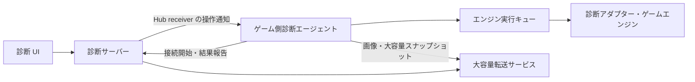

# ADR-DIAGNOSTICS-0001: MagicOnion によるゲームエンジン診断通信

- 状態: 提案
- 日付: 2026-10-08

## 背景

Lumyte の実行状態を外部から観測し、必要に応じて変更できる診断機能を提供する。診断システムをサーバー、ゲームに組み込む診断エージェントをクライアントとして MagicOnion で通信する。

対象はテレメトリー、シーンやコンポーネントなどのオブジェクトグラフ、レンダリング結果、プロパティ編集、インプットのオーバーライドである。ゲーム側で待ち受けポートを開かずに、診断側から操作できる必要がある。

通信遅延、切断、対象オブジェクトの破棄、大容量転送があっても、ゲーム実行と診断操作の整合性を維持する。通信処理からエンジンへ直接アクセスすると、スレッド制約やフレーム更新を壊すため、実行境界も定める。

配置と記述は [ADR-0001](../0001-adr-writing-policy.md)、プロジェクト配置は [ADR-0002](../0002-repository-layout.md) に従う。本 ADR は診断通信と操作の共通契約を対象とし、各サブシステムの具体的な実装は扱わない。

## 決定

ゲーム側から接続する MagicOnion StreamingHub を制御経路の中心とする。診断サーバーは receiver コールバックで要求を通知し、ゲーム側は安全な実行タイミングで処理して結果を報告する。

観測と変更操作を明示的なプロトコルにする。制御、テレメトリー、大容量データは論理的に分離し、画像や大きなスナップショットを制御用 Hub に直接載せない。

### 責務と依存関係

| 構成要素 | 責務 | 依存の制約 |
| --- | --- | --- |
| 診断 UI | 対象選択、可視化、操作要求 | 診断サーバーを利用し、ゲームへ直接接続しない |
| 診断サーバー | 認証、セッション、購読、要求と結果の相関管理 | エンジン実装型を参照しない |
| ゲーム側診断エージェント | 接続、検証、要求キュー、観測データの送信 | 各サブシステムの診断アダプターを利用する |
| 診断アダプター | 安全な時点での読み取り・変更、診断モデルへの変換 | 通信接続や UI を管理しない |
| 共有通信契約 | Hub 契約、診断専用 DTO、スキーマ | エンジンオブジェクトや Native ハンドルを含めない |
| 大容量転送サービス | 分割データの受信、保存、期限付き参照 | 制御と独立したキュー・転送予算を持つ |

共有契約、エージェント、サーバーは実装時に `src/Diagnostics/` の別プロジェクトとして配置する。エンジンの通常実行は診断サーバーの存在に依存させず、診断アダプターを明示的に登録する。この ADR の追加ではプロジェクトを作成しない。

### 接続とセッション

ゲーム側が接続し、StreamingHub の接続を維持する。接続時にプロトコルバージョン、エンジン・ビルド情報、実行インスタンス ID、対応機能、型スキーマのバージョンを交換する。サーバーはセッション ID とセッションに許可する機能を返す。

実行インスタンス ID はゲームプロセスの起動ごとに変える。セッション ID は接続ごとに変える。複数インスタンスを許容し、診断利用者は操作対象を明示する。

接続状態は未接続、接続中、機能交渉中、利用可能、切断として扱い、交渉完了前は操作を受け付けない。再接続には上限付きのバックオフを使用し、新しいセッションで購読とスナップショットを同期し直す。古いセッションの未完了操作は自動再実行しない。

### 主要な公開通信 API

共有契約の名前空間は `Lumyte.Diagnostics.Contracts` とする。以下は判断対象となる主要シグネチャであり、DTO のフィールド番号や全メンバーは実装前に具体化する。Hub は `IStreamingHub<IDiagnosticsHub, IDiagnosticsReceiver>` を継承する。

| 公開 API | 役割 | 契約・注意事項 |
| --- | --- | --- |
| `Task<SessionWelcome> IDiagnosticsHub.RegisterAsync(ClientHello hello)` | 接続と機能交渉 | 認証後、一接続につき一回。非互換なら利用可能状態にしない |
| `void IDiagnosticsReceiver.OnCommand(DiagnosticCommand command)` | サーバーからゲームへの要求通知 | 受信処理はキュー投入までとし、エンジンを直接操作しない |
| `Task IDiagnosticsHub.ReportCommandResultAsync(CommandResult result)` | 受信確認・実行結果の報告 | `RequestId` と `SessionId` を一致させ、受付と完了を区別する |
| `Task IDiagnosticsHub.PublishTelemetryAsync(TelemetryBatch batch)` | テレメトリーの送信 | 有界バッチとし、欠落件数を含める |
| `Task IDiagnosticsHub.PublishGraphUpdateAsync(GraphUpdate update)` | 小さな状態更新の送信 | 基準リビジョンと順序を含め、大容量なら転送参照を使う |
| `Task IDiagnosticsHub.ReportTransferAsync(TransferDescriptor transfer)` | 大容量転送の完了通知 | 完了・整合性確認後の転送 ID とメタデータを報告する |

`DiagnosticCommand` は識別子付きの型付き要求とし、購読の設定・解除、グラフ取得・再同期、プロパティ編集、画像キャプチャー、入力リースの取得・更新・解除を表現する。任意コード、任意メソッド呼び出し、任意メモリー読み書きは提供しない。

receiver の戻り値に操作結果を依存させず、要求通知と結果報告を別メッセージにする。診断 UI 向け API、大容量転送サービスの具体的な API、サブシステムの公開アダプター API は別途定義する。

### 要求と結果の契約

要求には `RequestId`、`SessionId`、操作種別、対象、有効期限、必要に応じた期待リビジョンを含める。有効期限はゲーム側で判定できる単調増加時計上の予算として扱い、サーバーとゲームの壁時計の一致を前提にしない。

結果は受付または終端結果を表し、終端結果には成功、拒否、競合、対象消失、非対応、期限切れ、実行失敗を区別する。成功時には実際に適用した値やフレーム番号を返す。

ゲーム側は同じセッション内の `RequestId` を重複排除し、処理中なら再投入せず、結果を保持していれば同じ結果を返す。重複排除情報の保持期限は要求の有効期間を下回らせず、期限を過ぎた要求は再実行しない。

サーバー側のタイムアウトは未実行を意味しない。結果不明の場合は対象状態を再取得し、副作用のある操作を新しい要求として無条件に再送しない。通信全体で exactly-once の実行保証は提供しない。

### スレッドと実行タイミング

通信処理は要求の検証とキュー投入までを行う。シーンやプロパティの読み書きは所有スレッド、キャプチャーは描画パイプラインの適切な位置、入力変更はゲーム処理へ入力を渡す前に適用する。

読み取ったデータはエンジン所有オブジェクトへの参照を残さない DTO に変換する。シリアライズ、圧縮、ネットワーク待ちは可能な範囲でエンジンスレッドの外へ移す。破棄済み対象は実行時にも検証する。

診断処理にはフレームごとの時間・件数予算と有界キューを設け、超過時は分割、延期、拒否する。診断通信を待つためにゲームフレームをブロックしない。

### テレメトリー

診断サーバーが項目、取得周期、集約方法を指定する購読方式とする。初期対象はフレーム時間、CPU・GPU 時間、メモリー、描画統計、診断処理自体の負荷とする。計測不能な項目は機能交渉または結果で非対応を示し、ゼロ値に置き換えない。

サンプルには実行インスタンス ID、シーケンス番号、フレーム番号、ゲーム側の単調増加時刻を含める。送信はバッチ化し、混雑時は特性に応じて間引き・集約する。欠落件数を報告し、ゲーム実行を停止させてまで完全配送を保証しない。

### オブジェクトグラフ

シーン、エンティティ、コンポーネント等は診断用の投影モデルとして公開する。生のポインターを公開せず、実行インスタンス内の診断用 ID と世代で識別する。親子関係と任意参照を区別し、循環参照は ID で表現する。

型情報、プロパティ情報、生成・更新・破棄を扱う。無制限な再帰展開は行わず、ルート、子要素、プロパティを段階的に取得する。読み取り対象と編集対象は登録されたスキーマで明示する。

初期スナップショットと差分で同期する。スナップショットに基準リビジョン、差分に前後のリビジョンと順序情報を付与する。スナップショット取得中の差分は基準以降を保持して適用し、保持上限超過や欠落を検出したら再同期する。

一貫した状態を取得できない対象は取得フレームと整合性の範囲を明示し、単一フレームの状態であるかのように表示しない。

### プロパティ編集

対象 ID・世代、プロパティ ID、型付き値、期待リビジョンを要求に含める。ゲーム側は対象の存続、権限、型、値域、編集可能なエンジン状態を検証し、所有スレッドで適用する。

期待リビジョンが一致しない場合は競合として拒否する。成功時は補正後も含めた実際の値と新しいリビジョンを返す。ゲーム側での変更もリビジョンへ反映し、それを追跡できないプロパティには楽観的競合検出を保証しない。

複数プロパティの原子的な一括編集は、アダプターが保証できる場合だけ公開する。それ以外は個別結果を返し、部分成功を隠さない。

### レンダリング結果と大容量転送

初期実装はオンデマンドの静止画取得とする。対象ビュー、解像度、フォーマット、頻度上限を指定し、対応環境では GPU 読み戻しを非同期に行う。

結果にはキャプチャー ID、フレーム番号、ビュー、寸法、画素形式、色空間を含める。画像の圧縮や大きなスナップショットの転送は制御用 Hub から分離し、別の MagicOnion サービス等を使った分割転送でゲーム側からアップロードする。

転送 ID はセッションと要求に紐付ける。総サイズ、チャンクの位置、整合性情報を検証し、転送途中を完了済みとして公開しない。サイズ、同時数、帯域、保存期間に上限を設け、切断や期限切れの未完了データを解放する。ダウンロードにも認可を適用する。

制御用 Hub は転送参照とメタデータのみを扱う。独立したストリームとキューを使い、帯域競合が残る場合は接続と帯域予算も分離する。継続キャプチャーでは古いフレームを破棄し、待ち行列を増やさない。低遅延動画は後続 ADR の対象とする。

### インプットのオーバーライド

ゲーム側の入力抽象化層で、対象入力、置換・加算方式、開始条件、有効期間、所有者を持つ期限付きリースを適用する。実デバイス入力との優先順位は、置換なら対象を上書き、加算なら対象型の範囲に補正して合成する。非対応の型・方式は拒否する。

初期実装では対象入力の制御権を単一所有者に限定する。更新・解除は所有者とリース ID を検証する。期限はゲーム側の単調増加時計で判定し、明示解除、切断、対象コンテキストの終了でも解除する。切断検知が遅れても期限切れにより解除されるようにする。

解除後は実入力から状態を再計算し、必要な解放イベントを生成して押下状態を残さない。フレーム指定はゲーム側フレーム番号を基準とし、開始フレームを過ぎた新規要求は拒否する。

この機能だけで決定的な入力再生は保証しない。時計、乱数、外部イベントまで含めた再現実行は別途設計する。

### 負荷制御

| 種別 | 混雑・欠落時の方針 |
| --- | --- |
| 操作要求・結果 | 有界キュー。受付拒否を明示し、接続喪失後の結果不明は再照会で解決する |
| テレメトリー | 間引き・集約と欠落件数の報告 |
| グラフ差分 | 順序を検証し、欠落時に再同期 |
| レンダリング結果 | 古いフレームを破棄可能とする |
| 大容量転送 | 同時数・サイズ・帯域・保存期間を制限する |

上限値は実装時の測定で決め、設定可能にする。診断無効時に購読処理や継続的なキャプチャーを実行しない。

### セキュリティと配布

TLS を使用し、ゲーム接続と診断利用者を認証する。観測、編集、入力操作の権限を分け、サーバーで利用者を認可し、ゲーム側でもセッションに許された操作と公開対象を検証する。ゲーム側が UI から受け取った自己申告の権限を信頼する設計にはしない。

編集と入力操作の主体、対象、結果を監査ログに記録する。秘密情報をスキーマの公開対象から除外する。製品ビルドでは診断機能を既定で無効とし、有効化条件を明示する。

### 互換性と対応環境

共有 DTO には MessagePack の安定したキーと型識別子を使い、既存キーの意味変更や再利用を避ける。接続時にプロトコルバージョンを確認し、対応機能とスキーマを交渉する。非互換なら接続を利用可能にせず、機能不足ならその操作を提供しない。

MagicOnion と MessagePack の版は実装時に固定する。AOT・トリミング環境では生成コードとシリアライズ対象を検証する。

| 環境 | 本 ADR の扱い |
| --- | --- |
| Windows / Linux | ネイティブ gRPC・HTTP/2 による接続を初期検証対象とする。動作検証は未実施 |
| Browser | StreamingHub の双方向通信が利用可能か、採用版とトランスポートで要検証。通常の gRPC-Web だけで利用可能とは仮定しない |

Browser で StreamingHub の要件を満たせない場合の中継や代替トランスポートは後続 ADR で決め、未対応の間は機能交渉で明示する。

## 検討した代替案

| 案 | 採用しない理由 |
| --- | --- |
| ゲーム側をサーバーにする | 待ち受けポート、端末探索、ファイアウォール対応が必要となる |
| Unary RPC のポーリングだけで構成する | 操作通知の遅延と継続観測の通信量が増える |
| 全データを単一 StreamingHub で送信する | 画像転送が制御応答を遅らせ、負荷制御を分けにくい |
| エンジンオブジェクトを直接シリアライズする | 循環参照、スレッド制約、内部実装への結合、情報公開の制御に問題がある |

ゲーム側からの接続とサーバーからの操作通知を両立できるため、StreamingHub を制御の中心にする。

## 結果と影響

診断 UI と通信をエンジン実装から分離し、複数のゲームインスタンスを共通の契約で扱える。安全な実行時点、切断時の入力解除、編集競合、転送上限を定めることで診断操作の影響を制御できる。

一方で、要求と結果の相関管理、ID・世代・リビジョン、差分同期、スキーマ、負荷制御の実装が必要となる。診断自体にも CPU・GPU・メモリー・帯域のコストがあり、遠隔操作はローカルデバッガーと同じ即時性を保証しない。

## 検証方針

実装・性能測定は未実施である。採用後、以下を確認する。

- 接続・認証・機能交渉、非互換拒否、複数インスタンスの操作分離。
- 重複要求、期限切れ、結果報告前の切断、再接続での未完了操作の非再実行。
- 対象破棄、ID 再利用、競合編集、部分成功、所有スレッドでの実行。
- スナップショット取得中の更新、差分欠落、保持上限超過と再同期。
- 入力の所有者競合、更新、期限切れ、切断時解除、解除後のボタン状態。
- 画像のフレーム対応、転送のサイズ超過・中断・期限切れ・整合性エラー。
- 大容量転送中の制御応答時間、診断有効・無効時のフレーム時間と資源消費。
- 対象ランタイムの AOT・トリミング、Browser の双方向通信可否。

## 別途決定する事項

- 全 DTO とスキーマの詳細、各診断アダプターの公開 API、具体的なプロジェクト名。
- 大容量転送 API、保存先、診断 UI 向け API、認証方式と資格情報の配布。
- 入力・描画システムへの具体的な統合位置とプラットフォーム別対応範囲。
- 帯域・キュー・実行時間の具体的な上限と測定に基づく受け入れ基準。
- Browser の通信方式、低遅延動画、決定的な再現実行。
