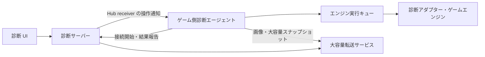

# ADR-DIAGNOSTICS-0001: MagicOnion によるゲームエンジン診断通信

- 状態: 提案
- 日付: 2026-10-08

## 背景

Lumyte の実行状態を外部から観測し、必要に応じて変更できる診断機能を提供する。診断システムをサーバー、ゲームに組み込む診断エージェントをクライアントとして MagicOnion で通信する。

対象はテレメトリー、シーンやコンポーネントなどのオブジェクトグラフ、レンダリング結果、プロパティ編集、インプットのオーバーライドである。ゲーム側で待ち受けポートを開かずに、診断側から操作できる必要がある。

通信遅延、切断、対象オブジェクトの破棄、大容量転送があっても、ゲーム実行と診断操作の整合性を維持する。通信処理からエンジンへ直接アクセスすると、スレッド制約やフレーム更新を壊すため、実行境界も定める。

配置と記述は [ADR-0001](../0001-adr-writing-policy.md)、プロジェクト配置は [ADR-0002](../0002-repository-layout.md) に従う。本 ADR は診断通信と操作の共通契約を対象とし、各サブシステムの具体的な実装は扱わない。

## 決定

ゲーム側から接続する MagicOnion StreamingHub を制御経路の中心とする。診断サーバーは receiver コールバックで要求を通知し、ゲーム側は安全な実行タイミングで処理して結果を報告する。

観測と変更操作を明示的なプロトコルにする。制御、テレメトリー、大容量データは論理的に分離し、画像や大きなスナップショットを制御用 Hub に直接載せない。

### 責務と依存関係

| 構成要素 | 責務 | 依存の制約 |
| --- | --- | --- |
| 診断 UI | 対象選択、可視化、操作要求 | 診断サーバーを利用し、ゲームへ直接接続しない |
| 診断サーバー | 認証、セッション、購読、要求と結果の相関管理 | エンジン実装型を参照しない |
| ゲーム側診断エージェント | 接続、検証、要求キュー、観測データの送信 | 各サブシステムの診断アダプターを利用する |
| 診断アダプター | 安全な時点での読み取り・変更、診断モデルへの変換 | 通信接続や UI を管理しない |
| 共有通信契約 | Hub 契約、診断専用 DTO、スキーマ | エンジンオブジェクトや Native ハンドルを含めない |
| 大容量転送サービス | 分割データの受信、保存、期限付き参照 | 制御と独立したキュー・転送予算を持つ |

共有契約、エージェント、サーバーは実装時に `src/Diagnostics/` の別プロジェクトとして配置する。エンジンの通常実行は診断サーバーの存在に依存させず、診断アダプターを明示的に登録する。この ADR の追加ではプロジェクトを作成しない。



### 接続とセッション

ゲーム側が接続し、StreamingHub の接続を維持する。接続時にプロトコルバージョン、エンジン・ビルド情報、実行インスタンス ID、対応機能、型スキーマのバージョンを交換する。サーバーはセッション ID とセッションに許可する機能を返す。

実行インスタンス ID はゲームプロセスの起動ごとに変える。セッション ID は接続ごとに変える。複数インスタンスを許容し、診断利用者は操作対象を明示する。

接続状態は未接続、接続中、機能交渉中、利用可能、切断として扱い、交渉完了前は操作を受け付けない。再接続には上限付きのバックオフを使用し、新しいセッションで購読とスナップショットを同期し直す。古いセッションの未完了操作は自動再実行しない。

### 主要な公開通信 API

共有契約の名前空間は `Lumyte.Diagnostics.Contracts` とする。以下は判断対象となる主要シグネチャであり、DTO のフィールド番号や全メンバーは実装前に具体化する。Hub は `IStreamingHub<IDiagnosticsHub, IDiagnosticsReceiver>` を継承する。

| 公開 API | 役割 | 契約・注意事項 |
| --- | --- | --- |
| `Task<SessionWelcome> IDiagnosticsHub.RegisterAsync(ClientHello hello)` | 接続と機能交渉 | 認証後、一接続につき一回。非互換なら利用可能状態にしない |
| `void IDiagnosticsReceiver.OnCommand(DiagnosticCommand command)` | サーバーからゲームへの要求通知 | 受信処理はキュー投入までとし、エンジンを直接操作しない |
| `Task IDiagnosticsHub.ReportCommandResultAsync(CommandResult result)` | 受信確認・実行結果の報告 | `RequestId` と `SessionId` を一致させ、受付と完了を区別する |
| `Task IDiagnosticsHub.PublishTelemetryAsync(TelemetryBatch batch)` | テレメトリーの送信 | 有界バッチとし、欠落件数を含める |
| `Task IDiagnosticsHub.PublishGraphUpdateAsync(GraphUpdate update)` | 小さな状態更新の送信 | 基準リビジョンと順序を含め、大容量なら転送参照を使う |
| `Task IDiagnosticsHub.ReportTransferAsync(TransferDescriptor transfer)` | 大容量転送の完了通知 | 完了・整合性確認後の転送 ID とメタデータを報告する |

`DiagnosticCommand` は識別子付きの型付き要求とし、購読の設定・解除、グラフ取得・再同期、プロパティ編集、画像キャプチャー、入力リースの取得・更新・解除を表現する。任意コード、任意メソッド呼び出し、任意メモリー読み書きは提供しない。

receiver の戻り値に操作結果を依存させず、要求通知と結果報告を別メッセージにする。診断 UI 向け API、大容量転送サービスの具体的な API、グラフ・描画・入力に固有の公開アダプター API は別途定義する。

### DI による構成と公開境界

DI をサブシステム統合の基準とする。診断アダプターはコンストラクターで対象サブシステムを受け取り、`IDiagnosticContributor.Configure` で公開内容を宣言する。サブシステム自身はレジストリ、接続、ランタイムを取得しない。登録ハンドルと通信のライフサイクルは診断基盤が所有する。

DI 統合は `Microsoft.Extensions.DependencyInjection` の `IServiceCollection` を使う。診断操作の契約型は `Lumyte.Diagnostics`、DI 拡張は `Lumyte.Diagnostics.DependencyInjection` に分ける。MagicOnion への依存は通信実装に限定する。以下は公開 API の設計であり、実装は未追加である。

```csharp
public interface IDiagnosticContributor
{
    void Configure(DiagnosticBuilder builder);
}

public interface IDiagnosticPump<TPoint> where TPoint : class
{
    void Activate();
    void Pump(DiagnosticFrame frame, DiagnosticBudget budget);
    void Deactivate();
}

public interface IDiagnosticSession
{
    Task StartAsync(CancellationToken cancellationToken);
    Task StopAsync(CancellationToken cancellationToken);
}

public sealed class DiagnosticOptions
{
    public bool Enabled { get; set; }
    public Uri? ServerAddress { get; set; }
    public IReadOnlyList<string> AllowedMeterNames { get; set; } = Array.Empty<string>();
}

// Lumyte.Diagnostics.DependencyInjection 内の拡張メソッド。
public static IServiceCollection AddLumyteDiagnostics(
    this IServiceCollection services, Action<DiagnosticOptions> configure);
public static IServiceCollection AddDiagnosticExecutionPoint<TPoint>(
    this IServiceCollection services, string id) where TPoint : class;
public static IServiceCollection AddDiagnosticSubsystem<TContributor, TPoint>(
    this IServiceCollection services, SubsystemDescriptor descriptor)
    where TContributor : class, IDiagnosticContributor
    where TPoint : class;
```

`AddLumyteDiagnostics` は設定と通信ファクトリを Singleton、セッション、レジストリ、購読状態、カタログ、実行キューを Scoped として登録する。一つのゲーム実行に一つの明示的な DI スコープを作る。別スコープは別の実行インスタンス ID と接続を持ち、オブジェクト、要求、購読を共有しない。Scoped をプロセス全体の Singleton として注入しない。

`AddDiagnosticExecutionPoint<TPoint>` は型と安定したポイント ID を対応付け、`IDiagnosticPump<TPoint>` を Scoped として登録する。型は DI で使うマーカーであり、マーカーインスタンスを生成しない。型・ID の重複と未定義ポイントへの登録を起動時に拒否する。

`AddDiagnosticSubsystem<TContributor, TPoint>` は公開記述子を登録し、`TContributor` を Scoped として登録する。同じ型の既存の Scoped 登録があればそれを利用し、Singleton・Transient 登録なら起動時に拒否する。フレーム更新側への `TContributor` の注入と診断側の解決は、同じスコープ内の同一インスタンスになる。同じ型の複数サービス登録も拒否し、別の `IDiagnosticContributor` インスタンスを生成する登録は行わない。同じ型を複数サブシステムとして登録することは初期 API では拒否する。

スコープごとの調整サービスだけが登録済み型を DI から解決する。アダプターとサブシステムは `IServiceProvider` を受け取らず、依存をコンストラクターに明示する。未使用のアダプターが DI 登録だけで公開されるとは限らず、対応ポイントの `Activate` が必要である。

| サービス | 寿命 | 所有者・依存 |
| --- | --- | --- |
| 設定、通信ファクトリ、登録記述子 | Singleton | スコープ内のエンジンオブジェクトを保持しない |
| `IDiagnosticSession`、内部レジストリ | Scoped | ゲーム実行スコープ。アダプターの生成・破棄は DI に任せる |
| `IDiagnosticPump<TPoint>` | Scoped | 同じスコープのキューと調整サービスを参照する |
| 診断アダプター、診断対象、更新ループ | Scoped | 同じゲーム実行内のインスタンスを共有する |
| `IMeterFactory` / Meter | DI ルート | 標準 AddMetrics。スコープから共有 Meter を破棄しない |
| `IGameExecutionIdentity` / MeterListener | Scoped | 実行 ID による計測分離と購読管理 |
| 操作登録ハンドル | 登録期間 | DI サービスにせず、診断基盤が解除を管理する |

### DI と所有スレッドのライフサイクル

DI の解決と所有スレッドの確定は別の処理とする。コンストラクターでは外部公開・接続・エンジン操作を行わない。

1. Composition Root でサービスを登録し、ゲーム実行スコープを作る。
2. エンジンが各ポイントの所有スレッドで `Activate` を呼ぶ。初回呼び出しで所有スレッドを確定し、そのポイントのアダプターを同じスコープから解決して `Configure` を呼ぶ。
3. 診断基盤がスキーマを検証し、ポイント単位で全アダプターを一括公開する。失敗時はそのポイントの公開を取り消し、例外を起動側に返す。
4. `IDiagnosticSession.StartAsync` が通信を開始し、有効化されたカタログを送る。接続開始後の追加 `Activate` もカタログ更新として扱う。
5. 所有スレッドが安全な更新位置で `Pump` を呼び、アダプターが値を記録する。
6. 終了時は各所有スレッドで `Deactivate` を呼び、要求受付・登録・操作対象の購読を解除する。標準メトリクスはセッション停止まで独立して観測できる。その後 `StopAsync` で接続と送信処理を終了し、スコープを破棄する。

有効化済みポイントへの同じ所有スレッドからの `Activate` は冪等とする。`Deactivate` も冪等とし、再有効化時は新しい登録世代にする。異なるスレッドからの有効化・処理・解除、`Pump` 中の再入や解除を拒否する。予期しないスコープ破棄では基盤が登録を無効化し、通信を終了するが、サブシステムにアクセスする終了コールバックは呼ばない。セッション実装は `IAsyncDisposable` を実装し、スコープは `CreateAsyncScope` で生成して非同期破棄する。通常終了は上の順序を守る。

計測用サービスのコンストラクターで標準 Meter / Instrument を作成することは許容するが、計測値は発行せずエンジンへアクセスしない。型の解決時にスレッド制約のある対象を構築する場合は、その解決も所有スレッドで行う。DI 自体にスレッド親和性を期待しない。複数ポイントを同時に持つスコープでは、調整サービスが登録カタログの更新を同期する。

`Enabled = false` でも同じ DI 登録と注入を利用する。アダプターの構成は有効化時に行えるが、診断用 Listener は計測を有効化せず、キューは空、通信接続は作らない。標準メトリクス生成と他の Listener は継続できる。テストでは診断対象や Pump をテスト用サービスに差し替えられる。メトリクスのテストは標準 MeterListener で記録を受け取り、診断通信を必要としない。

### サブシステムが宣言する API

```csharp
namespace Lumyte.Diagnostics;

public sealed record SubsystemDescriptor(
    string Id, string DisplayName, int SchemaVersion);

public readonly record struct DiagnosticFrame(long Number, long TimestampTicks);
public sealed record DiagnosticBudget(TimeSpan MaxDuration, int MaxCommands);

public sealed class DiagnosticBuilder
{
    public void Operation(
        OperationDescriptor descriptor, DiagnosticOperationHandler handler);
}

public enum DiagnosticPermission { Observe, Edit, OverrideInput }
public enum DiagnosticValueKind { Boolean, Int64, Double, String }
public sealed record DiagnosticField(
    string Id, DiagnosticValueKind Kind,
    double? Minimum = null, double? Maximum = null,
    int? MaxLength = null);
public sealed record OperationDescriptor(
    string Id, string DisplayName, DiagnosticPermission RequiredPermission,
    DiagnosticField[] Arguments, DiagnosticField[] Results);

public delegate DiagnosticOperationResult DiagnosticOperationHandler(
    DiagnosticOperationContext context, DiagnosticArguments arguments);

public sealed record DiagnosticOperationContext(
    Guid RequestId, DiagnosticFrame Frame, string ActorId,
    long? ExpectedRevision, CancellationToken CancellationToken);

public sealed class DiagnosticArguments
{
    public bool GetBoolean(string id);
    public long GetInt64(string id);
    public double GetDouble(string id);
    public string GetString(string id);
}

public readonly struct DiagnosticValue
{
    public static DiagnosticValue From(bool value);
    public static DiagnosticValue From(long value);
    public static DiagnosticValue From(double value);
    public static DiagnosticValue From(string value);
}

public sealed class DiagnosticOperationResult
{
    public static DiagnosticOperationResult Success(
        IReadOnlyDictionary<string, DiagnosticValue> values,
        long? revision = null);
    public static DiagnosticOperationResult Reject(string code, string message);
    public static DiagnosticOperationResult Conflict(long currentRevision);
}
```

`DiagnosticBuilder` は `Configure` の呼び出し中だけ有効とし、内容をコピー・検証して一括登録する。登録失敗時は一部だけ公開しない。操作 ID の重複と無効な引数・結果スキーマを登録エラーとする。標準メトリクスはこの Builder に登録しない。

サブシステム ID は `physics` などの安定した名前、操作 ID は `set-time-scale` などとする。メトリクスは Meter と Instrument の名前で独立して識別する。表示名を識別子に使わない。同時に同じサブシステム ID を登録できない。再有効化すると世代を進め、旧世代の要求と購読を引き継がない。契約変更時は `SchemaVersion` を更新する。

基盤の内部登録が操作ハンドラーの生存期間を所有し、公開 API として登録ハンドルを DI 利用者に渡さない。解除後の未実行要求は対象消失になる。再有効化時には `Configure` を再実行する。基盤は解除後のハンドラー参照を解放するが、アダプター自体の破棄は DI スコープが担う。

### .NET 標準メトリクスの生成と転送

テレメトリーの生成には `System.Diagnostics.Metrics` を使用する。独自の `DiagnosticMetric<T>`、`Gauge` / `Counter` 登録、`TryRecord` は提供しない。サブシステムは DI で受け取る `IMeterFactory` から `Meter` を取得し、標準の Instrument に `Record` / `Add` する。診断操作の登録とは独立して計測でき、OpenTelemetry 等の別 Listener と併用できる。

`services.AddMetrics()` が標準の `IMeterFactory` を登録する。ファクトリは DI ルートで Meter を共有・所有するため、Scoped サブシステムが共有 Meter を Dispose しない。`AddLumyteDiagnostics` も `AddMetrics` を呼ぶが、計測のみ利用するアプリは診断接続を登録する必要がない。

同じ Meter を使う複数ゲームスコープを分離するため、Scoped の `IGameExecutionIdentity` を注入する。`Guid InstanceId { get; }` を持ち、セッションの実行インスタンス ID と一致する。全ゲーム計測に `lumyte.instance.id` タグを付ける。Listener はそのタグと Meter の所属ファクトリを検証し、自分の実行スコープの計測だけを受け付ける。タグを持たないプロセス共通メトリクスは初期設計ではゲームへ自動配信しない。

エージェントはスコープごとに `MeterListener` を所有する。Instrument の公開通知から名前、Meter 名・版、Instrument 種別、数値型、単位、説明を取得し、カタログへ登録する。購読がある Instrument にだけ `EnableMeasurementEvents` を適用し、`SetMeasurementEventCallback<T>` で標準計測を受け取る。解除・切断で不要な計測受信を無効化し、セッション終了で Listener を Dispose する。再接続時は Listener を再作成し、既存 Instrument も再発見する。

Listener のコールバックは `Record` / `Add` を呼ぶスレッドで同期実行される。コールバック内ではエンジンへアクセスせず、タグをコピーして有界バッファへ投入するか、短い集約処理だけを行う。シリアライズと MagicOnion 送信は別処理に移す。バッファ超過と不正値の破棄を診断基盤が数え、計測コードへ例外を返さない。標準 `Record` / `Add` に配送成功の戻り値はなく、完全配送は保証しない。

| 標準 Instrument | 用途・入力 | 初期の送信集約 |
| --- | --- | --- |
| `Counter<T>` | 件数などの非負の増分を `Add` | 集約窓の Sum。累計値として解釈しない |
| `UpDownCounter<T>` | リソースの増減を `Add` | 符号付きの窓内 Sum。購読前の現在量は復元しない |
| `Gauge<T>` | 現在値を `Record` | Latest / Min / Max / Mean |
| `Histogram<T>` | 時間などの観測分布を `Record` | Count / Sum / Min / Max、明示境界のバケット |

対象は標準 API が許容する `byte`、`short`、`int`、`long`、`float`、`double`、`decimal` とする。転送で整数を無条件に double に変換せず、元の型をカタログで宣言する。集約のオーバーフローや精度の扱いは通信 DTO の具体化時に定める。Gauge は .NET 10 の標準 API を使う。

Histogram のバケット境界はエージェントの設定で固定し、カタログへ含める。異なる境界の購読要求は拒否する。標準計測は単なる観測値であり、Listener が分布を構成する。集約期間内に Counter の記録がない場合は、期間全体を継続観測できたときだけ増分ゼロとし、Gauge 等の未観測値は欠測とする。切断、バッファ欠落、購読開始時刻も送信する。

`ObservableGauge` / `ObservableCounter` / `ObservableUpDownCounter` は初期転送対象に含めない。`RecordObservableInstruments` は収集側スレッドでコールバックを呼び得るため、エンジン状態への直接アクセスや、共有 Meter から Scoped オブジェクトの捕捉を許可する設計にしない。後続設計ではスレッド安全なスナップショットとコールバックの寿命を定める。未対応 Instrument はカタログで非対応を示す。

Instrument の識別には Meter 名・版、Instrument 名・種別・数値型と、Listener が割り当てる Instrument ID を使う。同じ名前の別 Instrument を無条件に統合しない。Meter 名は `DiagnosticOptions.AllowedMeterNames` の完全一致で制限し、既定の空リストでは公開しない。タグ名・文字列長・系列数にも上限を設ける。`lumyte.instance.id` は経路識別用として集約系列の次元から除き、オブジェクト ID やフレーム番号を高カーディナリティタグにしない。

複数利用者の購読はエージェントが統合し、購読ごとに必要な窓で集約する。生成側の `Instrument.Enabled` はすべての Listener の状態を示すため、診断サーバーの購読有無とは解釈しない。高価な計測のガードには使えるが、診断無効時にも OpenTelemetry 等による計測を妨げない。

標準計測にはフレーム番号や生成時刻が含まれない。Listener は受信時の単調増加時刻を記録し、送信データに集約期間を付ける。フレーム相関がない計測にはフレーム番号を推測して付けない。正確なフレーム相関が必要なイベントはメトリクスとは別契約で設計する。ログと分散トレースは、将来 `ILogger` と `ActivitySource` を対象とする別の転送設計で扱う。

### 操作の実行契約

操作は明示的な名前と入出力スキーマで公開する。初期の引数は必須のスカラー値に限定し、未知フィールド、欠落、型違い、範囲外、長さ超過をハンドラー実行前に拒否する。リフレクションで任意メソッドを公開しない。

操作は登録時に指定した実行ポイントへ配送する。エンジンがその所有スレッド上の安全な位置で `Pump` を呼ぶと、期限と権限を再検証した後にハンドラーを同期実行する。入力前、シミュレーション後、描画後などはエンジン側が実行ポイントを用意する。キューは DI スコープ内で実行ポイントごとに一つとし、異なる所有スレッドでの `Pump` と再入を拒否する。

`Pump` は実行予算に達すると後続要求を延期するが、実行中の同期ハンドラーを強制中断できない。ハンドラーは短時間で終了する必要がある。GPU 待ち、長時間探索、ファイル・ネットワーク待ちを伴う操作はこの同期 API に登録せず、専用のジョブ・キャプチャー API で別途設計する。

`ActorId` は認証済み要求からエージェントが設定する。キャンセルは実行開始前の中止と協調的な確認に使い、実行後の自動ロールバックを意味しない。副作用の前に検証を終える。例外は実行失敗として報告し、内部スタックトレースを UI に転送しない。成功の出力は宣言されたスキーマに適合することを検証するが、出力エラーがあっても既に生じた副作用は戻らない。

リビジョンの比較・更新は対象を所有するハンドラーが行う。エージェントは `ExpectedRevision` を渡すだけで、サブシステム内部の整合性を代行しない。`Reject` のコードは操作固有の安定したコードとし、認証・対象消失・期限切れ等の共通エラーはエージェントが生成する。

### 物理サブシステムの登録例

以下は `PhysicsWorld` が `LastStepMilliseconds`、`ActiveBodyCount`、`TimeScale`、`Revision` を持つ例である。`Revision` は診断経由以外の `TimeScale` 変更でも進むものとする。

```csharp
public sealed class PhysicsDiagnostics : IDiagnosticContributor
{
    private readonly PhysicsWorld _world;
    public PhysicsDiagnostics(PhysicsWorld world) => _world = world;

    public void Configure(DiagnosticBuilder builder)
    {
        builder.Operation(new OperationDescriptor(
            "get-time-scale", "Get time scale", DiagnosticPermission.Observe,
            Array.Empty<DiagnosticField>(),
            new[] { new DiagnosticField("actual", DiagnosticValueKind.Double, 0, 2) }),
            (context, arguments) => DiagnosticOperationResult.Success(
                new Dictionary<string, DiagnosticValue>
                {
                    ["actual"] = DiagnosticValue.From(_world.TimeScale),
                }, _world.Revision));

        builder.Operation(new OperationDescriptor(
            "set-time-scale", "Set time scale", DiagnosticPermission.Edit,
            new[] { new DiagnosticField("value", DiagnosticValueKind.Double, 0, 2) },
            new[] { new DiagnosticField("actual", DiagnosticValueKind.Double, 0, 2) }),
            (context, arguments) =>
            {
                if (context.ExpectedRevision is not long expected)
                {
                    return DiagnosticOperationResult.Reject(
                        "revision-required", "Expected revision is required.");
                }

                if (expected != _world.Revision)
                {
                    return DiagnosticOperationResult.Conflict(_world.Revision);
                }

                _world.SetTimeScale(arguments.GetDouble("value"));
                return DiagnosticOperationResult.Success(
                    new Dictionary<string, DiagnosticValue>
                    {
                        ["actual"] = DiagnosticValue.From(_world.TimeScale),
                    }, _world.Revision);
            });
    }
}
```

標準メトリクスは操作アダプターと独立した Scoped サービスで生成する。

```csharp
using System.Diagnostics.Metrics;

public interface IGameExecutionIdentity
{
    Guid InstanceId { get; }
}

public sealed class PhysicsMetrics
{
    private readonly Histogram<double> _stepDuration;
    private readonly Gauge<long> _activeBodies;
    private readonly KeyValuePair<string, object?> _instanceTag;

    public PhysicsMetrics(IMeterFactory meterFactory, IGameExecutionIdentity identity)
    {
        var meter = meterFactory.Create(new MeterOptions("Lumyte.Physics")
        {
            Version = "1.0.0",
        });
        _stepDuration = meter.CreateHistogram<double>(
            "physics.step.duration", unit: "ms", description: "Physics step duration");
        _activeBodies = meter.CreateGauge<long>(
            "physics.active_bodies", unit: "{body}", description: "Active bodies");
        _instanceTag = new("lumyte.instance.id", identity.InstanceId.ToString("D"));
    }

    public void RecordAfterSimulation(PhysicsWorld world)
    {
        _stepDuration.Record(world.LastStepMilliseconds, _instanceTag);
        _activeBodies.Record(world.ActiveBodyCount, _instanceTag);
    }
}
```

DI 登録は Composition Root で行う。アダプターと更新ループが注入される `PhysicsWorld` は同じ Scoped インスタンスである。以下のマーカーは実行位置を型で識別する。

```csharp
public sealed class AfterPhysicsSimulation { }

services.AddLumyteDiagnostics(options =>
{
    options.Enabled = true;
    options.ServerAddress = new Uri("https://localhost:5001");
    options.AllowedMeterNames = new[] { "Lumyte.Physics" };
});
services.AddMetrics();
services.AddScoped<PhysicsMetrics>();
services.AddScoped<PhysicsWorld>();
services.AddScoped<PhysicsLoop>();
services.AddDiagnosticExecutionPoint<AfterPhysicsSimulation>(
    "physics.after-simulation");
services.AddDiagnosticSubsystem<PhysicsDiagnostics, AfterPhysicsSimulation>(
    new SubsystemDescriptor("physics", "Physics", 1));
```

更新ループも DI で構築する。コンストラクターは受け取った依存を保持するだけとし、エンジンが所有スレッド上で `Initialize`、`Update`、`Shutdown` を呼ぶ。例の予算は説明用である。

```csharp
public sealed class PhysicsLoop
{
    private readonly PhysicsWorld _world;
    private readonly PhysicsMetrics _metrics;
    private readonly IDiagnosticPump<AfterPhysicsSimulation> _pump;

    public PhysicsLoop(
        PhysicsWorld world, PhysicsMetrics metrics,
        IDiagnosticPump<AfterPhysicsSimulation> pump)
    {
        _world = world;
        _metrics = metrics;
        _pump = pump;
    }

    public void Initialize() => _pump.Activate();

    public void Update(double deltaTime, DiagnosticFrame frame)
    {
        _world.Step(deltaTime);
        _pump.Pump(frame, new DiagnosticBudget(TimeSpan.FromMilliseconds(0.2), 8));
        _metrics.RecordAfterSimulation(_world);
    }

    public void Shutdown() => _pump.Deactivate();
}
```

ゲーム起動側は実行スコープから `PhysicsLoop` と `IDiagnosticSession` を一度解決する。所有スレッドで `Initialize` 後にセッションを開始する。終了は所有スレッドで `Shutdown`、セッション停止、スコープの非同期破棄の順に行う。非同期接続後の継続が所有スレッドへ戻るとは仮定せず、フレーム更新と終了はエンジンの実行機構へ配送する。診断セッションは PhysicsLoop を解決・更新せず、両者の順序を起動側が管理する。

### カタログ公開とサーバーからの利用

Hub に `Task PublishCatalogAsync(DiagnosticCatalog catalog)` を追加する。カタログはセッション ID、カタログリビジョン、登録中の各操作サブシステムの ID・世代・スキーマ版・操作記述子、および Listener が発見した Instrument の記述子を含む。接続・再接続後は完全なカタログを送り、登録・解除時も新しいリビジョンの完全版を送る。サイズ超過時は既存の大容量転送参照を使う。

サーバーは受信カタログを認可に従って UI に公開する。カタログはコードやデリゲートを含まない。操作の要求経路は以下のとおりである。

1. DI が `PhysicsWorld` と `PhysicsDiagnostics` を同じスコープで構築する。`Activate` が `Configure` を呼び、`physics` の公開後にエージェントがカタログを送る。
2. Listener が `Lumyte.Physics` の `physics.step.duration` を発見し、カタログを更新する。UI がその Instrument ID を周期 100 ms で購読し、ゲーム側は対象と集約方式を検証して購読 ID を返す。
3. 物理更新後の標準 Histogram.Record が Listener へ計測を通知する。エージェントが実行 ID を検証して集約し、購読 ID、Instrument ID、集約期間、Count / Sum とバケットを含む `TelemetryBatch` を送る。
4. UI が `physics/get-time-scale` で現在値とリビジョンを取得し、`physics/set-time-scale` に `value = 0.5` と期待リビジョンを指定する。サーバーは `InvokeOperation` 要求を送る。
5. エージェントが対象の ID・世代・カタログ版、権限、スキーマを検証し、指定実行ポイントへ投入する。
6. 次の `Pump` でハンドラーが適用し、実際の値とリビジョンを結果として返す。エージェントが元の `RequestId` でサーバーへ報告する。

`InvokeOperation` のペイロードは `SubsystemId`、`Generation`、`SchemaVersion`、`OperationId`、引数値、期待リビジョンを持つ。`ConfigureTelemetry` は購読 ID、Instrument ID、カタログリビジョン、周期、集約を持つ。操作の登録世代をメトリクスの識別に流用しない。カタログ更新と競合する要求は古い世代・スキーマとして拒否し、サーバーは再取得する。

公開順序はセッション確立、カタログ公開、購読・操作受付とする。サーバーはカタログを処理した Hub 呼び出しの完了後に要求を送る。解除直前のカタログを見て要求しても、ゲーム側の実行時検証で対象消失として処理する。

### 要求と結果の契約

要求には `RequestId`、`SessionId`、操作種別、対象、有効期限、必要に応じた期待リビジョンを含める。有効期限はゲーム側で判定できる単調増加時計上の予算として扱い、サーバーとゲームの壁時計の一致を前提にしない。

結果は受付または終端結果を表し、終端結果には成功、拒否、競合、対象消失、非対応、期限切れ、実行失敗を区別する。成功時には実際に適用した値やフレーム番号を返す。

ゲーム側は同じセッション内の `RequestId` を重複排除し、処理中なら再投入せず、結果を保持していれば同じ結果を返す。重複排除情報の保持期限は要求の有効期間を下回らせず、期限を過ぎた要求は再実行しない。

サーバー側のタイムアウトは未実行を意味しない。結果不明の場合は対象状態を再取得し、副作用のある操作を新しい要求として無条件に再送しない。通信全体で exactly-once の実行保証は提供しない。

### スレッドと実行タイミング

通信処理は要求の検証とキュー投入までを行う。シーンやプロパティの読み書きは所有スレッド、キャプチャーは描画パイプラインの適切な位置、入力変更はゲーム処理へ入力を渡す前に適用する。

読み取ったデータはエンジン所有オブジェクトへの参照を残さない DTO に変換する。シリアライズ、圧縮、ネットワーク待ちは可能な範囲でエンジンスレッドの外へ移す。破棄済み対象は実行時にも検証する。

診断処理にはフレームごとの時間・件数予算と有界キューを設け、超過時は分割、延期、拒否する。診断通信を待つためにゲームフレームをブロックしない。

### テレメトリー

診断サーバーが項目、取得周期、集約方法を指定する購読方式とする。初期対象はフレーム時間、CPU・GPU 時間、メモリー、描画統計、診断処理自体の負荷とする。計測不能な項目は機能交渉または結果で非対応を示し、ゼロ値に置き換えない。

送信バッチには実行インスタンス ID、シーケンス番号、Instrument ID、ゲーム側の単調増加時刻による集約期間を含める。標準メトリクスにはフレーム番号を要求しない。送信はバッチ化し、混雑時は特性に応じて間引き・集約する。欠落件数を報告し、ゲーム実行を停止させてまで完全配送を保証しない。

### オブジェクトグラフ

シーン、エンティティ、コンポーネント等は診断用の投影モデルとして公開する。生のポインターを公開せず、実行インスタンス内の診断用 ID と世代で識別する。親子関係と任意参照を区別し、循環参照は ID で表現する。

型情報、プロパティ情報、生成・更新・破棄を扱う。無制限な再帰展開は行わず、ルート、子要素、プロパティを段階的に取得する。読み取り対象と編集対象は登録されたスキーマで明示する。

初期スナップショットと差分で同期する。スナップショットに基準リビジョン、差分に前後のリビジョンと順序情報を付与する。スナップショット取得中の差分は基準以降を保持して適用し、保持上限超過や欠落を検出したら再同期する。

一貫した状態を取得できない対象は取得フレームと整合性の範囲を明示し、単一フレームの状態であるかのように表示しない。

### プロパティ編集

対象 ID・世代、プロパティ ID、型付き値、期待リビジョンを要求に含める。ゲーム側は対象の存続、権限、型、値域、編集可能なエンジン状態を検証し、所有スレッドで適用する。

期待リビジョンが一致しない場合は競合として拒否する。成功時は補正後も含めた実際の値と新しいリビジョンを返す。ゲーム側での変更もリビジョンへ反映し、それを追跡できないプロパティには楽観的競合検出を保証しない。

複数プロパティの原子的な一括編集は、アダプターが保証できる場合だけ公開する。それ以外は個別結果を返し、部分成功を隠さない。

### レンダリング結果と大容量転送

初期実装はオンデマンドの静止画取得とする。対象ビュー、解像度、フォーマット、頻度上限を指定し、対応環境では GPU 読み戻しを非同期に行う。

結果にはキャプチャー ID、フレーム番号、ビュー、寸法、画素形式、色空間を含める。画像の圧縮や大きなスナップショットの転送は制御用 Hub から分離し、別の MagicOnion サービス等を使った分割転送でゲーム側からアップロードする。

転送 ID はセッションと要求に紐付ける。総サイズ、チャンクの位置、整合性情報を検証し、転送途中を完了済みとして公開しない。サイズ、同時数、帯域、保存期間に上限を設け、切断や期限切れの未完了データを解放する。ダウンロードにも認可を適用する。

制御用 Hub は転送参照とメタデータのみを扱う。独立したストリームとキューを使い、帯域競合が残る場合は接続と帯域予算も分離する。継続キャプチャーでは古いフレームを破棄し、待ち行列を増やさない。低遅延動画は後続 ADR の対象とする。

### インプットのオーバーライド

ゲーム側の入力抽象化層で、対象入力、置換・加算方式、開始条件、有効期間、所有者を持つ期限付きリースを適用する。実デバイス入力との優先順位は、置換なら対象を上書き、加算なら対象型の範囲に補正して合成する。非対応の型・方式は拒否する。

初期実装では対象入力の制御権を単一所有者に限定する。更新・解除は所有者とリース ID を検証する。期限はゲーム側の単調増加時計で判定し、明示解除、切断、対象コンテキストの終了でも解除する。切断検知が遅れても期限切れにより解除されるようにする。

解除後は実入力から状態を再計算し、必要な解放イベントを生成して押下状態を残さない。フレーム指定はゲーム側フレーム番号を基準とし、開始フレームを過ぎた新規要求は拒否する。

この機能だけで決定的な入力再生は保証しない。時計、乱数、外部イベントまで含めた再現実行は別途設計する。

### 負荷制御

| 種別 | 混雑・欠落時の方針 |
| --- | --- |
| 操作要求・結果 | 有界キュー。受付拒否を明示し、接続喪失後の結果不明は再照会で解決する |
| テレメトリー | 間引き・集約と欠落件数の報告 |
| グラフ差分 | 順序を検証し、欠落時に再同期 |
| レンダリング結果 | 古いフレームを破棄可能とする |
| 大容量転送 | 同時数・サイズ・帯域・保存期間を制限する |

上限値は実装時の測定で決め、設定可能にする。診断無効時に購読処理や継続的なキャプチャーを実行しない。

### セキュリティと配布

TLS を使用し、ゲーム接続と診断利用者を認証する。観測、編集、入力操作の権限を分け、サーバーで利用者を認可し、ゲーム側でもセッションに許された操作と公開対象を検証する。ゲーム側が UI から受け取った自己申告の権限を信頼する設計にはしない。

編集と入力操作の主体、対象、結果を監査ログに記録する。秘密情報をスキーマの公開対象から除外する。製品ビルドでは診断機能を既定で無効とし、有効化条件を明示する。

### 互換性と対応環境

共有 DTO には MessagePack の安定したキーと型識別子を使い、既存キーの意味変更や再利用を避ける。接続時にプロトコルバージョンを確認し、対応機能とスキーマを交渉する。非互換なら接続を利用可能にせず、機能不足ならその操作を提供しない。

MagicOnion と MessagePack の版は実装時に固定する。AOT・トリミング環境では生成コードとシリアライズ対象を検証する。

| 環境 | 本 ADR の扱い |
| --- | --- |
| Windows / Linux | ネイティブ gRPC・HTTP/2 による接続を初期検証対象とする。動作検証は未実施 |
| Browser | StreamingHub の双方向通信が利用可能か、採用版とトランスポートで要検証。通常の gRPC-Web だけで利用可能とは仮定しない |

Browser で StreamingHub の要件を満たせない場合の中継や代替トランスポートは後続 ADR で決め、未対応の間は機能交渉で明示する。

## 検討した代替案

| 案 | 採用しない理由 |
| --- | --- |
| ゲーム側をサーバーにする | 待ち受けポート、端末探索、ファイアウォール対応が必要となる |
| Unary RPC のポーリングだけで構成する | 操作通知の遅延と継続観測の通信量が増える |
| 全データを単一 StreamingHub で送信する | 画像転送が制御応答を遅らせ、負荷制御を分けにくい |
| エンジンオブジェクトを直接シリアライズする | 循環参照、スレッド制約、内部実装への結合、情報公開の制御に問題がある |

ゲーム側からの接続とサーバーからの操作通知を両立できるため、StreamingHub を制御の中心にする。

## 結果と影響

診断 UI と通信をエンジン実装から分離し、複数のゲームインスタンスを共通の契約で扱える。安全な実行時点、切断時の入力解除、編集競合、転送上限を定めることで診断操作の影響を制御できる。

一方で、要求と結果の相関管理、ID・世代・リビジョン、差分同期、スキーマ、負荷制御の実装が必要となる。診断自体にも CPU・GPU・メモリー・帯域のコストがあり、遠隔操作はローカルデバッガーと同じ即時性を保証しない。

## 検証方針

実装・性能測定は未実施である。採用後、以下を確認する。

- 接続・認証・機能交渉、非互換拒否、複数インスタンスの操作分離。
- 重複要求、期限切れ、結果報告前の切断、再接続での未完了操作の非再実行。
- DI の Scoped インスタンス共有、スコープ間分離、寿命違反、依存循環、診断無効時の注入。
- 有効化の原子性、重複 ID、解除・再有効化、起動失敗時の解放、所有スレッドと終了順序。
- MeterListener の既存 Instrument 発見、購読統合、タグと DI スコープによる分離、他 Listener との共存。
- 標準 Counter / Gauge / Histogram の集約、欠測・欠落、系列数上限、Meter と Listener の破棄。
- カタログ更新と操作の競合。
- 対象破棄、ID 再利用、競合編集、部分成功、所有スレッドでの実行。
- スナップショット取得中の更新、差分欠落、保持上限超過と再同期。
- 入力の所有者競合、更新、期限切れ、切断時解除、解除後のボタン状態。
- 画像のフレーム対応、転送のサイズ超過・中断・期限切れ・整合性エラー。
- 大容量転送中の制御応答時間、診断有効・無効時のフレーム時間と資源消費。
- 対象ランタイムの AOT・トリミング、Browser の双方向通信可否。

## 別途決定する事項

- Observable Instrument、ログ・トレース転送、数値集約の精度とオーバーフロー。
- 全通信 DTO のフィールド番号、グラフ・描画・入力の診断アダプター API、具体的なプロジェクト名。
- 大容量転送 API、保存先、診断 UI 向け API、認証方式と資格情報の配布。
- 入力・描画システムへの具体的な統合位置とプラットフォーム別対応範囲。
- 帯域・キュー・実行時間の具体的な上限と測定に基づく受け入れ基準。
- Browser の通信方式、低遅延動画、決定的な再現実行。
