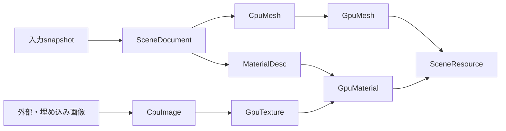

# ADR-RESOURCES-0001: Pipelineによるリソース変換・依存解決・世代管理

- 状態: 提案
- 日付: 2026-10-09
- 更新日: 2026-10-10
- 関連カテゴリ: core、graphics、platform

## 背景

画像、音声、モデルなどは、取得したバイト列を一度デコードするだけでは実行時に利用できない。CPU上の中間型からGPU上の型へ変換し、外部ファイルや同一ファイル内の要素を読み込み、依存する画像やmaterialを組み合わせる必要がある。長い音声は全体を展開せず再生に合わせて読み込みたい。変更したアセットを実行中に更新する場合も、使用中のGPU資源や再生中の音声を途中で破棄してはならない。

読み込みを単一の型別ローダーへ集約すると、中間型の再利用、依存解決、ストリーミング、HotReloadを個別に実装することになる。また、managedな参照だけではunmanagedなコンポーネントを要求するECSからリソースを指せない。型付きPipelineの依存グラフを基盤に、生成物の世代と利用権を統一して管理する。

本ADRのリソースはアセットの実行時オブジェクトである。ECSそのもの、コーデック、アセット変換ツールや配信パック形式は設計対象にしない。メモリ機構は [MEMORY-0001](../memory/MEMORY-0001-memory-management-contracts.md)、deviceのDIとlostは [GRAPHICS-0014](../graphics/GRAPHICS-0014-device-di-and-loss-recovery.md) の契約を使う。以下は公開APIを含む設計案であり、本PRに実装は含めない。

## 決定

### 範囲と責務

[ADR-0002](../0002-repository-layout.md) に従い、共通基盤を `src/Core/Lumyte.Resources/`、名前空間・パッケージ名を `Lumyte.Resources` とする。空のプロジェクトはこのPRで作成しない。

共通基盤はPipeline登録と実行、型付きキー、共有読み込み、依存グラフ、世代の公開と解放、ストリーミングセッション、unmanagedハンドルを担当する。Memoryの契約へ依存するが、Graphics、Audio、Platformの具象型には依存しない。標準DIを前提とし、登録・型の解決は `Lumyte.Resources.DependencyInjection` に置く。形式の解析やCPU型は対応する機能のステージ、GPU変換はGraphics側のステージ、音声デコードはAudio側のストリームreaderに置く。取得元アダプターと変更監視はPlatform側などに配置し、Engineまたはアプリが接続する。

managerはDIから取得元とステージを借用する。登録構成はDI構築前に固定し、managerの終了後にDI scopeがサービスを解放する。固定変換設定や描画contextが異なる場合はmanagerを分ける。同じ描画contextのdevice復旧はmanagerを作り直さずruntime dependencyの世代変更で扱う。

### Source・Stage・managerのDI

`IServiceCollection.AddResources(name, configure)` を構成の入口とし、名前付きのscopedなResourceManagerをkeyed DIから解決する。登録builderは型とPipelineのmetadataを追加するだけで、Source・Stage instanceやIServiceProviderを受け取って実行するものではない。公開の手動ResourceManagerBuilderは設けない。

Source、Stage、runtime dependencyはconstructor injectionを使う。既定は各manager／Pipelineのkeyed scoped登録とし、同じDI scopeで使う依存サービスを借用する。明示的なsingleton実装を使う場合は、その依存もsingletonとして成立することを登録時に確認する。単に型が同じだから複数Pipelineの可変設定や取得元を共有してはならない。Transientを構築ごとに解決して解放責任を曖昧にする方式は用いない。

業務処理のSource・Stage・BuildContextにはservice locatorを公開しない。SourceにIMemoryManagerや設定、GPU Stageに名前付きIGraphicsDeviceServiceなどを注入する。利用中の生成物やreaderはDI scopeではなくmanagerが作る実行時世代・sessionとして所有する。

DI解決でI/Oやasync初期化を同期ブロックしない。deviceのInitializeAsyncなどはEngineがawaitしてからGPU資源を要求する。同名manager、同名Pipeline、Sourceの重複、未登録依存、scopedを捕捉するsingletonは構成エラーとする。Engineは利用権とsessionを終了し、ResourceManagerの終了成功を確認してからDI scopeを閉じる。登録したSource・StageをmanagerからDisposeせず、DIと二重所有しない。

### 型付きPipelineとキー

Pipelineは名前付きの型付き出力ノードとして登録する。入力型のない開始ステージと、登録済みPipelineの出力を入力とする `TInput → TOutput` の変換ステージを組み合わせる。複数段の変換は入力Pipelineをつないで表す。主入力以外の依存も同じグラフへ追加できる。型から変換経路を自動探索せず、要求時にPipelineを明示する。

例えば `EncodedImage → CpuImage → GpuTexture` では、CpuImageを要求してCPUで利用する経路と、同じCpuImageからGPU資源を作る経路を共有できる。同じCPU型から異なる用途のGPU型へ分岐でき、同じ入出力型でも名前の異なるPipelineを登録できる。変換の完了条件や解放処理は各ステージが定義する。

`ResourceId` は取得元内の非空の `/` 区切り相対名である。先頭・末尾の `/`、空セグメント、`.`、`..`、バックスラッシュ、制御文字、`:`、`?`、`#` を拒否する。ordinalで比較し、暗黙の小文字化・URLデコード・Unicode正規化は行わない。default値はAPI境界で拒否する。

`ResourceAddress` はResourceId、Subresource、Variantからなる。Subresourceは `mesh/0`、`image/2` のようなステージが定義する論理要素名であり、ファイルパスとして解決しない。Variantはデコードや生成方法を区別する安定した識別子であり、可変optionsオブジェクトをキーにしない。両者は空文字を既定値とし、nullを拒否してordinalで比較する。

キャッシュの論理キーはmanager内の `(ResourceAddress, PipelineId)` とする。PipelineIdはmanager内で一意で、その出力型と `ResourceKey<T>` のTが一致する必要がある。物理ファイル、CPU型、GPU型、ファイル内の複数要素は別キーで管理する。実際の生成物はこのキーに内容の `Revision` を加えた世代で識別する。Revisionは非ゼロのmanager内単調増加値である。PublicationVersionは初期値0とし、通常構築を含む公開mapの更新単位ごとに増やす。識別子のcounterは周回させず、枯渇した場合は新規生成・公開を失敗させる。

変換ステージのGetInputが主入力のAddressを決めるため、出力と入力のSubresourceやVariantが異なる変換も表現できる。入力Pipelineは登録時に固定する。GetInputとステージの設定は同じ要求に対して決定的であり、実行中に変更しない。managerの初回DI解決時に主入力の未登録・型不一致・静的循環を検証する。

### 依存解決と寿命

ステージは `ResourceBuildContext.RequireAsync` で型付きキーを要求する。managerはキーごとの読み込みを集約し、依存の成功を待って値を渡し、辺と使用した世代を記録する。ステージからmanagerへ直接Acquireして依存を隠すことや、context外で完了を待たない読み込みを開始することは禁止する。

依存の寿命は次の二つに分ける。

- `Build`: 変換中だけ値を借用し、ステージと構築時の片付けが完了したら利用権を返す。GPU uploadに使うCPU型などが該当する。再構築用の依存情報は保持するが、中間オブジェクトを保持する必要はない。
- `Resident`: 生成物の解放完了まで、要求時に確定した依存世代を保持する。materialが使うtexture、ゼロコピーで参照するdocumentのバイト列、stream factoryが使う入力snapshotなどが該当する。

RequireAsyncの既定値はResidentとする。変換の主入力もInputLifetimeで同じ規則を指定する。同じ依存を複数回要求しても一つの辺と利用権に集約し、BuildとResidentが混在したらResidentへ引き上げる。生成物はBuild依存への参照を持ち出してはならない。所有物を二重解放するような入力の所有権移転や、入力そのものを別の所有出力として返すことは認めない。

循環検出は呼び出しstackだけでなく、全構築taskのwait-for graphと公開済みの依存情報を含む論理グラフで行う。依存辺を追加する前に到達可能性を検査し、自己依存、cachedな依存経由の循環、別々に開始された `A → B` と `B → A` も検出する。候補構築中のノードは旧依存辺を新しい辺で置き換えて検査する。Pipeline、Address、型を含む循環経路を示したInvalidOperationExceptionで失敗させ、永続的な待ち合わせにしない。同一Reload内では同じ論理キーの候補は一つに集約する。

ファイルを読む操作もcontextを経由し、SourceIdと取得元のRevisionを依存として記録する。Build依存の値をTrimで解放した後も、公開中の根から到達できる軽量な依存情報は残す。これにより、CPUオブジェクトが既に解放されていても、元ファイルの変更からGPU出力への影響を追跡できる。

複合アセットでは、開始ステージがdocumentを解析し、外部バッファ・画像の相対参照をResourceIdへ解決する。同じdocument内のバッファ、画像、mesh、material、sceneなどはSubresourceで選択する。埋め込みバイト列も開始ステージからdocumentをRequireする経路で扱える。バイト範囲、stride、頂点属性、sceneの階層、skinやanimationの解釈は形式別ステージの責務とし、共通基盤へ形式を埋め込まない。

### 単一ファイルの複数出力とdocumentの共有

ファイルの拡張子やResourceIdを一つの出力型へ固定しない。一つのResourceIdにdocumentの根を作り、`mesh/0`、`material/0`、`image/0`、`animation/0` などのselectorとPipelineを組み合わせて独立した型付き出力を要求する。CPU／GPUの違いもPipelineで区別する。同じselectorを異なる出力型で使う場合も、それぞれのPipelineを明示する。

形式別モジュールは一つのdocument Pipelineと複数のprojection StageをDI登録する。各projectionは同じResourceId・空Subresource・document用Variantの根をRequireし、同じ構築viewでは解析と入力snapshotを共有する。projectionが持つデコード用Variantをそのままdocumentへ渡さず、GetInputやRequireのキーで共通documentのVariantへ明示的に写す。

documentはIResourceDocumentを実装して発見用のimmutableな一覧を公開できる。一覧はselector、種類、対応Pipelineのmetadataであり、生成済みの各出力や非所有handleの集合ではない。利用者はdocumentのleaseを取得して一覧を見てから、必要な型付きキーを要求する。全mesh、全画像、全GPU出力を一覧取得時に生成しない。

documentからの共有sliceはResident依存、コピーして独立したCPU型を作る場合はBuild依存とする。個別projectionはdocumentを直接Disposeしない。埋め込みbufferや画像の境界はdocumentから検証し、外部入力も同じcontextの依存へ加える。selectorの意味・安定性は形式別契約とし、未知・重複・範囲外のselectorは黙って別要素へ置換しない。

同じ入力Revisionから作るdocumentとprojectionを世代で結び付け、旧documentの一覧から取得したsliceを新documentへ読み替えない。rootの変更は公開中のprojectionへ逆依存で伝播し、必要な型だけを再構築して一括公開する。原本のバイト列・解析documentのメモリ計上は共有所有者で一回行い、projectionごとに重ねない。



### 公開API案: Pipeline・依存・取得元

比較元は `main` の `f3f4f670d48ffbd9f663f9ec737e462a280cd5ca`。比較元に `Lumyte.Resources` は存在しないため、宣言はすべて追加である。各ブロックは主要メンバーの抜粋である。

```diff
+namespace Lumyte.Resources
+{
+    public readonly record struct ResourceId
+    {
+        // 論理名を検証。不正値はArgumentException。defaultは無効。
+        public ResourceId(string value);
+        public string? Value { get; }
+    }
+    public readonly record struct ResourceAddress
+    {
+        // idは有効、subresourceとvariantは非null。要素名はパスとして扱わない。
+        public ResourceAddress(ResourceId id, string subresource = "", string variant = "");
+        public ResourceId Id { get; }
+        public string Subresource { get; }
+        public string Variant { get; }
+    }
+    public readonly record struct ResourceKey<T> where T : class
+    {
+        // 非空pipelineIdを検証。managerで登録出力型との一致も確認する。
+        public ResourceKey(ResourceAddress address, string pipelineId);
+        public ResourceAddress Address { get; }
+        public string PipelineId { get; }
+    }
+    public enum ResourceDependencyLifetime { Build, Resident }
+    public interface IResourceDocument
+    {
+        ResourceId Id { get; }
+        // 発見用metadata。値の生成・GPU uploadを一覧取得に含めない。
+        IReadOnlyList<ResourceSubresource> Subresources { get; }
+    }
+    public sealed record ResourceSubresource
+    {
+        public required string Selector { get; init; }
+        public required string Kind { get; init; }
+        public required IReadOnlyList<string> PipelineIds { get; init; }
+    }
+
+    public interface IResourceSource
+    {
+        // 一つの不変Revisionのsnapshotを取得。所有権はmanagerへ渡す。
+        // 未存在はFileNotFoundException。snapshot取得中の変更は失敗か再試行とする。
+        ValueTask<ResourceSourceSnapshot> OpenSnapshotAsync(ResourceId id, CancellationToken cancellationToken = default);
+        // 現在の不透明なRevision。未存在はnull。内容変更時は必ず変化する。
+        ValueTask<string?> GetRevisionAsync(ResourceId id, CancellationToken cancellationToken = default);
+    }
+    public abstract class ResourceSourceSnapshot : IAsyncDisposable
+    {
+        public abstract ResourceId Id { get; }
+        public abstract string Revision { get; }
+        // 不明な長さはnull。全体を取得してLengthを求めない。
+        public abstract long? Length { get; }
+        public abstract bool CanReadRange { get; }
+        // streamは呼び出し側が所有。全readはこのsnapshotのRevisionに固定する。
+        // offset>=0、lengthはnullまたは正数。範囲外は引数例外。
+        // range非対応でoffset!=0ならNotSupportedException。seek可能性は保証しない。
+        public abstract ValueTask<Stream> OpenReadAsync(long offset = 0, long? length = null, CancellationToken cancellationToken = default);
+        // 全streamを閉じてからmanagerが解放。失敗時の再試行を安全に扱う。
+        public abstract ValueTask DisposeAsync();
+    }
+
+    public interface IResourceSourceStage<T> where T : class
+    {
+        // 固定主入力のない開始ステージ。context経由で取得元と依存を利用する。
+        // 非nullの完成値を返し、その所有権をmanagerへ渡す。
+        ValueTask<T> BuildAsync(ResourceBuildContext context, CancellationToken cancellationToken);
+        // 成功した値の解放。失敗後の再試行で二重解放しない。
+        ValueTask ReleaseAsync(T resource);
+    }
+    public interface IResourceTransform<TInput, TOutput>
+        where TInput : class where TOutput : class
+    {
+        // 同じ出力に同じ入力Addressを返す。ユーザーコードはlock外で呼ぶ。
+        ResourceAddress GetInput(ResourceAddress output);
+        ResourceDependencyLifetime InputLifetime { get; }
+        // inputは借用。GPU転送を含む場合、利用可能になるまで待ってから返す。
+        ValueTask<TOutput> BuildAsync(TInput input, ResourceBuildContext context, CancellationToken cancellationToken);
+        ValueTask ReleaseAsync(TOutput resource);
+    }
+    public sealed class ResourceBuildContext
+    {
+        public ResourceAddress Address { get; }
+        public string PipelineId { get; }
+        // 依存世代の値を借用。循環検査・集約・Reload候補の解決をmanagerで行う。
+        public ValueTask<T> RequireAsync<T>(ResourceKey<T> key, ResourceDependencyLifetime lifetime = ResourceDependencyLifetime.Resident, CancellationToken cancellationToken = default) where T : class;
+        // source依存を記録し、snapshotを借用。直接Disposeしてはならない。
+        public ValueTask<ResourceSourceSnapshot> OpenSourceAsync(ResourceId id, ResourceDependencyLifetime lifetime = ResourceDependencyLifetime.Build, CancellationToken cancellationToken = default);
+        // 補助資源の解放責任を登録時にmanagerへ渡す。出力のReleaseと二重所有しない。
+        // Buildは構築終了時、Residentは出力の解放後。失敗時には両方を片付ける。
+        public void RegisterCleanup(Func<ValueTask> cleanup, ResourceDependencyLifetime lifetime = ResourceDependencyLifetime.Build);
+        // 借用scope。managerが構築終了または出力解放の後に終了する。
+        public Lumyte.Memory.IMemoryScope GetMemoryScope(ResourceDependencyLifetime lifetime);
+        // DI登録されたruntime依存を記録。存在・可用性・Version一致を検証する。
+        public void TrackRuntimeDependency(string dependencyId, ulong expectedVersion, ResourceDependencyLifetime lifetime = ResourceDependencyLifetime.Resident);
+    }
+}
```

### 公開API案: DI登録

```diff
+namespace Lumyte.Resources.DependencyInjection
+{
+    public static class ResourceServiceCollectionExtensions
+    {
+        // named/keyed scoped manager。IMemoryManagerの登録も必要。
+        public static IServiceCollection AddResources(this IServiceCollection services, string name, Action<ResourceRegistrationBuilder> configure);
+    }
+    public sealed class ResourceRegistrationBuilder
+    {
+        // instanceを渡さず、DIがconstructorから生成する型を指定する。
+        public ResourceRegistrationBuilder UseSource<TSource>(ServiceLifetime lifetime = ServiceLifetime.Scoped) where TSource : class, IResourceSource;
+        public ResourceRegistrationBuilder AddSourcePipeline<TOutput, TStage>(string pipelineId, ServiceLifetime lifetime = ServiceLifetime.Scoped)
+            where TOutput : class where TStage : class, IResourceSourceStage<TOutput>;
+        public ResourceRegistrationBuilder AddTransformPipeline<TInput, TOutput, TStage>(string pipelineId, string inputPipelineId, ServiceLifetime lifetime = ServiceLifetime.Scoped)
+            where TInput : class where TOutput : class where TStage : class, IResourceTransform<TInput, TOutput>;
+        public ResourceRegistrationBuilder UseRuntimeDependency<TDependency>(string dependencyId)
+            where TDependency : class, IResourceRuntimeDependency;
+    }
+}
```

### メモリ機構の利用

ResourceManagerはDIでIMemoryManagerを受け取り、contextにBuild用・Resident用のscopeを提供する。ステージはCPU領域をRentAsyncで確保し、GPU／Native領域はReserveAsync、物理確保、Commitの順で計上する。GPU確保量が未知ならEstimateを明示する。物理資源を解放してからchargeまたはscopeを返す。

Build scopeは構築時の補助資源の片付け後、Resident scopeは出力とResident callbackの解放成功後に閉じる。片付け失敗時はscopeとchargeも保持する。共有のdocumentやCPU入力を利用する依存先はchargeを増やさない。Sourceは同じIMemoryManagerをDIで受け取り、snapshot自身のscopeを所有する。

managerはIMemoryReclaimerとして登録し、登録解除tokenを所有する。未使用cacheの実際の解放で返った当該poolのchargeを合算して応答する。source、stage、scopeの利用権を壊す回収はしない。予約不足はMemoryBudgetExceededExceptionとして候補を片付け、回収・再要求はEngineが明示的に判断する。旧値とReload・復旧候補、staging、旧device epochも同じ予算へ合算する。

メモリ機構の内部アルゴリズムは交換可能で、初期版を高度なLRUや専用allocatorへ限定しない。一方、予約の同時消費防止と未解放領域の計上保持は必須とする。

### 読み込み、所有権、片付け

通常の構築も一つの公開mapを捕捉し、contextの依存をそのmapまたは同じ構築の候補へ解決する。同じキー・互換な構築viewのAcquireは一つのtaskへ集約する。Reload候補と通常構築など、異なるviewの値は無条件に共有しない。context内の依存と取得元snapshotは構築のスコープに属し、成功時にResident利用権だけを出力世代へ移す。ステージが開いたstreamはステージが閉じ、scope終了時には残っていてはならない。GPUの部分生成物などは生成直後にRegisterCleanupへ登録するか、ステージ自身が失敗時も確実に片付ける。登録した補助資源をReleaseAsyncでも解放してはならない。

通常構築でも依存の旧世代を新しい公開先として戻さないよう、参照したmapの対象キーとsourceの版を公開前に検証する。無関係なキーだけが増えた場合は結果を併合できる。同じキーの世代が競合した場合は候補を片付け、診断を含むInvalidOperationExceptionで再取得を要求する。既知sourceの版変更を検出した場合は、要求された新規出力も含めてHotReloadと同じ影響範囲の再構築・一括公開へ進める。新しい中間値だけを公開して、旧版から作った親の公開先を残す更新は行わない。

構築時の片付けまで成功してから完成値を公開する。失敗時は完成値があればReleaseAsyncを実行し、登録した片付けを逆順で実行する。出力のReleaseが失敗した場合は、その再試行に必要なResident資源と依存を先に解放しない。片付けにも失敗した場合は、生成物・callback・必要な依存利用権を `CleanupFailed` として保持し、成功した解放を二重実行せずにTrimや終了時に再試行する。失敗値は再公開しない。既存の公開世代がある場合はそれを維持し、元の失敗と片付け失敗を集約して通知する。

片付け済みの失敗構築は共有taskの表から外し、次の要求で再試行できる。同じキーのCleanupFailedが残る場合は再構築をInvalidOperationExceptionで拒否し、先にTrimで片付ける。既存の成功した公開値へのAcquireは引き続き許可する。

外部Acquireのキャンセルはその待機だけを終了し、共有構築を中断しない。lease発行とキャンセル観測の境界を同期し、発行確定後は成功を返す。内部構築にはmanager所有のtokenを渡す。これはReload候補の中止などに用い、依存の待機解除と部分生成物の片付けを行う。通常の共有構築は待機者がゼロでも継続する。取得元はタイムアウトを設け、同期ブロックで非同期処理を待たない。

managerが生成物を所有し、leaseは特定Revisionの利用権を持つ。共有値は読み取り専用として扱い、利用者は直接Disposeせず、leaseより長くValueを使用しない。物理deviceのlostで必要なruntime世代が失効した場合はValueの使用を拒否するが、leaseは解放責任を保持する。lease返却はI/O、GPU待機、生成物の解放を行わない。最後の返却後は未使用キャッシュになり、Trimで解放する。

解放順は出力のRelease、Residentの補助資源、Resident依存の利用権返却とする。依存自身の解放はその利用権がゼロになってから行う。親の解放が失敗したら必要な依存は保持する。Trimは依存辺のある親から処理し、その呼び出しで未使用になった依存も対象にできる。利用権と新規取得を同期し、解放中の世代へleaseを発行しない。各成功世代でRelease成功は一回だけとし、callbackの成功・失敗も個別に記録する。

### unmanagedハンドルとECS

`ResourceHandle<T>` はmanaged参照、string、pointerを持たない16 byteの値型である。構成は非ゼロのManagerId、slot番号、slotのGenerationのみとし、Tは型安全性のためのphantom型で、値として保持しない。payloadがmanagedなclassでもhandle自体はunmanagedとしてコンポーネントやNative領域に格納できる。

handleは論理キーを指し、内容Revisionを固定しない。所有は別のmanagedな `ResourceReference<T>` が持つ。CreateReferenceAsyncで最新公開値の常駐を保証するreferenceを作り、そのHandleをECSへコピーする。referenceの登録と現在世代の常駐権を公開処理と同じ同期境界で確定する。device lost中は論理所有と再構築の要求を残して、値の常駐先を一時的に利用不能にする。コピーだけでは利用権を増やさない。worldやシーンのmanagedな所有表がreferenceを保持し、最後の利用者が消えたときに返す。entityごとに所有する場合も、entity生成・複製・削除に合わせて所有表側でreferenceを追加・返却する。

同じキーの生存中referenceはslotを共有する。最後のreference返却でslotを失効させ、再利用時はGenerationを増やす。ManagerIdはprocess内で再利用せず、Generationが周回するslotは再利用しない。default、別manager、型不一致、返却済みslot、古いGenerationは解決できず、古いhandleが別資源を指すABA問題を避ける。handleはプロセス内の識別子であり、保存データには論理キーを記録する。

TryAcquireはhandleと必要なruntime世代の可用性を検証し、その時点の公開Revisionを固定したleaseを返す。I/OやPipeline実行を起こさない。健康なdeviceのHotReload後もhandleは同じ論理キーを指し、新しいTryAcquireは新Revision、既存leaseは旧Revisionを使用する。handleが失効しても発行済みleaseは利用権を保持する。物理device lostは旧GPU値を使用可能に保つ保証から除外する。

複数のhandleを同じフレームで解決する場合はResourceReadScopeを使う。scopeが公開mapを一つ捕捉して、そのmapからleaseを発行するため、途中のHotReloadで新旧の組み合わせが変わらない。scopeは捕捉した世代を解放から保護し、scope終了後も発行済みleaseは自身の世代を保持する。最後のreference返却によるhandle失効はscope内でも検証し、新たなleaseを発行しない。

unmanagedジョブからmanaged managerを呼べることは保証しない。ジョブ投入前にmanaged側でhandleを解決し、必要なunmanagedデータへ変換して渡す。そのジョブやGPU使用の終了までleaseまたはread scopeを保持する。handleをGPU addressやGraphicsのdescriptorとして解釈しない。

### 公開API案: manager・利用権・ハンドル

```diff
+namespace Lumyte.Resources
+{
+    [System.Runtime.InteropServices.StructLayout(System.Runtime.InteropServices.LayoutKind.Sequential)]
+    public readonly struct ResourceHandle<T> where T : class
+    {
+        // managerだけが生成する。以下の整数以外のinstance fieldを持たない。
+        public ulong ManagerId { get; }
+        public uint Slot { get; }
+        public uint Generation { get; }
+        // default判定だけであり、生存検証はmanagerが行う。
+        public bool IsDefault => ManagerId == 0 || Generation == 0;
+    }
+    public sealed class ResourceReference<T> : IDisposable where T : class
+    {
+        public ResourceKey<T> Key { get; }
+        // 論理所有があってもdevice lost中などはfalse。
+        public bool IsAvailable { get; }
+        // 非所有のhandle。参照返却後の取得はObjectDisposedException。
+        public ResourceHandle<T> Handle { get; }
+        // 常駐権を返す。冪等、非同期I/Oなし。最後の所有者ならslotを失効させる。
+        public void Dispose();
+    }
+    public sealed class ResourceLease<T> : IDisposable where T : class
+    {
+        public ResourceKey<T> Key { get; }
+        public ulong Revision { get; }
+        public bool IsUsable { get; }
+        // 返却後はObjectDisposedException。runtime失効はResourceUnavailableException。
+        public T Value { get; }
+        // 特定世代の利用権を返す。冪等、生成物の解放・GPU待機なし。
+        public void Dispose();
+    }
+    public sealed class ResourceReadScope : IDisposable
+    {
+        public ulong PublicationVersion { get; }
+        // 捕捉した公開mapから世代を固定。無効handleはfalseとnull。
+        public bool TryAcquire<T>(ResourceHandle<T> handle, out ResourceLease<T>? lease) where T : class;
+        // 捕捉した世代の保護を終了。発行済みleaseは有効なまま。冪等。
+        public void Dispose();
+    }
+    public sealed class ResourceManager : IAsyncDisposable, Lumyte.Memory.IMemoryReclaimer
+    {
+        public ulong ManagerId { get; }
+        public ulong PublicationVersion { get; }
+        // Reload中は既存の公開世代を使い、未公開キーはPipelineを実行する。
+        // 未登録PipelineはNotSupportedException、出力型不一致はArgumentException。
+        public ValueTask<ResourceLease<T>> AcquireAsync<T>(ResourceKey<T> key, CancellationToken cancellationToken = default) where T : class;
+        // 論理キーの常駐権を作る。内容RevisionはHotReloadで切り替わる。
+        public ValueTask<ResourceReference<T>> CreateReferenceAsync<T>(ResourceKey<T> key, CancellationToken cancellationToken = default) where T : class;
+        // I/Oなし。成功時はその瞬間の公開世代を保持したleaseを返す。
+        public bool TryAcquire<T>(ResourceHandle<T> handle, out ResourceLease<T>? lease) where T : class;
+        public ResourceReadScope BeginRead();
+        // 利用権ゼロの世代・構築後の片付け失敗を処理。成功した世代の解放数を返す。
+        // 失敗は他の独立した候補も処理後AggregateException。中断は次の解放の前。
+        public ValueTask<int> TrimAsync(CancellationToken cancellationToken = default);
+        // source変更から影響する公開グラフを再構築。詳細はHotReloadの契約に従う。
+        public ValueTask<ResourceReloadResult> ReloadAsync(IReadOnlyCollection<ResourceId> changedSources, CancellationToken cancellationToken = default);
+        // source更新と同じ候補グラフで、deviceなどの新runtime世代へ再構築する。
+        public ValueTask<ResourceReloadResult> RebuildRuntimeAsync(IReadOnlyCollection<string> dependencyIds, CancellationToken cancellationToken = default);
+        // 利用権のない候補だけを回収し、実際に返却した当該poolのcharge量を返す。
+        public ValueTask<ulong> ReclaimAsync(Lumyte.Memory.MemoryPoolId pool, ulong targetBytes, CancellationToken cancellationToken = default);
+        // 外部利用権・scope・session・構築・Reload・Trimがあれば状態を変えず拒否する。
+        // 依存利用権は内部のため終了を妨げず、親から解放する。成功後は冪等。
+        public ValueTask DisposeAsync();
+    }
+}
```

### ストリーミング

長い音声などは「共有可能な不変stream factory」をPipelineの出力にする。ヘッダーと必要なindexだけを構築時に読み、入力snapshotをResident依存として保持する。全デコード結果や可変の再生cursorをリソースキャッシュへ入れない。factoryから開く各セッションは独立したcursor、decoder状態、先読みbufferを持つ。同じ音源の複数再生が位置やseekを共有することはない。

factoryも通常の型付き出力なので、例えば `EncodedStreamFactory → PcmStreamFactory` を変換Pipelineで表せる。後段factoryは前段をResident依存として保持し、OpenReaderAsyncごとに独立したreaderのchainを作る。各要素の実際の変換はreader内でオンデマンドに行い、外側readerが内側readerの終了も所有する。Source・StageはDIが作り、独立したreaderはそのfactoryがセッション用に作る。

manager経由でセッションを開き、factoryの特定Revisionのleaseをセッションに持たせる。セッションの寿命がfactoryと入力snapshotの寿命を保証する。decoderは要求された要素を順に読み、managerは単一producer・単一consumerの固定個数の固定長blockへ先読みする。bufferが満杯ならproducerを止め、消費後に再開する。使用できる論理bufferの上限は `BlockSize × MaxBufferedBlocks × sizeof(TElement)` とし、allocatorが丸めた実際のCapacityとdecoder固有の作業領域は別途計上する。readerも作業領域を有界にし、全ファイル展開を前提にしない。

OpenStreamAsyncはreaderとbufferを作り、最初のblockまたは終端を取得してからセッションを返す。このtokenは作成中だけに使い、作成後のtokenキャンセルでセッションを停止しない。作成失敗・キャンセルではproducerを停止し、readerとfactoryのleaseを片付ける。

ReadAsyncの位置は利用者へ渡した要素数で進む。要求キャンセルはそのreadの待機だけを中断し、先読みや他のセッションを止めない。消費確定前なら位置を変えずにキャンセルし、確定後なら成功を返す。リアルタイムの音声callbackはReadAvailableでbuffer内のデータだけを読む。この経路は定常状態でI/O、デコード、待機、lock、割り当てを行わない。データ不足時は0を返し、無音補完などの再生方針はAudio側が決める。0は不足と終端の両方で起こり得るため、EndOfStreamで区別する。

セッションのconsumerは一つとし、ReadAsync、ReadAvailable、SeekAsyncを競合させない。seek時は現在の先読みを中断して完了を待ち、旧bufferを破棄し、readerを指定位置へ移してから先読みを再開する。range取得と形式が対応する場合だけCanSeekをtrueにする。非対応はNotSupportedExceptionとし、全体を読み込む代替処理を隠さない。seek失敗時はセッションをFaultedとして後続readを拒否し、Disposeによる片付けを許す。

入力snapshotはすべてのreadを同じ取得元Revisionへ固定する。取得元は不変blob、版付きストレージ、固定snapshotなどで保証し、後続rangeの取得でその版が失われた場合はI/O失敗にする。変更後のバイト列を旧セッションへ混ぜない。削除やI/O・デコード失敗は当該セッションをFaultedにし、他のセッションと既存の公開factoryは維持する。

セッションのDisposeAsyncはproducerを中断して終了を待ち、reader、buffer、factoryのleaseの順に解放する。片付け失敗時は責任を保持して再試行できる。同時Disposeは同じ終了taskを待つ。HotReloadしても再生中のセッションは旧Revisionで継続し、新規セッションは新Revisionを使用する。再生途中の差し替え、crossfadeや位置移行はAudio側で新セッションを開いて行う。

streamのscopeはsessionが所有し、readerへ借用として渡す。managerの先読みbuffer、reader chainの作業領域、Native decoderのchargeをこのscopeへ登録し、readerの終了成功後にscopeを閉じる。chain内の各readerが共有scope自体をDisposeしてはならない。GPUに依存しない音声のsessionはGraphicsのlostで停止させない。

### 公開API案: ストリーミング

```diff
+namespace Lumyte.Resources
+{
+    public sealed record ResourceStreamOptions
+    {
+        // 要素単位。どちらも正数で、積とbyte数のoverflowを検証する。
+        public int BlockSize { get; init; } = 4096;
+        public int MaxBufferedBlocks { get; init; } = 2;
+    }
+    public interface IResourceStream<TElement> where TElement : unmanaged
+    {
+        // 実装はreaderごとに独立したcursorを作る。managerが所有してsessionへ包む。
+        // memoryはsessionから借用。確保・予約は追跡し、scope自身は閉じない。
+        ValueTask<IResourceStreamReader<TElement>> OpenReaderAsync(ResourceStreamOptions options, Lumyte.Memory.IMemoryScope memory, CancellationToken cancellationToken = default);
+    }
+    public interface IResourceStreamReader<TElement> : IAsyncDisposable where TElement : unmanaged
+    {
+        // 単位はTElement。音声なら型が表すframeであり、圧縮byte位置ではない。
+        bool CanSeek { get; }
+        ValueTask<int> ReadAsync(Memory<TElement> destination, CancellationToken cancellationToken = default);
+        ValueTask SeekAsync(ulong elementOffset, CancellationToken cancellationToken = default);
+    }
+    public sealed class ResourceStreamSession<TElement> : IAsyncDisposable where TElement : unmanaged
+    {
+        public ulong Revision { get; }
+        public ulong Position { get; }
+        public bool CanSeek { get; }
+        // producerが終端へ達し、bufferを全消費したときtrue。
+        public bool EndOfStream { get; }
+        // consumerは一つ。空destinationは0、それ以外の0は終端。
+        public ValueTask<int> ReadAsync(Memory<TElement> destination, CancellationToken cancellationToken = default);
+        // 非同期read・seekと同時利用不可。不足なら0、確保済みbufferだけを読む。
+        public int ReadAvailable(Span<TElement> destination);
+        public ValueTask SeekAsync(ulong elementOffset, CancellationToken cancellationToken = default);
+        public ValueTask DisposeAsync();
+    }
+    public sealed class ResourceManager
+    {
+        // factory取得からreader生成まで失敗した場合もleaseと部分生成物を片付ける。
+        public ValueTask<ResourceStreamSession<TElement>> OpenStreamAsync<TResource, TElement>(ResourceKey<TResource> key, ResourceStreamOptions options, CancellationToken cancellationToken = default)
+            where TResource : class, IResourceStream<TElement> where TElement : unmanaged;
+    }
+}
```

readerの非空ReadAsyncが0を返すのは終端だけとする。短いreadは許可する。readerの内部cursorと利用者のPositionは先読みの分だけ異なるため、公開位置はsessionが管理する。Audio側のframe型、sample rate、channel構成、seek精度、コーデック固有のindexは機能側の契約で定める。

### HotReloadと世代の公開

変更監視は取得元とは独立した `IResourceChangeSource` が通知し、Engineが通知をまとめてReloadAsyncへ渡す。manager自身に常駐スレッドやOS監視を持たせない。通知は再確認のきっかけであり、渡されたRevisionを信頼して内容を差し替えない。監視のない環境は手動通知またはGetRevisionAsyncによる定期比較で同じ経路を使う。

Reloadは次の順で処理する。

1. 公開map、依存情報、PublicationVersionを捕捉する。変更sourceから逆依存をたどり、常駐reference、公開cache、現在の利用中世代に関係する出力の影響範囲を求める。過去のRetired世代は再構築しない。Build依存の中間値が消えていても、記録した辺を使う。
2. 影響する根を候補グラフで再構築する。依存は同じtransactionの候補世代か、捕捉した公開世代へ解決し、同じキーを別々の世代として構築しない。新しい依存や削除された依存は候補の実際のRequire結果から記録する。候補は構築順に確定し、GPU転送も完了させる。
3. 参照した取得元Revisionを再確認する。構築中にsourceが変化した場合や、公開mapが別の構築で更新された場合はConflictとして候補を片付け、再試行を呼び出し側に任せる。Reload同士は直列化する。
4. 候補値、依存辺、handleの解決先を一つの同期境界でまとめて公開し、PublicationVersionを一回増やす。構築や検証に失敗した場合は公開mapを変更しない。
5. 旧世代をRetiredへ移す。既存lease、read scope、stream session、Resident依存が保持する旧世代はそのまま生かし、利用権ゼロになった後にTrimで解放する。

公開はmanager内で原子的である。複数ファイルが外部で同時保存されることまでは保証せず、transactionで実際に参照した不変snapshot集合の整合性を保証する。最終確認直後に起きた外部変更は次の通知・比較で処理する。writerの更新単位をまとめるmanifestなどは取得元側の追加機能とする。

Acquireとhandle解決は候補の構築中も旧公開世代を使える。lease.Valueが途中で置き換わることはない。新旧のGPU資源を同時に保持するため、Reload中のメモリ使用量が増える。同じframeで複数出力を読む利用者はBeginReadを使い、長時間保持した旧scopeやleaseが解放を遅らせることを受け入れる。

source削除、形式不正、依存欠落、循環、GPU upload失敗はReload全体を失敗させ、旧公開値を維持する。候補の片付けも失敗したらCleanupFailedとして保持する。公開成功後の旧世代の片付け失敗は公開を巻き戻さず、Trimのエラーとして扱う。新しい生成物の構築と旧世代の破棄を一つの成功条件に混ぜない。

### 公開API案: HotReload

```diff
+namespace Lumyte.Resources
+{
+    // revisionは通知時点のhint。削除・版不明はnull。
+    public readonly record struct ResourceSourceChange(ResourceId Id, string? Revision);
+    public interface IResourceChangeSource
+    {
+        // Engineが列挙し、debounce・重複排除してReloadAsyncへ渡す。
+        IAsyncEnumerable<ResourceSourceChange> WatchAsync(CancellationToken cancellationToken = default);
+    }
+    public enum ResourceReloadStatus { Unchanged, Published, Conflict }
+    public sealed record ResourceReloadResult
+    {
+        public required ResourceReloadStatus Status { get; init; }
+        public required ulong PublicationVersion { get; init; }
+        // 公開した論理出力数。Unchanged・Conflictでは0。
+        public required int UpdatedResources { get; init; }
+    }
+}
```

Reloadのキャンセルは公開前なら候補を片付けてOperationCanceledExceptionを返す。公開の確定とキャンセル判定を同期し、公開後のキャンセルで失敗を返さない。変更のないsnapshot集合ならUnchangedとし、PublicationVersionを増やさない。内容Revision、取得元Revision、PublicationVersion、slotのGenerationはそれぞれ異なる識別子として扱う。

### runtime dependencyとDeviceLost

sourceとは別に、DI登録されたIResourceRuntimeDependencyを依存グラフへ接続する。Snapshotは単調増加するVersion、IsAvailable、不可逆に失効した上限InvalidatedThroughVersionを持つ。利用可能なVersionは非ゼロかつ失効上限を超える必要があり、Versionと失効上限を減少・周回させない。登録IDとの不一致やこれらの不変条件違反は構成／providerのエラーとして拒否する。変更通知はmetadata更新とEngineへの通知に限定し、callbackから再構築を直接始めない。通知を購読した後にもSnapshotを読み、登録時の変更を取りこぼさない。

Graphics連携は `Lumyte.Resources.Graphics` に置く。このパッケージだけがResources、Graphics.Hosting、Abstractionsに依存する。DIで指定されたdevice serviceの状態をruntime dependencyへ写し、GPUステージにUseGraphicsAsyncを提供する。取得したdevice leaseとReady Versionを同じ構築へ登録し、既定ではdevice leaseをResident callbackとして出力のNative解放後まで保持する。同名の別DI scopeのserviceなど、bridgeに登録したinstanceと異なるserviceは、Versionが同じでも拒否する。

runtime依存もBuildとResidentを区別する。どちらも公開前の検証・再構築のprovenanceには使うが、公開後の物理的な使用可否はResidentなruntime依存とResident辺を通じて伝播する。例えばGPU readbackを完了して独立したCPU値を作るステージはUseGraphicsAsyncをBuildで使い、その後のdevice lostで完成済みCPU値を使用不能にしない。GPU値を保持する出力はResidentで登録する。

device serviceをDIで注入しても、Stageのconstructorで生のdeviceを固定しない。BuildではUseGraphicsAsyncでepochを固定し、生成物のReleaseでは生成時に保持したdevice、dispatcher、chargeを使う。新しいdeviceを再解決して旧GPU資源を解放することは禁止する。

device lostを観測すると、そのVersion以下にResident依存するGPU値とResident辺を通じた推移的な親を利用不能にする。公開mapの常駐先から切り離してRetiredに移し、論理referenceとhandleのslotは再構築要求として保持する。これにより論理referenceだけが旧GPU確保を永久に保持することを避ける。特定世代のlease・read scope・Resident依存がある旧値はその解放まで保持するが、IsUsableはfalseとなる。

ValueとTryAcquireは現在の失効上限を検証する。loss前に捕捉したread scopeも、物理的に失効したGPU値を返せない。失効していないCPU型やstream factory、音声sessionの使用は継続できる。必要なruntimeが利用不能なキーへのAcquireはResourceUnavailableExceptionとし、無期限の復旧待機にしない。

Engineが旧GPU jobとleaseを終了し、backendの退役安全性を確認してからTrimでNative確保とchargeを片付ける。device serviceのRecoverAsyncがReadyになったら、RebuildRuntimeAsyncで失効した根と同じruntimeへ依存する公開値を新epochで再構築する。既存CPU型を再利用できるが、新Capsに合わない型や解放済みCPU型は検証・再生成が必要である。

公開前にruntimeのVersion・可用性とsourceのRevisionを両方検証し、競合なら候補を片付けてConflictを返す。HotReloadとruntime再構築は同じ公開coordinatorで直列化する。失敗時はCPUの公開mapを維持し、GPUは利用不能のままとして旧GPU値を復活させない。成功したGPUグラフの一括公開後、同じhandleから新epochを解決できる。

```diff
+namespace Lumyte.Resources
+{
+    public readonly record struct ResourceRuntimeSnapshot(ulong Version, bool IsAvailable, ulong InvalidatedThroughVersion);
+    public interface IResourceRuntimeDependency
+    {
+        string Id { get; }
+        // Versionは状態変更ごとに増加し、失効上限は減少しない。
+        ResourceRuntimeSnapshot Snapshot { get; }
+        event EventHandler? Changed;
+    }
+    public sealed class ResourceUnavailableException : InvalidOperationException
+    {
+        public string DependencyId { get; }
+        public ulong Version { get; }
+    }
+}
+namespace Lumyte.Resources.Graphics
+{
+    public static class ResourceGraphicsServiceCollectionExtensions
+    {
+        // named managerとnamed device serviceをbridgeで接続。重複・未登録は構成エラー。
+        public static IServiceCollection AddResourceGraphics(this IServiceCollection services, string resourceManagerName, string deviceServiceName, string dependencyId);
+    }
+    public static class ResourceGraphicsBuildExtensions
+    {
+        // device leaseの所有はcontextへ移す。callerは直接Disposeしない。
+        // 失敗時は取得済みleaseも片付け、出力の物理世代をruntimeへ記録する。
+        public static ValueTask<Lumyte.Graphics.Hosting.GraphicsDeviceLease> UseGraphicsAsync(this ResourceBuildContext context, Lumyte.Graphics.Hosting.IGraphicsDeviceService service, string dependencyId, ResourceDependencyLifetime lifetime = ResourceDependencyLifetime.Resident, CancellationToken cancellationToken = default);
+    }
+}
```

### 利用例

以下のステージ名・資源型は機能側の例であり、共通パッケージが提供する型ではない。

```csharp
var services = new ServiceCollection();
services.AddMemoryManagement(options =>
    options.SetBudget(new MemoryPoolId("cpu"), 384UL * 1024 * 1024, 512UL * 1024 * 1024));
services.AddGraphicsDevice<AppDeviceFactory>("main");
services.AddResources("scene", pipelines => pipelines
    .UseSource<FileResourceSource>()
    .AddSourcePipeline<SceneDocument, SceneDocumentStage>("scene.document")
    .AddSourcePipeline<CpuMesh, CpuMeshStage>("mesh.cpu")
    .AddTransformPipeline<CpuMesh, GpuMesh, GpuMeshStage>("mesh.gpu", "mesh.cpu")
    .AddSourcePipeline<CpuImage, CpuImageStage>("image.cpu")
    .AddTransformPipeline<CpuImage, GpuTexture, GpuTextureStage>("image.gpu", "image.cpu")
    .AddSourcePipeline<AudioStream, AudioStreamStage>("audio.stream"));
services.AddResourceGraphics("scene", "main", "graphics.main");

await using var provider = services.BuildServiceProvider(
    new ServiceProviderOptions { ValidateScopes = true, ValidateOnBuild = true });
await using var world = provider.CreateAsyncScope();
var devices = world.ServiceProvider.GetRequiredKeyedService<IGraphicsDeviceService>("main");
await devices.InitializeAsync();
var resources = world.ServiceProvider.GetRequiredKeyedService<ResourceManager>("scene");

var address = new ResourceAddress(new ResourceId("scenes/example.scene"), "mesh/0");
var key = new ResourceKey<GpuMesh>(address, "mesh.gpu");
using var owner = await resources.CreateReferenceAsync(key);
ResourceHandle<GpuMesh> componentHandle = owner.Handle; // ECSのunmanagedなfieldに格納。

using (var frame = resources.BeginRead())
{
    if (frame.TryAcquire(componentHandle, out var mesh))
    {
        using (mesh!)
        {
            // GPU使用があれば、その完了までmeshを保持する。
        }
    }
}

var audioKey = new ResourceKey<AudioStream>(
    new ResourceAddress(new ResourceId("audio/music.asset")), "audio.stream");
await using var playback = await resources.OpenStreamAsync<AudioStream, StereoFrame>(
    audioKey, new ResourceStreamOptions());
// I/Oは先読み側で行い、音声callbackはReadAvailableだけで消費する。

await resources.ReloadAsync(new[] { address.Id, audioKey.Address.Id });
// owner.Handleは同じ値。新規取得は新Revision、playback.Revisionは旧版のまま。
```

CpuMeshStageはcontextから `scene.document` の同じResourceId・空SubresourceをBuild依存として取得し、選択したmeshのバッファを解決する。GpuMeshStageはCpuMeshをBuild依存としてuploadし、完了後にCPU利用権を返す。CPU型を直接取得したい利用者は同じAddressの `ResourceKey<CpuMesh>(address, "mesh.cpu")` を要求する。materialやsceneのステージはRequireでGPU依存をResidentとして組み合わせる。

例のFileResourceSourceのroot設定やAppDeviceFactoryの固有設定もDIへ登録する。GPU Stageのconstructorは `[FromKeyedServices("main")] IGraphicsDeviceService` を受け取り、Build内で `context.UseGraphicsAsync(devices, "graphics.main")` をawaitする。Source・Stageを利用側がnewせず、serviceを同期生成して中でasync初期化を待つこともしない。

```csharp
// CpuMeshStage.BuildAsync内。DecodeMeshAsyncは形式別の処理。
var documentKey = new ResourceKey<SceneDocument>(
    new ResourceAddress(context.Address.Id), "scene.document");
var document = await context.RequireAsync(
    documentKey, ResourceDependencyLifetime.Build, cancellationToken);
return await DecodeMeshAsync(document, context.Address.Subresource, context, cancellationToken);
// 戻り値がdocumentのメモリを借用する場合は、上記依存をResidentにする。
```

### スレッド、GPU、終了

Acquire、reference返却、lease返却、公開map更新、Trimはmanager内で同期する。ユーザーコード、I/O、GPU処理、callbackをlock内で呼ばない。異なるキーのステージは並列実行され得る。DI登録builderは構成時だけ利用し、並列変更を保証しない。contextは一回の構築専用で、そこで開始した操作はすべてawaitし、構築終了後に使用しない。

実行スレッドやSynchronizationContextは保証しない。GPU deviceやAudioにスレッド制約があるステージは自身で指定スレッドへ配送する。Browserでも同期ブロックやTask.Runを必須とせず、非同期I/Oとboundedな先読みを使える構成にする。同じlease・scopeの利用とDisposeは競合させない。

[GRAPHICS-0003](../graphics/GRAPHICS-0003-textures-and-views.md)、[GRAPHICS-0005](../graphics/GRAPHICS-0005-argument-tables-and-gpu-references.md)、[GRAPHICS-0007](../graphics/GRAPHICS-0007-command-buffers-and-submission.md) の健康なdeviceの所有権を維持する。GPU変換ステージは明示的なupload、barrier、submitと完了待機を実行する。利用側は記録開始からGPU実行完了までleaseを保持し、登録や子Viewを解除してから返す。lease返却やTrimで暗黙のsubmitやGPU待機を補わない。生存中の登録・子資源・GPU使用があるReleaseは失敗として扱う。lost時の失敗終了とNative退役はGRAPHICS-0014の追加契約に従う。

ファイル取得元は設定root外への参照とシンボリックリンク経由の逸脱を拒否する。外部相対参照の正規化は形式別ステージが行い、最終ResourceIdを検証する。HTTP取得元は設定したbase内で解決し、任意ホストへの要求に使わない。source snapshotの版固定とrange対応をアダプターの契約として検証する。

DisposeAsyncは外部reference、lease、read scope、session、進行中の構築・Reload・runtime再構築・Trim・回収があれば状態を変えずInvalidOperationExceptionで拒否する。内部のResident依存は親からの解放で返す。終了開始後は新規操作を拒否し、回収登録とruntime購読を解除してから解放を進める。失敗した片付けを保持してDisposeの再呼び出しで再試行する。同時Disposeは同じ終了taskを待つ。取得元とステージはmanagerが解放しない。

### エラーと検証方針

不正ID・Address・options・型不一致は引数例外、未登録Pipelineや非対応seekはNotSupportedException、循環や寿命違反はInvalidOperationException、解放後アクセスはObjectDisposedExceptionとする。I/O・デコード失敗の原因を保持し、代替値、無限再試行、エラーの握り潰しを行わない。handleのTryAcquire失敗はfalseとnullで表し、解放済みmanagerやscopeへの操作は例外とする。

実装時には以下を受け入れ条件として検証する。

- 多段のCPU→GPU変換、同じ中間型の共有、異なるPipeline・Subresource・Variant・managerの分離、GetInputによる異なるAddressへの変換。
- 外部・埋め込み入力、同一document内の複数要素、diamond依存の集約、動的依存の追加・削除、別々に開始したtask間を含む循環の検出。
- Build依存の解放とprovenance保持、Resident依存の親からの解放、部分生成物とcallbackの片付け失敗・再試行、利用者キャンセルによる他者への非干渉。
- handleがunmanagedで16 byteになること、複製しても所有数が変わらないこと、別manager・型・Generationの拒否、slot再利用、HotReload後のhandle継続と旧leaseの生存。
- 入力Revisionとbuffer上限を固定した長いストリーム、二つの独立cursor、backpressure、短いread、EOFとunderflow、seek・readキャンセル・I/O失敗・Dispose、旧セッションと新セッションの世代分離。
- 依存先だけの変更による親再構築、中間値Trim後の影響追跡、候補全体の原子的公開、読み込み中の変更・公開競合・削除・依存循環・GPU失敗時の旧map維持。
- 一つのread scopeが一つの公開mapを見ること、lease・scope・sessionが保持する旧世代を早期解放しないこと、終了拒否と片付け再試行。
- DIのconstructor injectionとkeyed scope分離、async初期化をDI解決から行わないこと、Source・Stageの二重Dispose防止、寿命不整合の検出。
- 同一ファイルのdocument共有と複数型へのprojection、発見一覧取得時に出力を全生成しないこと、Variant正規化、shared sliceの寿命と一回計上。
- pool予算の同時予約、Build／Resident／sessionのscope終了順、解放失敗時のcharge保持、旧GPU epochと復旧候補の合算。
- device lost中のGPU値・推移的Resident親の拒否、BuildだけでGPUを使ったCPU値の継続、handle維持、sourceとruntimeの公開競合、新Capsでの再検証、旧deviceでのRelease。

共通基盤はfake取得元・ステージ・readerで決定的に検証する。形式別の複合scene、GPU upload、音声の長時間再生とcallback経路、Windows・Linux・Browserのsnapshot・変更監視は各統合テストで検証する。本PRでは文書の必須項目・リンク・APIと本文の整合性を確認し、実行テストは実装PRで行う。

## 検討した代替案

- 型ごとの単一Load／Unload: 小さい資源には簡潔だが、CPU型の共有や別型への変換、複合依存を隠してしまうため、名前付きPipelineで段階を表す。
- 型から変換経路を自動探索する: 登録数が増えると経路が曖昧になり、同じ型の用途別変換も選べない。要求するPipelineを明示する。
- Requireを通常のAcquireとして扱う: グラフへ記録されない依存では循環検出・解放順・HotReload影響範囲を求められない。構築contextを必須にする。
- すべての依存を生成物と同じ寿命にする: 安全だが、upload済みのCPUデータや読み終えた入力を保持し続けるため、BuildとResidentを区別する。
- ストリーム全体をキャッシュする、または再生cursorを共有する: 長い音声のメモリと複数再生の独立性を満たせないため、不変factoryと独立セッションに分ける。
- HotReloadで既存値をその場で変更する: フレーム途中の新旧混在やGPU使用中の破棄が起きるため、候補グラフを構築して世代をまとめて公開する。
- 整数handle自体に参照カウント操作を持たせる: unmanaged値のコピーと所有を対応させられないため、非所有handleとmanagedな所有表・leaseを分離する。
- Source・Stageのinstanceを利用側の手動builderで渡す: 依存・設定・終了の構成がDIと分かれる。型を登録してconstructor injectionで構成する。
- 一つのファイルを一つの生成物として全ロードする: 不要なmeshや画像まで生成し、型ごとの要求を扱えない。documentと必要なprojectionを分ける。

## 結果と影響

- 同じ依存グラフで多段変換、中間型の共有、複合資源、HotReloadの影響追跡を扱える。ステージは依存と補助資源の所有を明示する必要がある。
- Build依存を解放できる一方、再構築に必要な軽量metadataは公開中の根から到達する間保持する。グラフ探索と世代・snapshot管理の実装コストが増える。
- handleはECSへ格納できるが、所有管理とmanagedな解決境界は必要である。handleのコピーから自動的な寿命延長やunmanagedジョブ内のI/Oは発生しない。
- ストリームbufferを有界にでき、再生中の旧世代を維持できる。decoderの作業領域、取得元の版保存、underflow対策は機能側でも管理する必要がある。
- Reload中は旧値、候補値、依存、入力版を同時に保持するため、通常時よりメモリを使う。長いleaseや再生は旧世代の解放を遅らせる。
- メモリbucketの予算・予約・回収インターフェースを使える。初期の回収は明示的なTrim／Reclaimでよく、高度なLRUを必須にしない。呼び出し側キャンセル後も共有構築が続く場合がある。
- DI scopeのサービス所有と、実行時のリソース・メモリ・device世代の所有を分ける。device lostではGPUの旧値を使い続ける保証を持たず、CPUの継続とGPUの再構築を分離する。

## 別途決定する事項

- 形式別のCPU／GPU型とステージ、音声コーデック・frame形式・再生機能、取得元の具体的な版保存方式。
- manifest、インポート・ビルド・パック形式、ネットワーク配信と長期キャッシュ。
- メモリ管理の具体的なallocator・計測・自動排除方針、ロード優先度。
- 診断表示、Reloadの通知debounceと再試行方針、Audioのcrossfadeや再生位置移行、復旧後のrenderer再開手順。
