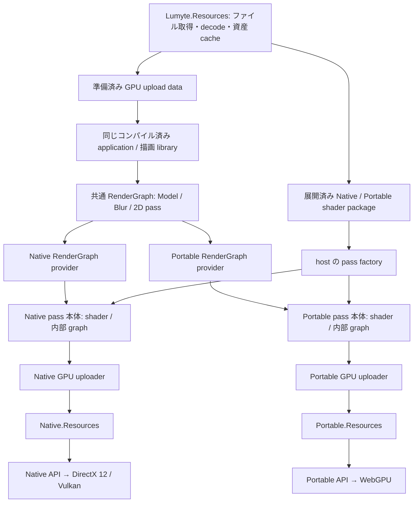
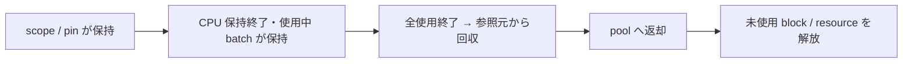

# GPU リソース管理ライブラリの設計案

## 状態と対象

検討案。[ADR 0029](../adr/0029-resource-management-api.md) が定める Native／Portable の独立した管理 API を基礎に、package 配置、到達性による回収、資産 cache と予算の連携を具体化する。ここで示す tracing GC、pressure 通知、CLR GC 連動は追加検討であり、採用済み・実装済みとはしない。

アプリケーションと描画ライブラリは共通 assembly `Lumyte.Graphics.RenderGraph` で Model、Blur、2D 等の機能 pass を組み立てる。同じコンパイル済み consumer から、実行時に選んだ Native／Portable provider を利用する。pass 作者は共通 CPU 入力と論理 I/O の契約に対し、それぞれ独立した shader、GPU 構造体、uploader、cache と内部 graph を持つ本体を提供する。`Lumyte.Graphics.Native.Resources` と `Lumyte.Graphics.Portable.Resources` は各本体で使う別のライブラリとして残す。Native は DirectX 12／Vulkan、Portable は WebGPU を主要な対象とする自身の backend を利用する。

## 層と責務



| 層 | 担当 |
| --- | --- |
| Lumyte.Resources | ファイル取得、glTF・画像・font 等の解釈、shader container 展開、CPU 側の所有参照・依存・世代と資産 cache の eviction。GPU へ渡す準備済み data を提供する |
| 共通 RenderGraph | 機能 pass の CPU 入力・論理 I/O、pass の追加・依存、計画と提出。consumer が依存する一つの契約 |
| 共通 Resources facade | 準備済み package upload data の GPU 確保・転送、共通 export、scope・pin と回収 |
| Native GPU uploader | 準備済み data の Native 入力構造体・address／descriptor index への配置、Native package plan と転送 |
| Portable GPU uploader | 準備済み data の Portable 入力構造体・明示 binding への配置、Portable package plan と転送 |
| 二系統の GPU resource manager | 管理対象の resource/view、配置、使用保持、GPU 完了後の回収と計数 |
| 二系統の RenderGraph provider | 機能 pass の本体を選び、各内部 graph を実行計画へ統合し、同期・transient lifetime・提出を管理 |
| 二系統の機能 pass 本体 | 準備済み shader package からの program 初期化、専用 GPU 構造体・upload・GPU cache・内部 graph を独立して構築 |
| Native／Portable API | それぞれ指定された resource・command・同期の実行 |

ファイル取得と decode の API は `Lumyte.Resources` 側で扱い、ここでは新設しない。Graphics はメモリ上の upload 入力型と、その data を GPU 資源へ具体化する二つの uploader を定義する。CPU data は共有できるが、GPU package の配置、shader 入力 ABI、program と resource handle は共用しない。GPU backend への依存は各系統の uploader が持ち、資産 store 本体に加えない。

## 共通の公開型と独立した管理実装

通常の consumer は機能 pass の request に準備済み CPU upload data、描画設定と論理 resource を渡す。明示的に共有 GPU package を作る場合は `IGpuRenderRuntime.Resources` の `IGpuGraphResources` を使い、scope、GPU upload、論理 package export、`GpuGraphBufferRef`／`GpuGraphTextureRef` と pin を扱う。参照は runtime と世代の identity を含む。provider が低層の managed reference への対応表と wrapper を所有する。共通 facade に raw resource の生成、shader 用 data schema、view／binding 操作を設けない。

低層の両 namespace には `GpuResourceManager`、`GpuResourceScope`、`GpuBufferRef`、`GpuTextureRef`、`GpuViewRef`、`GpuPackageRef` を用意する。`CreateScope`、`CreateBuffer`、`CreateTexture`、`GetView`、`ImportPackageAsync`、`Pin`、`BeginBatch`、`Collect` の名前と所有の意味を揃える。これらを直接使う場合の戻り値と引数は各系統の型であり、共通 backend interface は要求しない。共通 facade を実装するのは上位 provider とし、この管理 library に Graph の型への依存を加えない。

managed reference は manager と record 世代を指す非所有値とする。変数に保存しただけでは資源を保持せず、scope、package、明示 pin、使用 batch が root を持つ。管理層は自分の record 世代を確認し、古い reference が再利用後の別資源へ接続することを防ぐ。

共通境界は `IGpuRenderPassContract<TRequest, TResult>` が定める ID、version、CPU 入力と論理 I/O であり、`graph.AddPass(name, contract, request)` と機能ごとの `AddModelPass`／`AddBlurPass`／`Add2DPass` を使う。shader の program ID、Draw／Dispatch の共通記録、共通 shader 入力や ABI 変換は consumer に要求しない。pass 本体はそれぞれの専用 shader API を使い、Native の GPU address、descriptor index、Portable の binding layout を共通 request へ埋め込まない。raw handle、root data、GPU buffer 内の pointer/index を走査して参照先を推定しない。

## Native の descriptor 自動管理

shader から参照する Texture の作成では、指定された default view と descriptor を作成してから公開する。追加の mip/layer/format/storage view は `GetView` の時点で準備し、同じ resource 世代と view 記述なら共有する。すべての解釈を先回りして作らない。

利用者は準備済み view に `GetShaderIndex(view)` を呼び、通常は slot の allocate、write、clear、free を呼ばない。index の取得自体では新たな slot 割当をしない。linear range の `GetGpuAddress(buffer)` も同様に非所有値を返す。

resource 世代は default view を保持し、view は参照先 resource に、resource は backing allocation に依存する。default view と resource の関係を単純な参照カウントだけで表すと循環になるため、管理内部で一つの所有 record にまとめるか、明示 root からの到達性で処理する。index と address は世代の生存中安定させる。

Metal の Texture が持つ暗黙 view / resource ID の操作感を参考にする。ただし Metal 4 は command buffer が resource を強参照して自動延命する API ではない。descriptor の利便性と寿命・同期を分けて設計する。[Metal 4 core API](https://developer.apple.com/documentation/metal/understanding-the-metal-4-core-api)

## Portable の view と binding 自動管理

Portable には Bindless を要求しない。`scope.GetBindings(program, group, inputs)` が Portable shader の指定 group の binding metadata と、明示的に渡された resource/view/sampler から一つの immutable binding set を準備する。

shader compiler が出力する POD 構造体と binding schema は下位 API の型で完結させる。managed reference を受ける入力型は Resources 側の生成器が Portable 専用 schema から別途作る。機能 pass の CPU 入力は pass の意味に従って作者が定義し、shader schema から生成しない。Portable 本体が自身の GPU 入力と binding を明示的に構築する。shader loader が上位ライブラリへ依存する循環を作らない。

binding cache の key は program の layout、各 resource/view 世代、range と dynamic offset 条件を含む。同じ material 入力は binding set を再利用でき、入力の差替えは新世代を作る。GPU 使用中の binding set を書き換えない。Native の descriptor index を Portable 内部で模倣する必要はない。

binding set は実際に束ねた resource 世代を依存として保持する。未使用 cache entry は回収可能とし、cache がすべての過去 resource を永久に root として保持しないようにする。global な型領域や全 slot 候補を延命する仕組みは設けない。

管理層が実際の binding を知ることと、RenderGraph が read/write の用途を知ることは別である。pass の同期計画には使用者が read/write を明示する。binding の生成だけで state や barrier を推論しない。

## 用途別 pool

| 用途 | Native | Portable |
| --- | --- | --- |
| 永続 Texture | texture requirement に従う heap の配置と再利用 | description／usage に応じた device-owned Texture |
| Attachment | attachment 用 pool と利用期間に応じた配置 | サイズ、sample、usage が合う Texture の再利用 |
| Linear / Buffer | 大きな linear region/range からの整列した切出し | buffer の用途、サイズ、書込み方法に応じた再利用 |
| Upload / Readback | host-visible region と completion に従う ring/page | queue write、staging、map と completion に従う再利用 |
| Package | 統一 heap の単一 allocation または既定 pool | resource 群と binding cache を一つの所有集合として管理 |
| Transient | Graph の寿命・alias 配置を適用 | Graph の pass と寿命に従う resource 再利用 |

Native は `NativeGpuHeap` による memory 取得を統一したまま、配置方針を用途別に分ける。Texture と linear data が必ず別の native heap を要求するという意味ではない。完全な resource description、memory kind、取得済み requirement の組で pool を保守的に分け、compatibility の bit 表現や format 表を再解釈しない。

`MTLHeapType.automatic` が resource の配置位置を選ぶ点を参考に、管理層に offset を指定しない入口を置く。下位 Native API の明示配置は維持する。Portable の管理層は Buffer／Texture object の生成と再利用を行い、heap を作成する段階を設けない。[Metal automatic heap](https://developer.apple.com/documentation/metal/mtlheaptype/automatic)

## パッケージと統合 allocation

通常の機能 pass は request 内の準備済み upload data を使い、`BuildAsync` で専用 GPU payload と各系統の `GpuPackagePlan` を具体化する。共通 facade の `scope.ImportPackageAsync(data, cancellationToken)` は準備済み `GpuPackageUploadData` から pass 間で共有する GPU package を作る。provider の uploader は `Profile` が示す export の用途契約に従い、物理 resource 生成前に usage を含む完全な description を決定する。profile と内容 key はロード先ではない。低層 manager は各系統の完成した plan を受け取り、GPU 確保と転送を行う。consumer は Native／Portable の plan 型や shader を選ばない。

`GpuUploadDataKey(Id, Revision)` は不変内容と世代の識別に限り、`IGpuUploadData.Key` として cache 再利用に使う。`ReadUpload(data)` は渡された data と明示した子参照を保持する。画像入力は `GpuImageUploadData` と mip/layer、row/slice stride、bytes を持つ `GpuImageSubresourceData` で表し、ファイルの decode は済んでいるものとする。Graphics が URI、stream、資産 ID から data を取り寄せる経路は設けない。

data の memory は所有または移譲・コピーで確保し、元の資産 cache が eviction されても graph が保持する世代を無効にしない。Native／Portable の packing は各 uploader が行うため、この入力がそのまま shader ABI の byte 配置であることは要求しない。

| Plan の情報 | 内容 |
| --- | --- |
| Resources | Buffer／Texture の description、用途、初期データ |
| Dependencies | package 内の resource 関係、外部の共有資産への明示参照 |
| Exports | mesh、material、texture を引く package 内の ID |
| Native Placement | Native 専用の単一 allocation または既定 pool を選ぶ配置 group。Portable plan は配置を指定しない。 |
| Shader data | 系統ごとの入力構造体、参照解決に必要な metadata |
| Upload data | decode/transcode 済みデータと転送を構成する情報 |

Native は resource ごとの要件から offset と総容量を計算し、同じ group の全 token を一回の `CreateGpuHeap` へ渡す。linear region と Texture を配置し、descriptor と address を解決する。Portable は `CreateBuffer`／`CreateTexture` でメモリ込みの resource を直接作り、Portable 入力と binding set を組み立てる。heap の事前作成や memory requirement／配置 offset の計画は行わない。

各系統の pass 実装は自身の material buffer 等を明示して準備し、GPU package builder／uploader と転送 utility を使って upload と保持を行う。初期 upload 完了後に完成した package 世代を公開する。共通 consumer 向けの shader/data schema は設けず、Native pointer/index や GPU ABI 構造体の bytes を共通 payload とみなさない。command が Parameter Data を生成・upload する責務を持たず、root の buffer fallback も行わない。Native shader は root data から参照を導出し、Portable shader は別の入力 ABI に従う。

Native 専用の `GpuPackagePlacement.SingleAllocation` は指定 group の資源を実際に一つの allocation に置く要求とする。共用できなければ失敗し、黙って複数へ変更しない。Native の配置指定を省略した場合は `Pools` を使う。Portable の `ImportPackageAsync(plan, cancellationToken)` には配置引数を設けず、直接生成した Buffer／Texture を一つの package として所有する。

glTF/GLB のファイル byte 列を一回コピーするだけで GPU resource になるわけではない。Texture の native 配置と upload footprint は別に必要である。staging、外部共有 Texture、descriptor storage／binding object を単一 allocation に強制しない。

Native shader package と Portable shader package は `Lumyte.Resources` で展開済みの不変 data を host が pass factory に渡し、各 pass 本体がそれぞれの `ShaderLoader.Load(package)` で GPU program を初期化する。この操作は I/O とデシリアライズを含まない。pass 作者は共通の機能契約に対応する二系統の実装と、それぞれが使う shader artifact を配布する。CPU manifest の共有だけで完成済み GPU package を互換にせず、資産 cache の key に実行系統、device、pass 実装、shader ABI と世代を含める。

package export の使用者は、必要な resource 世代と明示依存を保持する。Native の単一 allocation は group を回収単位とし、一部の mesh や Texture が残れば group 全体が残る。個別に寿命を分けたい Native の共有 Texture は、最初から外部 pool の資源として依存する。Portable は resource object と明示依存を回収単位とし、物理 allocation の共有を理由に寿命をまとめない。

## GC と GPU 完了

基本の安全条件は「CPU 所有から不要になったこと」と「未提出記録・GPU 使用が終わったこと」の両方である。次の tracing はその条件を満たすための追加案とする。



到達性の root は生成 scope、明示 pin、使用中 package、upload 中の所有、未提出記録を所有する batch、提出済み batch とする。Native では登録した view→resource→allocation と package 内の参照をたどる。Portable では binding set→実際に束ねた resource/view と package 依存をたどる。

`Pin(export)`／`batch.Use(export)` は export の resource と明示依存を保持する。Native の単一 allocation に属する export は、その group 全体も保持する。Native の GPU 上で計算される pointer/index の参照先は caller の明示依存で覆う。Portable は実際の binding set の依存で覆い、無関係な package 全体や global slot 候補へ保持を広げない。

CPU root がなくても batch root が残る資源は退役待ちである。GPU 使用中の resource を unreachable として破棄しない。`Collect()` は待機せず、回収できない record を次回に残す。複数 queue の使用は、必要な全 completion またはそれらを join した completion で覆う。

Native は管理上の descriptor 参照の解除・slot 返却、view/resource の破棄、allocation 範囲の返却の順に回収する。未参照 slot の物理内容は次の割当時に上書きし、低層 API に clear 操作を要求しない。Portable は binding cache の参照を解いてから binding/view/resource を回収する。未提出 command の破棄はどちらも資源より先に行う。例外、cancellation、Dispose は GPU 完了を意味しない。

ここでいう GC は不要判定と安全な回収であり、移動 compaction は含めない。特に Native の address/index を保持する GPU data を再配置するには別の契約が必要である。

CLR GC 連動を追加する場合でも finalizer は GPU API を直接呼ばず、CPU 保持の放棄を enqueue する。manager が正しい実行先で completion を確認して回収する。この連動を通常の入口にするかは未決定であり、明示 scope／pin／Collect の経路は維持する。

## Lumyte.Resources との接続

既存の `ResourceScope`／`ResourcePin` が資産のロード状態を保持し、`ResourceLease` が特定世代を保持する。`ResourceStore.CollectAsync` は未使用資産を予算・優先度・LRU で回収する。その cache eviction の判断を二つの GPU manager に複製しない。

Native と Portable の GPU 資産 wrapper は、それぞれ一つの package root を所有する。Store がその世代を終了すると root を放し、該当 manager が残る GPU 利用に従って退役する。render 側は資産 lease の生存中に package の `Use` を確立し、その後は CPU 資産 lease を終了できる。

hot reload は系統ごとに新しい package を構築し、upload 完了後に新世代を公開する。旧 Native の index/address、旧 Portable の binding set は旧 batch の利用終了まで残す。更新時に二世代が共存する peak memory を予算へ含める。

GPU 資源の cache と CPU upload data の保持を分ける。提出後に graph／plan が不要ならその CPU data の保持は解消でき、GPU 側は必要な staging と resource の使用保持を completion まで維持する。再提出可能な plan や別の CPU 所有者が data を保持する間は、その不変 memory を無効にしない。元ストリームと decoder の一時領域は `Lumyte.Resources` 内で処理し、Graphics へ渡すまでに必要な byte 列の所有を移すかコピーする。

既存 Store は resource の Dispose 完了後に `ResourceMemoryCost` を減算する。GPU wrapper の Dispose が retire 登録だけなら物理解放の完了ではない。Store の GPU cost は資産 cache を選ぶ論理評価量とし、manager が確保している量と区別する。

## メモリ予算と計数

Native は自分が所有する allocation block と descriptor storage を計数する。Portable は API から把握できる Buffer サイズや Texture の論理・推定量、binding/cache の数を区別して計数する。WebGPU から取得できない実際の heap byte 数を確定値として表示しない。いずれも OS が実際に常駐させた VRAM 量と同一ではない。

| 計数 | 意味 |
| --- | --- |
| AllocatedBytes | Native が backend から確保中の block／専用 allocation の量 |
| ResourceBytes | Portable が管理する resource の論理量。Texture の推定分は推定と示す |
| Live / Pending / Reusable | 生存、退役待ち、再利用可能な量。系統ごとの同じ評価基準で区分する |
| DescriptorSlots | Native の使用中・退役待ち・空き slot 数 |
| BindingCacheEntries | Portable の使用中・退役待ち・再利用可能な binding entry 数 |
| UploadBytes | upload 中の staging と一時資源の量 |

確保量に内訳を再加算しない。Native の共有 heap を Texture ごとに重複計上せず、alignment や allocator の余白は別途説明する。

圧力への対処は、完了済み退役の回収、未使用 block/resource の Trim、資産管理側への回収通知、GPU upload の延期／失敗の順とする。使用中資産の勝手な破棄や全 GPU 待機を暗黙に入れない。Store の回収と GPU retirement の間の遅延を考慮する。

既存の `CollectAsync(Budget)` は Store 自身の論理予算超過だけを対象とする。GPU の圧力を資産管理側の回収判断へ伝える連携は別途検討し、この文書では新しい `Lumyte.Resources` API を定義しない。資産 cache の回収結果は論理評価量であり、GPU manager は退役と Trim 後の量を再確認する。

## API の使用イメージ

以下は共通 RenderGraph を利用する consumer の例である。`runtime` は host が選択した `IGpuRenderRuntime`、`graph` は構築中の graph、`modelRequest` は準備済み model upload data とカメラ等の描画設定を持つ機能 pass の入力とする。`AddModelPass` は Model 機能 library が提供する拡張である。

```csharp
using Lumyte.Graphics.RenderGraph;
using Lumyte.Graphics.Passes;

var model = graph.AddModelPass("model", modelRequest);
graph.MarkOutput(model.Color);
var plan = graph.Compile();
using var execution = await runtime.SubmitAsync(plan, cancellationToken);
// SubmitAsync の完了は提出の受理。GPU の完了は execution の completion で待つ。
```

consumer は準備済み data を渡し、shader の選択やロード、系統固有の GPU 入力の構築を行わない。`SubmitAsync` が選択した機能 pass 本体の `BuildAsync` を呼び、shader program の GPU 初期化、内部 graph、低層 command と提出を実行する。Native の `SingleAllocation` は Native pass 側の package 方針に残し、Portable の upload 経路に heap 作成や placement を追加しない。

## 実装を分ける単位

1. 共通の機能 pass 契約、Graph／Resources facade と論理参照を定義し、同じ consumer assembly を Native／Portable provider で実行する契約を確立する。
2. Native の descriptor 自動所有と種類別配置、Portable の view/binding cache と resource pool を実装する。
3. 系統ごとの managed reference と scope/pin/batch、package builder、準備済み shader package の GPU 初期化、upload data からの転送と ResourceStore の所有連携 を実装し、機能 pass 本体の準備・内部 graph と接続する。
4. 明示所有と completion による安全な退役を完成させ、到達性 GC の必要な範囲と方式を決める。
5. budget pressure と Store の cache eviction を接続し、CLR GC 連動を採用するか別途判断する。

初期範囲に移動 GC、defragmentation、任意 GPU pointer の書換え、Texture streaming／部分 residency は含めない。低層 API に native validation の再実装や無条件の自動 barrier を追加しない。

## 既存実装の接続箇所

- [ResourceStore の回収](E:/Lumyte/src/resources/Lumyte.Resources/ResourceStore.cs:363)
- [世代 lease](E:/Lumyte/src/resources/Lumyte.Resources/ResourceLease.cs:6)
- [ロード時の依存保持](E:/Lumyte/src/resources/Lumyte.Resources/ResourceLoadContext.cs:36)
- [Dispose 後の memory cost 減算](E:/Lumyte/src/resources/Lumyte.Resources/ResourceRecord.cs:95)
- [Loader の実行先・計測契約](E:/Lumyte/src/resources/Lumyte.Resources/IResourceLoader.cs:6)

共通の機能 pass 契約、Clear／Copy／Output の二系統の本体、RenderGraph provider と二系統の GPU 管理ライブラリは実装済みである。RenderGraph は内容世代の保持・失効、外部資源の import、実行中の所有と回収を管理する。準備済み model data の GPU package 化と専用 uploader、ここで提案した tracing GC／予算管理は後続であり、基盤の完成と区別する。現在の検証範囲は [実装進捗](graphics-implementation-progress.md) を参照する。
